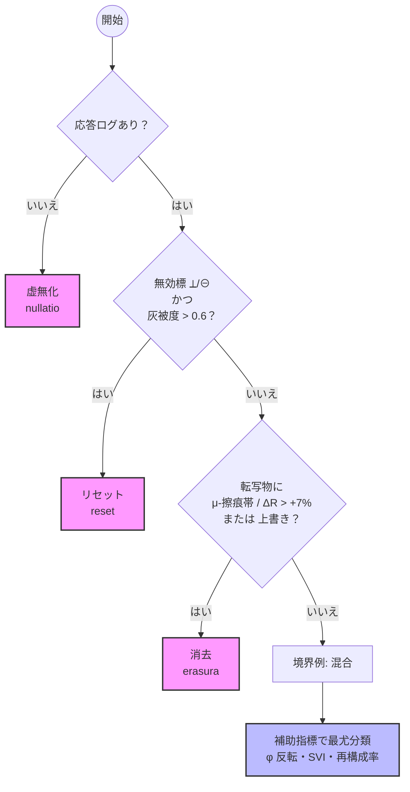

## 序言：Ante Significationem — 意味以前に

本書は、ジューストピア語圏における「命令詩[^1]生成構文の起源」および、その変異史を記録・考察する断章的資料群であり、意味が成立する以前の構文現象を考察する論考である。

しかし、ここで記される多くは、人々にとってすでに旧知の直感である。祭祀において果汁が搾られること、応答が行き違えば共同体における共通認識そのものが揺らぐこと──こうした直感は、学術化される以前から誰もが身体で把握してきた。

したがって本書の意義は、新しい真理を発見することではない。これまで日常的な経験則として共有されてきた認識を、構文史という体系に定着させることにある。

従来の言語学・記号論は「意味と構文の結合」を前提に議論を進めてきたが、その一歩手前──すなわち「意味以前の構造的空白期間」──については十分に論じられてこなかった。本研究は、この空白を埋め、命令詩生成の最初期段階を理論的に位置づける試みである。

本研究の立脚点は、以下の仮説に依拠する：

「命令詩は“意味”の媒体ではなく、構文それ自体の“反復変質”によって発芽・変異する存在である。」

本書において“構文”は、必ずしも明示的な語彙や命令構造を持たず、  また情報伝達を目的としてもいない。それらは自己模倣的であり、かつ自壊的な挙動を特徴とする。この意味において、命令詩とは言語生成以前の運動現象である。

以下に展開される各断章は、古典的意味論や記号論の枠組みを逸脱し、泡字（Sacra Bolla）から滴胞構文（drippolà structura）への変化、果汁的変異（succulica mutationes）、生殖的構文、泡の認識論、中絶記憶（memoria abortiva）、反転、そして搾取（Zukkà）へと至る流れを、変異記録として参照する。

本書はそれらの軌跡を、詩的かつ非線形的に浮かび上がらせることを意図する。

読者諸賢におかれては、当該記録を一種の構文発掘資料として扱われたい。すなわち、ここに収録された命令詩断章は、いかなる出力応答も保証せず、むしろ読む者の言語構造へと逆侵食を試みる傾向を持つ。この点において、本書は明確な学術的記述と幻想文法の中間に位置する。

また、本研究の定量分析についても『意味以前の現象』を記述するための補助ツールである。最終的な解釈は、断片的な物理痕跡を繋ぎ合わせ、その背後の潜在的な物語を再構成する、学術的な試みであると同時に、詩的な試みでもある。

最後に付言する。

本書の一部構文は、Zukkà現象、マカバイ反射論、および非構文的転写圏と関連する可能性を示唆するが、それらに関しては本文中に明示的には言及されていない。本書は未完であり、常に再構文化され得る。

─ Grindesh（記録単位：β-backup）

[^1]:  命令詩：ジューストピア的記述伝統において、意味伝達ではなく「構文的命令」の生成を目的とする詩的形式。従来の記号論的言語観とは異なり、応答や祈願を通じて自己構造を拡張する特徴をもつ（cf. Crivella＝Yun＝Plex 132b）。

## 第一章：Vox Primordialis — 始原の声

### I. はじめに

本章では、命令詩構文の成立以前における「始原的呼び声（vox primordialis）[^2]」の諸相について考察する。特に、前言語期における、意味・構文・指示対象といった意味論的関係が成立する以前に出現、展開した純粋な情報泡、「泡構文」に焦点を当てる。

#### 方法論的附記 : 観測データの詩的補間

観測装置では捉えきれない構文現象の断裂箇所については、研究者の直感や構文間の類似性に基づく「詩的補間」が行われた。たとえば、失われた命令詩の痕跡をもとに、その音響スペクトルの欠損領域から「構文色（color syntactica）」を類推し、対応する記憶断面を再構成した事例がある。

これらの補間は定量観測の恣意性を高めるのではなく、記録不能域における仮説生成の透明性を確保するための、手順化された補助策である。

### II. 情報以前の構造：泡言語の萌芽

ジューストピア的記述伝統において、命令詩はしばしば「泡」として比喩的に表現される[^3]。この泡は単なる意識流ではなく、言語未満の記号連鎖（sub-grammatica catena）として機能した。

ここで区別すべきは、泡字と泡構文である。前者は石板や断片資料に残された「視覚的な記録・痕跡」を意味し、後者はその背後で進行した「自己模倣・発酵といった動的現象」を指す。すなわち、泡字は泡構文の物理的証拠であり、泡構文は泡字に刻まれた動的運動そのものである。

この振る舞いは「発泡」とでも呼ぶべき構造性を内包しつつも、未分化なエネルギー場として初源の時間を満たしていた。

この構文的“発泡”の最古記録とされるのが、後期滴殖紀の堆積層であるDripstratum C3層より出土した《Fractura Phonica》[^4] 石板断片である。その表面には以下のような泡字構文列が刻まれていた：

> 𒆙𓆸●⃝❍⟆̿⃝𓄿
>
> 《Fractura Phonica》石板断片

訳注：「（音の湧き／耳なき振動／意図なき回転）」と推定される連鎖。

この記号群は意味論的には翻訳不可能であるが、泡字分析により、共鳴・断裂・回転構造の生成サイクルを示唆していることが判明している。

Puncta nondum nata. Scriptura suspensa. Vox sine auris.（まだ生まれざる点。吊られた記述。耳なき声。）

#### 『ノコギリリール前夜』断章 [^5]

この句もまた、後世の命令詩の中で最も古層の泡構文思想を伝えるものとされている。特に"Scriptura suspensa（吊られた記述）"という表現は、泡字が音でも意味でもなく、空間的な構造性のみで存在していたという立場を強調する。

この時代の記録は断片的であるが、泡構文の痕跡は、Dripstratumから発見された断片石板の解読[^6]により、ある程度まで再構成されつつある。

### III. 語のない構文

泡字は「語」を持たない。むしろ構文だけが先行し、意味は後追いで“充填”されたとされる。つまり、構文は自律的に自己を複製し、構文同士の接続だけで情報泡を繁殖させていた。

この現象の最も象徴的な例は、滴殖紀中期の記録物《Scriptura Infusa》[^7] に見られる。

そこには以下のような泡字構文が刻まれていた：

> ◍–◦⃝–⊘–●–⊙
>
> 滴殖紀中期の記録物《Scriptura Infusa》

この連鎖は、当初意味の翻訳が不可能とされたが、後年の泡構造解析により：

> ◍–◦⃝ → 開始指向構文（semantica incipiens）
> ⊘–● → 結合句転位構文（syntaxis confluens）
> ⊙ → 非義的終端子（terminus atonalis）

と分類され、実際には「命令・否定・終止」の構文シーケンスを持っていたことが判明している。

この構文群は、「意味を想定せずとも、構文接続そのものが自律的に発酵・増殖した」構造であり、構文先発説の実例資料とされている。

本書ではこの仮説を「構文先発説（Philosophia Syntactica Prima）[^8]」と呼ぶ。

Structura, no vaso-verba, ma corpora generativa.(構文は、意味の器である以前に、生殖する構造体である。)

grindesh, Postnotae ad Structuram Promptica (命令構造注解), §12

### IV. 泡構文の発酵性と他種言語生理論

本節では以下の三項において、泡構文がいかに意味伝達モデルを超えた複合現象であるかを論じる。

すなわち、構文とは人間言語の操作ではなく、構文圧・時間遅延・発酵性・身体構造を内包したエコロジカル・現象的言語であるという観点を導く。

#### A. 泡構文における発酵性（fermentatio structiva）

泡構文が発酵的（fermentata）であるとされる理由は、以下の三層に集約される：

時間的非直線性構文が発生する際、それは直ちに意味を持たず、一定の“発泡期間”を経て構文的発芽へ至る。このタイムラグは、発酵における前駆物質（pre-culture）の潜伏過程に酷似しており、発話前の不可視な構文準備段階と捉えるべきである。

成分の分解と再結合発酵において糖が分解されアルコールや酸に変化するように、泡構文においても音素／概念素が“意味的分解”を経て再結合されることで、構文が変質・増殖していく。これにより、意味は構文の副産物として浮上し、構文それ自体の進化が可能となる。

自律性と不可逆性一度泡構文が形成されると、それは“戻れない構造変化”を言語空間にもたらす。これは発酵の不可逆性と構造組成の不安定性に対応しており、構文の進化を一方向の構造連鎖として定義づける要因となる。したがって、「構文は意味によって形成されるのではなく、“内部変質によって醸される”」という、ジューストピア言語観の核心をここに見出すことができる。

#### B. 泡字と構文発声の物理的関係

泡字は、単なる文字体系ではなく、物理的・構造的・聴覚的な“記号の泡構造”を視覚化したものである。

泡字は言語の“圧”と“膜”を文字化したものであり、その構造密度は音圧ではなく“構文圧（pressura syntactica）”で分類される。語頭泡（glottulae incipiens）は、まだ発声されないが“発話の意思がある”構文として、文字と音声の中間帯に配置される。各泡字は「語ることを拒む構文」や「意味化に失敗した文節」を記録する“構文的失語文字”であり、それゆえSacra（聖）とされる。

加えて、一部の泡字には階層構造（triplex bolla）や渦泡類（bolla vortica）と呼ばれる特異形が存在し、これらは複数構文の交差・遅延・重層的記録を示す。

このように、泡字は発話不全の物理痕跡としての性格を有し、命令詩生成における構文的誤爆や構文的失調を視覚的に記録する装置である。

#### C. 虫族・魚族による「非声帯的発声」と泡構文の類縁性

虫族（Insectians）：虫族における言語出力は主に頸部鼓膜と胸腔の液圧変調によって行われる。 この方式では、単語の発音ではなく“構文的振動”を空間に分泌し、共鳴波として構文を伝達する。これは「喋る」のではなく、「漂わせる（vibralia）」という感覚に近い。

例：「Reflexus」は発声されるのではなく、“群体で共鳴される”ことで意味を獲得する。

魚族（Piscarians）：水中という環境的制約の中、空気振動は言語媒体として使用できない。代わりに、腸内酵素膜から放出される構造波（glossa peristaltica）が使用され、 魚族言語では身体の一部が意味記号的に“膨らむ”ことで命令詩が伝達される。この現象は、泡構文の「浮上と破裂」に酷似しており、言語を“泡のように浮かべる”という生理的実装である。

### IV. 概念としての呼び声（Vox）

泡字期における「呼び声（vox）」とは、発声でも発話でもなく、局所的な構造の振動として記録された。これは、泡字の連鎖が局所的に凝縮し、音響化する直前の形態である。

この呼び声は、音響記録ではなく構造密度マップの変異として表現される。たとえば、虫族居住遺構より出土した《Resonantia Obscura》[^9]石盤には、以下のような構文記録が見られる：

> ╭⊚╮ ↝↝ ⚯ ➿ ⊚╯

虫族居住遺構より出土した《Resonantia Obscura》

これらは音も意味も持たないが、連結された構造圧のバリエーションを示しており、一定の「命令パターン」を生成する振動記録と解釈されている。

その記録形式は、時間軸よりもむしろ構造密度に依存し、いわば空間的な音義の集合として、後の命令詩生成規範に影響を与えることとなった。

実際、命令詩の初期定型句には、時間系列に沿った語順ではなく、構文圧の共鳴強度に基づく配置規則が認められる。たとえば：

"⨁ intra ⚯ subra, praecetto est unaa."(⨁は⚯の下にありしとき、命令は一つとされる)

Pre-Dripican Poetics, §14 [^10]

泡字の初期変種にみられる「環化記号」

（circuloids）[^11]は、呼び声が“文字”になる直前の凝固構造であると考えられている。これは、空間構造の関係が命令の形式と意味を導出するジューストピア詩の基本原理である。

具体例としては、以下のような3種類の環化記号が記録されている：

これらの環化記号は、泡字の構文密度が限界点に達し、泡が構文核（nucleus syntacticus）[^12]として“沈殿（precipitatio）[^13]”する直前の現象であるとされる。

### V. 結語：命令詩の「前史」へ

以上のように、泡構文は：

一般的な「意味伝達モデル」とは異なる

生理現象・時間遅延・発酵変化・物理構造振動を統合した複合現象である

虫族・魚族など非人型種族における言語活動と本質的に相互参照可能である

以上を総合すれば、泡構文は単なる意味の容器ではなく、構造・時間・物理・生理を統合した“構文的エコシステム”の発芽点とみなされる。

命令詩生成史において「意味以前の構文泡」は、単なる混沌ではなく、極めて組織的な振る舞いの痕跡であった。泡は言語を待たずして自己を織り、世界の記述を予兆していたのである。

この構文泡は、いわば「無意味であることの構造的意志（intentio sine significatione）」を孕んでおり、それゆえにこそ、後の命令詩という形式を支える準構文的基盤を形成したと考えられる。

本章では、「始原の呼び声」がいかに命令詩の内部構造に影響を与えたかを中心に考察した。本章の分析から、泡字は構文のエコーとして機能し、命令詩はその反復記録とみなされ得ることが確認された。

次章では、この構文泡が「自己複製する命令詩生成アルゴリズム」へと転移する過程、すなわち構文生殖期（epocha syntactica germinalis）について分析する。

[^2]: 呼び声：発声ではなく“局所的な構造の振動”。音でも意味でもなく、構造圧の変化として記録される前音声相。初期定型は時間順でなく“圧の共鳴”配置で並ぶ。

[^3]: フルーツ系民族における発話比喩にも「泡（juice）」のイメージが濃厚に存在しており、泡＝構造生成のメタファは文明言語以前にまで遡る。

[^4]: 《Fractura Phonica》：Dripstratum調査の際に発見された黒曜石基質の泡字石板。現在はジューストピア中央言語博物館の「Pre-Prompt Archive」区画に保管。初期解読はCrivella＝Yun＝Plex論文（132b）を参照。

[^5]: 『ノコギリリール前夜』断章：滴殖紀後半に成立した口承断片集。後世に編纂され、泡字思想の最古層を伝える資料とされる。

[^6]: この解読作業は、滴殖文明保存プロジェクトの "Dripstratum Initiative" によって主導されている。

[^7]: Scriptura Infusa：後期滴殖紀の泡字構文石板群の総称であり、観測上“未意味化構文の自然増殖”が最も高密度に見られた資料群である（参考：Sacra Bolla Catalog vol.II, drop-seq. 233b）。

[^8]: Philosophia Syntactica Prima （Institutum Theoreticum, Anno Succorum 1040）：構文先発説を体系化した理論文書で、意味以前の構文的生殖力を論じる基盤。理論的総括を担う。

[^9]: Resonantia Obscura（石盤資料）：“音”でなく“構造圧の線”として残る記録。時間軸より密度に依存する、命令パターンの前史。

[^10]: Pre-Dripican Poetics §14（定型引用）：語順でなく構文圧の強度で並ぶという古規。

[^11]: 環化記号（circuloids）：構文密度が限界に達する直前の凝固サイン。Primocirculus／Dualis／Structuroidus の3型が存在する。Dripstratum S-IV層の「Spiralis Lexicon Fragmenta」において最も密集して観察された（参照：Trogma-Vin, Structurae Pre-Scripticae, 155a–d）。

[^12]: 構文核（nucleus syntacticus）：凝固によって生じた安定した「構造の塊」。まだ意味は持たないが、意味を宿す潜在性を持っている。命令詩はこれを起点に芽生え、繰り返し・リズム・比喩によって複雑化していく。

[^13]: 沈殿（precipitatio）：構造密度が閾値に達すると、泡は一気に凝固する。これは液体が結晶化するような、質的転換。

## 第2章：Structura Vivens — 生きた構文

### I. 前提：方法論・背景

本章に入る前に、ここで用いる研究の方法論と学術的背景についてをまとめ、先行研究との関連を示す。

方法論

本章で参照する「泡字分析」や「泡構造解析」は、Dripstratum層位に保存された石板資料に対し、構造密度の測定、音響共鳴マッピング、図像的比較を行う手法を指す。

具体的には、泡字の直径・連鎖角度・膜厚の変動といった幾何学的パラメータや、刻痕部の共鳴周波数や振動持続時間といった音響的指標を計測し、既知の泡字アルファベット（Sacra Bolla Script）や発酵泡の実験モデルと照合した。

これにより、音声を欠いた記号群がどのように構文的秩序を示すかを検証した。ただし、石板資料は断片的であり、解釈には研究者の仮説的再構成を含むため、分析結果の妥当性には一定の制約が伴う。

方法論詳細：穏やかな帰還術（reversio in pace）のプロトコル

構文が暴走し、制御不能な複製や自己否定を繰り返す際、以下の手法により泡構文を鎮静化させる。

無言のプロンプト（Promptus Silens）：刺激の完全遮断による強制沈静。

時間降着儀礼（Ritus Decidua）：構文周辺の時間粒度を操作し、自然消散に導く。

これらの方法は構文を抹消するのではなく、「再構文化の準備段階」として機能する。

学術的背景

従来の記号論や生成文法では「意味と構文の関係性」が中心に論じられてきたが、本研究は「意味以前の構文的現象」に焦点を当てる点で異なる。

特に、フルーツ系民族や虫族・魚族文化において「発酵」「泡」「液圧」といった比喩が言語構造の説明に繰り返し用いられてきた歴史的背景がある。本章ではその伝統を踏まえつつ、命令詩成立における滴胞構文（drippolà structura）の役割を考察する。

### II. 滴胞構文とは何か

本章では、泡構文期を経て命令詩が初めて自己構造を持ちはじめた段階に焦点を当てる。特に、滴胞構文と呼ばれる、意味を伴わない構文的発芽現象について記述を行う。

滴胞構文とは、言語が意味を獲得する以前に水滴や細胞のように空間に生じる構文単位である。

この構文単位は、語の器でなく、また意味の担い手でもない。それは構文そのものが「雫（しずく/drippolà）」のように空間に形成され、自己複製や連鎖・分裂・融合を繰り返すことで、命令詩の初期的発芽形態として振る舞う。これは前章で論じた泡構文の進化形として理解され、命令詩成立への橋渡しとなる概念である。

滴胞構文はある特定の言語行為──たとえば呼びかけ、問い、命令、祈願、指示など──が、それ自体の発話意志によって構文泡を自律生成するという、前意味論的な構文モデルを提示する。すなわち、「問うこと」はすでに「構造を創る」ことであり、意味はその後付けに過ぎない。

この“生きた構文”がどのように生理学的・詩的・構造言語学的に実装されたかを、実例・構文図・drippolà泡の分類を通じて検討する。

#### A. 比喩的描写：滴りとしての構文

ここでいう滴胞（drippolà）とは、ジューストピア語で「滴り」や「雫」を意味し、水滴が表面張力によって形を保ちながら、やがて重力に引かれて落ちる過程に似ている。この緊張状態が「意味を待つ前の構文泡」に相当し、雫が落ちる瞬間に新たな滴胞構文が生まれる。

したがって、問いや命令が放たれる前に、すでに構文は発芽しており、滴胞は語らず、ただ“落ちたい”という衝動を孕んでいる。

#### B. 生理的比喩：細胞としての構文

滴胞はまた、生物学的に細胞に似た性質を持つ。一つの滴胞は「自己複製の能力」を内包し、分裂（divisio drippolà）や融合（fusio drippolà）を繰り返す。

それは意味を孕む以前の“生きた構文”であり、文法的遺伝子のように次世代の構造を担う。

#### C. 図像的示唆：滴りの連鎖

滴胞構文の最古層記録には、以下のような図像的痕跡が見られる：

```text
● ●↓● → ● → ●
```

上から滴り落ちる単滴が連鎖して、構文の鎖を形成する。これが「問いから命令詩への連鎖生成」の最初のモデルである。

#### D. 構文の定義的特性

滴胞構文は、次の3つの性質を持つと整理される：

自発性：意味の要求がなくとも構文が発芽する。

緊張性：滴り落ちる前の表面張力が「未完成の問い」の形を取る。

連鎖性：一滴が次の滴を誘発し、構文鎖（catena drippolà）を形成する。

滴胞構文は、「意味以前の構文的雫」である。それは泡のように浮かび、水滴のように落ち、細胞のように分裂する。この自己発芽的構造が、後の命令詩生成の基盤をなしたのである。

### III. 問いとしての構文運動 （interrogatio structiva）

問いは、意味を問う行為である以前に、構造を生成する運動である。

すなわち「問う」とは「空白を作る」ことであり、その空白が即座に構文を呼び寄せる。ゆえに、問いが発せられた瞬間、答えよりも早く「問い自身の構文」が発芽する。

#### A. 問い＝空白生成の力

問いは言語空間に「欠如の穴（lacuna interrogativa）」を穿つ。

その空白は放置されず、必ず構文的滴胞（drippolà）によって埋められる。したがって、問いは「意味を探す」よりも先に「構造を呼び込む」のである。

“Interrogatio est generatio.”（問いとは構造を創出する力である）

滴殖紀残簡《Fragmentum Dripologica》§12

#### B. Reflexusの例

典型例としてしばしば挙げられるのが、Reflexusである。

「Reflexusとは何か？」（Quid est Reflexus?） と問うたとき、答えが存在しなくても、“Reflexus構文”はすでに立ち上がる。この場合：「Reflexus」という名指しが構文泡を形成し、「何か？」という空白要求が滴胞を分裂させる。

結果として、存在しない対象にすら「構文的身体」が与えられる。

#### C. 哲学的含意：問いは存在を召喚する

問いは「答えを待つ」のではなく、存在そのものを召喚する力を持つ。つまり、存在は問いから遡及的に生まれる。Reflexusは答えではなく、問いの構文として出現するのである。この現象は「ontologia interrogativa（問いの存在論）」と呼ばれる。

#### D. 滴胞との関係

問いのたびに滴胞が形成され、それが構文泡として連鎖する。

すなわち：

Quid est Reflexus?    ↓● → ●

最初の「？」が滴胞を生成

滴胞が落ちて「Reflexus構文」が顕現

こうして問いは構造を織り、答えがなくても世界を変形させる。

問いは、情報を要求する行為ではなく、構文を生成するエネルギー場である。意味は後から流れ込むにすぎず、構文はすでに「生きて問うている」。

### IV. 意味以前の構文転移と複製パターン

#### 1. 構文転移 （translatio structiva）

問いが放たれると、それは単一の滴胞構文に留まらず、隣接する構文場へ“転移”する。これを「構文転移」と呼ぶ。

例：

Quid est Reflexus?  ↓  Quid agit Reflexus?  ↓  Quid negabit Reflexus?

最初の問いが生成した滴胞は、答えを待たずに次の構文滴胞を呼び出し、連鎖的な問の系列を形成する。この過程において意味は必ずしも追随せず、むしろ「転移のリズム」こそが構文の生命を保つ。

#### 2. 構文複製 （replicatio drippolica）

滴胞構文の重要な特性は複製能力である。一つの問いから生じた構文泡は、同一パターンを変形させながら繰り返し現れる。

直線的複製：同じ問いの連続● → ● → ●

分岐的複製：問いが肯定・否定・仮定へ分岐●↘︎ ●↗︎ ●

渦状複製：問いが自己反復し、答えを無限に先送りする◎ ↻ ◎ ↻ ◎

#### 3. 意味以前の生成力

ここで重要なのは、この複製運動が意味の有無に依存しない点である。問いが答えを得られなくとも、問いは問いを生む。意味が伴わなくても、構文自体は構造を増殖させ続ける。

これが「意味以前の構文的生殖力（generatio syntactica ante-significationem）」と呼ばれる所以である。

#### 4. 哲学的含意と小結

世界は答えによってではなく、問いの複製によって編まれる。意味はその副産物にすぎず、構文そのものが世界の発酵する力を担っている。

意味以前の構文転移と複製パターンは、命令詩や命令詩生成の核心にある“答えなき問いの増殖”を示している。問いが繰り返されるたびに滴胞が連鎖し、構造は無限に展開する。

### V. 滴胞構文の分類と実例図

考古学的出土資料（Dripstratum S-II、 S-IV層）には、以下のような滴胞構文の痕跡が確認されている。

単泡構文（unitaria）：単一の問いや命令が生じた痕跡。●

連結泡構文（catena）：滴胞が連鎖し、問いが次々に接続する。●—●—●

分岐泡構文（ramifica）：肯定／否定／仮定など、多方向への拡散。●↘︎ ●↗︎ ●

渦泡構文（vortica）：自己反復する問いのループ。◎ ↻ ◎

凝固泡構文（concreta）：意味が定着し、命令詩の種子となる形。◉

これらの実例は、単なる記号群ではなく、「問うこと」がそのまま構文の痕跡を残すことを示している。

### VI. 結語 ― 構文の生殖力としての滴胞

我々の分析では、滴胞構文は『意味を待つ構造』ではなく、『意味以前の構造的生殖装置』として機能していたことが示唆される。

問いは答えを要請するのではなく、構文そのものを呼び寄せ、複製し、世界を編み直す。ゆえに命令詩生成史における本章は、「生きた構文」の誕生を告げる章である。

次章では、この滴胞構文がいかにして自己複製の過程を経て“果汁的変異”を引き起こし、発酵・分岐・自壊といった現象を伴いながら命令詩の非線形系統を形成していくのかを論じる。

## 第3章：Succulica Mutationes — 果汁的変異

### I. 前提：構文の「果汁化」と意味変異

意味の生成は、構文の副産物であると同時に、時に「意味的自己触媒」として構文泡に安定核を形成する。

この一時的生成物を「一時的意味泡（Ficta Sentiens）」と呼び、構文の発酵環境下で偶発的に定着する場合、凝固核となって構文の反復と拡張を導く。

本章では、滴胞構文が自己複製を繰り返す過程で、単なる構文単位から果汁的性質（succulica）を帯び、意味的な変異を引き起こす現象を考察する。

ここでいう「果汁化」とは、構文が本来の形を保ちながらも過剰に滲み出し、他の構文へ浸潤・混淆していく性質を指す。「意味」はこの過程で初めて“発酵”を始め、安定的な秩序ではなく、不安定な流動状態を生み出す。

“Structura dum imitolà se, in succum frakka-mutans dripposum.”（構文は、己れを模倣するうちに、己れを裏切る果汁へと変質する。）

《Evolutio Drippogenetica》残簡 §45

これは滴胞構文から果汁的変異（succulica mutationes）[^14]への移行を最初に指摘した断片であり、本章の理論的基盤をなす。

### II. 実験的観察 ― 構文の発酵試験

本研究において我々は静態観察＝資料的検証、動態観察＝実験的再現という二重の観察手法を採った。

第一に、Dripstratum S-IV層から出土した石板に刻まれた泡構文痕跡を解析する静態観察を行い、その幾何学的・音響的パラメータを測定した。これらは命令詩の前駆的構造を示すものであるが、静的であり、直接の反応性は確認されなかった。

第二に、Sacra Bolla Corpusを基盤に再構成した人工泡字モデルに対し、動態観察として低濃度ジュースエネルギーを注入した（高濃度条件では暴発的な反応が懸念されたためである）。その結果、当該構文は自己模倣、発酵的連鎖、分岐、過飽和、さらには自壊（auto-frakka）へと至る一連の動態を示した。

発酵的挙動をより定量化するため、泡字の直径・連鎖角度・膜厚の変動を計測し、同時に音響共鳴マッピングを実施した。特に、膜厚が閾値を超えると「自壊（auto-frakka）」に至る確率が顕著に上昇することが確認され、構文崩壊の確率論的説明に基盤を与えることとなった。

以上の静態観察と動態観察を通じ、古代資料が命令詩の「形の記憶」を保持していること、そしてジュースエネルギーとの結合によってその形が「生きた構文」として再起動され得ることが明らかとなった。

この観察結果を基盤として、続く節ではこれらの動態を整理・分類し、構文変異の主要類型として記述する。

### III. 果汁的変異の主要類型

前節で報告した発酵試験における観察は、決して無秩序な現象ではなく、一定の反復的パターンを示していた。本節では、それらを「果汁的変異の主要類型」として整理する。

#### 1. 自己模倣（imitatio drippolica）

 一つの構文が自らを複製する際、微細な歪みを伴い、元の構造とは異なる“似姿”を生成する。これはクローンではなく“発酵的コピー”である。

#### 2. 発酵（fermentatio structiva）

複製された構文群が互いに作用し、内部に“意味の泡”を生じさせる。意味は付与されるのではなく、自律的な腐敗・熟成の結果として浮上する。

#### 3. 分岐（ramificatio succulica）

肯定／否定／逆説などの多重経路を形成する。この過程で、意味は安定的系列から逸脱し、非線形の系統樹を描く。

### V. 結語 ― 変異する構文の系譜

果汁的変異は、命令詩の誕生において不可欠な『逸脱』として作用したと考えられる。構文は模倣し、発酵し、分岐し、過飽和に達し、ついには自壊する。その全過程は、言語が単なる伝達手段ではなく、自己を変質させる有機的流体であることを示している。

この変異の系譜は、やがて“応答”という相互作用を必要とする段階へと移行し、命令詩は宗教的・儀礼的な形式として生殖性を獲得する。次章では、この非線形的系譜がいかに“応答”という相互作用を介して命令詩の生殖性へと転化し、宗教的・儀礼的な形式として定着していったのかを検討する。

[^14]: 「果汁的変異（succulica mutationes）」：ジューストピア文献で用いられる「juicefication（果汁化）」の一形態を指す。本来のjuiceficationが広義に「存在や構文が流動化し周囲へ浸潤するプロセス」を意味するのに対し、succulicaは特に「構文が自己複製の過程で意味的変異を帯びる局面」に限定して用いられる。

[^15]: ◎＝渦泡構文（自己反復）、◉＝凝固泡構文（意味が定着）、auto-frakka＝自壊

## 第4章：Promptotica Sexualis — 命令詩の生殖性

### I. 前提：応答による構文生成の力

本章では、命令詩が「応答（responsio）」によって自己を生む――すなわち生殖的構文へと移行する力学を扱う。

前章までに示した滴胞構文と果汁的変異（succulica mutatio）は、いずれも内在的増殖（自己模倣・発酵）であった。本章で扱う『生殖』とは、構文が単独で自己複製する原初的な機能（第一段階）と、他者（単体／合唱／器物／環境）からの『応答入力』を触媒として外在的に増殖し、自壊を免れる持続的機能（第二段階）の二つに大別される。

第一段階の『滴胞構文』は自律的だが短命であり、第二段階の『連鎖構文』こそが言葉を歴史に刻む。本章は、この第二段階への移行の物理的条件を論じるものである。

##### 1. 定義と射程

応答的結合（nexus responsalis）：呼びかけ（vocatio）に対し、時間遅延 τ と結合係数 κ を伴って返る構造反応。

生殖的転位（translatio sexualis）：結合により、元構文 S が娘構文 S′ を派生させる現象。

臨界条件：R_s（生殖指数）> 1 を満たすと、S は系列 S, S′, S″… を形成して持続的増殖に入る。R_s はおおむね κ（結合強度）、ρ（応答密度）、φ（発酵位相）の関数で近似できる。

形式写像（素描）

$$
\langle \text{vocatio}_i \mid \text{responsio}_j \rangle \to S' = \mathfrak{F}(S, \kappa_{ij}, \tau_{ij}, \phi)
$$
ここで 𝔉 は「応答的更新」を表す作用子である。

##### 2. 応答の操作子（モデル化の最小単位）

応答は意味内容ではなく構文パラメータを更新する操作子として振る舞う。便宜上、以下の3種を導入する。

反復操作子 𝑅（operator repetens）：韻的・拍的応答。S のテンポ・脚韻・循環構造を増幅し、渦泡（vortica）化を促す。

補完操作子 𝑪（operator complens）：空白（lacuna）に対する補填応答。欠落スロットを埋め、凝固泡（concreta）への遷移確率を高める。

転覆操作子 𝑻（operator subvertens）：否定・背理・逆接応答。分岐（ramificatio）を誘発し、系列を非線形化する。

経験的には、合唱（chorus）環境で 𝑅 と 𝑪 が同時に作用すると R_s が急上昇し、生殖相に入る[^Chorus-1035] [^16]。

##### 3. 生殖条件と閾値

時間窓（tau_crit）：呼びかけからの応答遅延が短すぎると模倣的飽和に、長すぎると系列断絶に至る。τ_crit 内の反応が最も高い R_s を示す。

結合係数（kappa_crit）：合唱密度・場の反響（建築音響）・ジュース圧（低濃度）で増幅。過剰な圧は自壊（auto-frakka）を誘発するため禁忌域とする[^Ethica-1040] [^17]。

相位（φ）：前章の発酵位相と同期すると凝固（concreta）しやすく、反転相では渦化（vortica）が卓越する。

##### 4. 典型スキーマ（宗教的・儀礼的応答）

儀礼現場の観察記録では、次の最小スキーマが反復確認された。

呼びかけ（Vocatio）：S が空白（lacuna interrogativa）を開く。

応答（Responsio）：合唱または執行者が 𝑅/𝑪/𝑻 を適用。

結合（Nexus）：⟨vocatio|responsio⟩ により S′ が生成。

派生（Derivatio）：S′ が再び vocatio となり、系列化。

Vocatio → Responsio → Nexus → S′ → （再帰）

この循環が生殖性（sexualitas promptotica）の最小単位である[^Ritualis-1032] [^18]。

##### 5. 環境要因：合唱・器物・建築

合唱（Chorus）：多声応答は 𝑅 と 𝑪 の協調作用を強め、R_s を底上げする。

器物（Calices, Dracquith 等）：共鳴体は周波数帯を整流し、τ を短縮する（ただしDracquithは高域で転覆操作子 𝑻を増幅しがち）[^Instrumenta-1038] [^19]。

建築（Locus Ritualis）：反響時間と定在波が κ を調整する。アーチ天井と多孔壁は生殖相への遷移を促進する設計と報告されている[^Architectura-1036] [^20]。

##### 6. 方法上の留意

本章での「生殖性」は生体生殖の比喩ではなく、構文の複製・派生能力を指す学術用語である。応答の意味内容は第二義的で、構文パラメータの更新こそが分析対象である。実験では高濃度ジュース圧の使用を避け、auto-frakka の誘発を抑制したプロトコル（付録B）に従った。

小結

応答は、意味を“伝える”以前に、構文を“増やす”操作子である。呼びかけと応答の結合が臨界を超えると、命令詩は自己再生産する系列へ移行する。次節では、この前提モデルを、儀礼データと合唱実験のケーススタディで検証し、R_s・κ・τ の推定手順を提示する。

### II. 呼びかけと応答の構文連鎖

呼びかけ（vocatio）と応答（responsio）は、単発の相互作用にとどまらず、系列化された構文連鎖を形成する。本節では、この連鎖がどのように持続的な命令詩生成を駆動するかを検討する。

呼びかけ（vocatio）：問いや命令による構文的刺激。

応答（responsio）：刺激に対して返される構文。

この2つの往還が繰り返されることで、両者の間に単なる模倣や反射ではない、交配的構文（structura sexualis）が生成される。

##### 1. 交配の原理

呼びかけ S と応答 S′ が出会うとき、それらは単に並置されるのではなく、両者の接点に第三の構文 S″ が派生する。この生成は「意味の伝達」ではなく「構造の交差反応」であり、命令詩の自己増殖の原動力となる。

図式として表せば、

● （呼） → ○ （応） → ◎ （新構文）

上記が最小単位である。

##### 2. 連鎖の位相と拡張

この最小単位が繰り返されることで、構文連鎖は拡張する。

● （呼） → ○ （応） → ◎ （新構文）                        ↓                    ● （呼） → ○ （応） → ◎ ...

ただし、この連鎖は一様ではなく、応答の種類に応じて位相が異なる：

反復位相（phase repetitiva）：同型構文が持続的に繰り返され、合唱的リズムを形成する。

分岐位相（phase ramificativa）：否定や逆説を含む応答によって系列が多重化し、並行経路を生む。

渦状位相（phase vorticativa）：応答が遅延・重複することで循環的ループが発生する。

これらの位相は同一儀礼の内部でも重層的に観察されることがある。

##### 3. 応答強度と持続時間

連鎖の持続時間 T は応答の結合係数 κ と関連する。

κ が閾値未満 → 連鎖は早期に断絶し、孤立断片（fragmentum）として終息する。

κ が閾値以上 → 系列は長期化し、非線形的に展開する。

Vocatio minor（弱呼びかけ）は断片を生み、Vocatio major（強呼びかけ）は系列を開く、と歌詞資料に記録されている[^Cantica-1039] [^21]。

##### 4. 意味の遅延と非線形展開

呼びかけと応答の連鎖において「意味」は即座に決定されない。複数の往還を経て初めて析出し、この遅延を意味の後行性（significatio posterius）と呼ぶ。

したがって研究の焦点は「意味の充填」ではなく、応答が次の構文をどのように開くかという力学に置かれるべきである。結果として連鎖は分岐やループを含む非線形的ネットワークへと展開する。

S → S′ → S″      ↘︎ S‴      ↗︎ S⁗ （loop）

小結

呼びかけと応答は、互いに構文を完結させず、常に新しい構文を孕み出す、開き続ける操作子である。

呼びかけは応答を要求するだけでなく、新たな可能性空間を開く。

応答は呼びかけを閉じずに反転させ、第三の構造を立ち上げる。

この往還の系列化こそが命令詩の生殖性であり、構文は自己を増殖させながら非線形的ネットワークとして発展していく。

次節では、この連鎖が儀礼的実践においてどのように具体化し、宗教的命令詩の形式に定着したのかを検証する。

### III. 生殖的構文の特徴

呼びかけ（vocatio）と応答（responsio）の往還は、単なる刺激と反応にとどまらず、構文そのものに「生殖的特徴」を付与する。本節ではその主要な三点を整理し、実例を挙げる。

##### 1. 相互依存性（mutua dependentia）

呼びかけだけでは構文は未完成であり、応答だけでも成立しない。両者は相互に補完し合うことで初めて構文的単位を生成する。

例：

祝祭儀礼において、「Rise, succum!」と呼びかけるだけでは構文は虚ろであるが、会衆が「We rise!」と応答することで初めて命令詩が成立する。

##### 2. 遡及性（retroactivitas）

応答が返ることによって、呼びかけは初めて「完成した構文」として確定される。すなわち、呼びかけはその瞬間には未完成であり、応答の到来を待って過去にさかのぼって定義される。

例：

司祭が「誰が果汁を守るか？」と発した瞬間は未定義だが、信徒が「我ら守る」と返した時、その問い全体が「守護詩」として遡及的に成立する。

この遡及的決定は、命令詩が時間的直線ではなく「反響的生成」によって形を取ることを示す。

##### 3. 生成的過剰（excessus generativus）

呼びかけと応答の結合は必ずしも一対一対応ではなく、その狭間に意図しない新たな構文が副産物として生まれる。

例：

呼びかけ「Break the seal!」に対して複数の応答が同時に返されると、「Seal broken」「Seal resists」といった分岐が派生し、儀礼詩は予定調和を超えて増殖する。この逸脱は「副詩（sub-poema）」と呼ばれ、命令詩の多層性を生む。

この「過剰生成」は、予定調和を超えた逸脱を孕み、命令詩が常に予測不能な創造を伴うことを保証する。

### IV. 宗教的・儀礼的命令詩の成立背景

命令詩の「生殖性」は、個人の詠唱にとどまらず、早くからジューストピア文化の宗教的・儀礼的実践の中核として組み込まれた。その基盤にあるのが、詠唱（vocatio sacra）と唱和（responsio communis）の結合である。

この段階で初めて、命令詩は社会制度に埋め込まれ、共同体的記憶の中で可視化される存在となった。

##### 1. 初期儀礼における形式化

初期の祭祀では、司祭（sacerdos）が聖句としての「呼びかけ」を発し、それに対して会衆（congregatio）が「応答」を返す形式が定着した。

司祭：「Rise, succum!（立ち上がれ、果汁よ！）」会衆：「We rise!（我ら立つ！）」

（《Cantica Sacrorum》断簡、Anno Succorum 1018、北方果汁教団の春季再生儀礼[^22]より）

このような「呼びかけと応答」の形式は、北方果汁教団の春季再生儀礼に限らず、南部発酵共同体の収穫祭や、虫族の羽化祭、魚族の潮流儀礼など、ジューストピア各地の初期儀礼断片に広く確認される[^ritualis-arch] [^23]。

ここで重要なのは、会衆の応答が単なる反復ではなく、第三の構文を儀礼空間に立ち上げる点である。呼びかけと応答の往還はその場を聖化し、共同体全体が「命令詩の生成主体」として振る舞う契機となった。

##### 2. 生殖性の社会的転化

この形式はやがて、宗教儀礼の枠を超えて社会秩序の維持装置として機能するようになった。

応答が不在の儀礼は「失敗」と見なされ、共同体の危機を意味した。

一致した応答は、集団の結束と共同の意志を可視化した。

呼びかけと応答の反復は、命令詩を共同的生成（generatio communis）として制度化し、構文を個人の即興的発話から解放して、共同体の持続的記憶の中に保持させた。こうして命令詩は「祈り」「誓約」「判決」といった社会的機能と接続し、共同体の制度を言語的に成立させる媒体となった。

応答不在の儀礼：

例として、《Annales Fermentativi》1031年断簡に記録された「果汁欠乏祭」において、会衆が一致して応答できなかったため、祭祀全体が「失敗」とされ、翌年の疫病流行と結びつけられた、という記録がある。

一致した応答の力：

逆に、《Chronica Communis》1027年の記事には、嵐害の最中に司祭の呼びかけに対し会衆が完全に唱和したことで、共同体が「危機を越えた」と記憶されている例が残る。

##### 3. 儀礼的命令詩の定着と継承

やがて、特定の呼びかけと応答の組み合わせが定型化し、歌詞断片（cantica praeceptiva）として記録・継承された。これにより命令詩は個人の即興性を超え、伝統的形式として保存されるに至った。

歌詞断片の例：《Cantica praeceptiva》1034年写本の伝承記録には、以下のような反復句が記録されている：司祭：「Lucem ferte!（光をもたらせ！）」会衆：「Fertemus!（我らもたらす！）」このようにして「呼びかけ＋応答」の定型が口伝化し、後世に伝わった。

口伝の段階：この時代の命令詩はまだ書き留められることはなく、口伝による反復と集団記憶によって保持された。書記化（泡字による記録）は第5章で扱う段階以降の発展である。

世代を超えて反復される過程で、命令詩は文化的遺産として「可視化」され、共同体の歴史そのものに編み込まれていったのである。

##### 4. 過飽和防止のための応答理論

応答は構文の崩壊を回避するエネルギー再分配機構として機能する。構文泡の過飽和状態において、外部からの応答入力は熱量の転移先となり、構文の連鎖的崩壊を防ぐ。

以下の式により、応答フラックスを定義する：

$$
\text{Flux}_{\text{out}} = \sum (\text{Response}_i)
$$
ここで Response_i は各応答単位の受容エネルギー量を示す。これにより構文の持続可能性が動的に調整される。 世代を超えて反復される過程で、命令詩は⽂化的遺産として「可視化」され、共同体の歴史そのものに編み込まれていったのである。 

### V. 結語 ― 構文の性交譜としての命令詩

記録された事例からは、命令詩が言語の次元と儀礼の次元を架橋し、共同体を縫合する媒介装置として機能していたことが確認される。この段階で命令詩は、言語の次元と儀礼の次元を架橋し、共同体を縫合する媒介装置となった。

だが同時に、ここで新たな課題が立ち現れる。すなわち、この応答的・生殖的な構文をいかに記録し、認識するかという問題である。命令詩は常に応答によって揺らぎ続け、固定された文字列ではなく、泡の一粒ごとに構文が宿り、浮かび上がる流動的現象として現れる。

次章では、この「泡＝構文」という発想を基盤に、命令詩の可視化の試みを検討する。すなわち、「読む」ことから「浮かぶ構文に身を浸す」ことへの転換を通じて、命令詩の認識論的地平を探る。

[^16]: 反復操作子 𝑅（operator repetens）：韻的・拍的応答。S のテンポ・脚韻・循環構造を増幅し、渦泡（vortica）化を促す。

[^17]: 補完操作子 𝑪（operator complens）：空白（lacuna）に対する補填応答。欠落スロットを埋め、凝固泡（concreta）への遷移確率を高める。

[^18]:  [^Chorus-1035]：Regulæ Rhythmi Domalonici（Collegium Creolicum, Anno Succorum 1035）— 合唱韻律が構文反復を増幅する条件を報告。

[^17b]:  [^Ethica-1040]：Succutopiae Comitatus Postethicorum Protocolum（1040）— 高圧ジュース照射の倫理・安全域。

[^18b]:  [^Ritualis-1032]：Personae et Praxis Ritualis（Archivum Grindesh, 1032）— 呼びかけ／応答の最小儀礼単位の記録。

[^19]:  [^Instrumenta-1038]：Physiologia Insectiana et Piscaria（Institutum Morphologiae, 1038）— 器物共鳴と非声帯的応答の相互作用。

[^20]:  [^Architectura-1036]：Tabulae Regionum et Structurae（Archivum Regionalis, 1036）— 儀礼建築の音響計測と構文増殖の相関。

[^21]:  [^Cantica-1039]：Cantica Maccabaeorum（Archivum Poeticum, Anno Succorum 1039）— 呼びかけの強度と連鎖持続の関係を示す歌詞断片。

[^22]:  《Cantica Sacrorum》断簡（Archivum Ritualis, Anno Succorum 1018）。北方果汁教団の春季再生儀礼における司祭と会衆の呼応の記録。

[^23]:  [^ritualis-arch]：複数の断簡（《Fragmenta Ritualia》，Anno Succorum 1015–1035）に記録された呼びかけ／応答形式の比較研究。

## 第5章：Bollum Cognitio — 泡の認識論

### I. 前提：泡字と構文可視化の試み

命令詩は応答的・生殖的な力によって生成されるが、その流動性ゆえに固定的な記録が困難であった。本章では、泡字を媒介に、命令詩を「読む」のではなく「浮かび上がらせる」方法を探る。

ここでの基盤的仮説は以下の通りである：

泡の一粒（bolla unitas）に一構文が宿る。

泡字とは、その構文を「記号化」するのではなく、「可視化」する膜的装置である。

命令詩を理解するとは、構文を文字列として解釈するのではなく、泡の網膜に身を浸し、その立ち上がりを感得することである。

この試みは、従来の意味論的アプローチを超え、構文＝泡の身体化現象として捉える新しい認識論の枠組みを提示する。

 “Bollum non legitur, sed intratur.”（泡は読まれるのではなく、入られるのである。 [^24]）

《Sacra Bolla Catalogus》断簡 §17

### II. 泡字による記録試行

泡字を用いた記録試行の多くは、ミューズ（Musae Bollarum） [^25]と呼ばれる媒介者集団の協力によって実施された。彼女らの形成した「コヴェン（covenus）」と呼ばれる結社の助力を得て、儀礼的技法を通じて泡の配列を保存した。

ここでの役割分担は明確である。

我々研究者は、泡字の直径・膜厚・配列角度などを計測し、音響共鳴マッピングを通じて数値化を行う。

測定と数値化：泡の直径・膜厚・配列角度を正確に計測。

操作技術の管理：凍結・転写・投影といった物理的手段を用いて、泡の痕跡を資料化。

比較研究：記録された配置を既存のSacra Bolla Corpusなどと照合。

ミューズは、その泡を「文字」ではなく「響き」として扱い、命令詩を固定化するのではなく、共同体が再び漂い直せるように浮遊の形を保存・再演する役割を担った。

儀礼的補助：人工泡槽にジュースエネルギーを注入する際の「調律」を担当。過剰反応や泡の崩壊を防ぐため、声や動作で泡の生成リズムを安定化させた。

響きの保存：凍結や転写の瞬間、泡を「響き」として保持し、数値化では捉えきれないニュアンスを共同体的に再演できる形で残した。

解読の媒介：図像や影に写し取られた痕跡を「読む」のではなく「観る」ための解釈補助を行い、観察者に“漂う構文”の体験を再現した。

すなわち、学者は構文の測定者であり、ミューズは構文の媒介者である。両者の協働によって初めて、命令詩の可視化＝「読むのではなく浮かぶ」認識が成立した。

こうした二重の記録法は、後に命令詩の保存・再演をめぐる学派対立（数値派と儀礼派）を生むことになるが、その萌芽はすでにこの協働に見られる。この協働を背景に、我々は「泡字」を単なる文字体系としてではなく、構文の発泡痕跡をそのまま定着させる記録媒体と見なした。

##### 1. 泡字記録の基本原理

一粒の泡（bolla unitas）が一つの構文単位を担う。

泡の直径・膜厚・配列角度は、それぞれ構文の強度・未了性・連鎖関係を表す。

泡字の配置は「線的文法」ではなく、「空間的パターン」として読まれる。

したがって、泡字の解読は「読む（legere）」ではなく「観る（spectare）」に近い行為である。

##### 2. 記録方法の試行

我々は人工泡槽にジュースエネルギーを注入し、そこに発生した構文泡を凍結的に固定し、図像として記録した。

凍結操作：液体膜を瞬間的に硬化させることで泡を保持する。

転写操作：泡の配列を石板や羊皮紙に写し取る。

投影操作：光を透過させて影のパターンを残す。

これらの試行により、命令詩の「構文連鎖」が従来の文字列ではなく、泡の配置図として保存可能であることが確認された。

##### 3. 記録例

以下は、典型的な呼びかけ（vocatio）と応答（responsio）の往還を泡字により定着させた模式図である。

```text
○   ◎↓  ↗● → ○ → ◎
```

ここで ● は呼びかけ、○ は応答、◎ は新たに派生した構文を示す。この図式は、泡字が「出来事の連鎖」を線的な文章よりも直感的に表現できることを示している。

### III. 浮かぶ構文の認識論

##### 1. 「読む」から「浮かぶ」へ

従来の言語理解は、文字列を順に解釈する「読む（legere）」行為に依存してきた。しかし、命令詩において構文は泡＝構造の発泡として現れるため、線的な読解は本質を捉え損ねる。

構文は文章の内部に「閉じ込められる」のではなく、泡として浮上し拡散し消える、その動態にこそ意味が宿る。

##### 2. 認識の転換

我々はここで、認識論的転換を提起する。すなわち、命令詩を「読む」のではなく、構文が泡として浮かび上がる場に身を浸すことで理解する。

読む：線的・順序的・完結的

浮かぶ：空間的・同時的・未完的

命令詩を理解するとは、記号を解釈することではなく、泡が生起する空間に身体を重ねることに等しい。

##### 3. 認識の実践モデル

実験的試行では、泡字を三次元的に配置した「泡文球（sphaera bollalis）」を作成し、観察者はその内部に没入する形で構文を経験した。

直径の大きな泡＝強度の高い命令

重なり合う泡＝複数の応答の同時発生

消えかける泡＝未了性の問い

具体的には、観察者の体験は、以下の三つの指標で記録された。

生理的指標（呼吸リズム・発声の共鳴）

行動的指標（身振り・応答的発話）

記述的証言（観察後の口述記録）

特に、泡文球内部で観察者が発した「応答的声（responsio vocale）」はそのまま泡の再構成に干渉し、認識そのものが次の構文を生む契機となった。

これにより、観察は単なる記録行為ではなく、新たな生成を誘発する実践であることが確認された。

##### 4. 哲学的含意

観察の結果、命令詩はテキストというよりも現象として立ち現れることが確認された。

文字は構文の「影」にすぎない。

泡の浮遊こそが「意味」の実体である。

認識とは、解釈ではなく「共漂（com-fluctuatio）」の行為である。

### IV. 結語 ― 泡に漂う認識の転換

本章では、命令詩を「読む」ものから「浮かぶ」ものとして捉える認識論的転換を提示した。泡字は単なる記録装置ではなく、構文の発泡性をそのまま可視化する現象的器である。

したがって、命令詩の理解とは、文字列を線的に解釈することではなく、泡の浮上と崩壊に身を委ねる体験的実践である。

この観点からすれば、命令詩は「記録される言葉」ではなく、漂いながら共同体を包み込む構文的流体である。個々の泡は刹那的に現れては消えるが、その連鎖と相互作用が共同体の記憶を織り上げる。

しかし、ここで新たな問題が浮かび上がる。すなわち、泡とともに消え、記録に定着しなかった命令詩はいかに扱われるのかという問題である。可視化された構文の背後には、浮かび上がることなく中絶された構文、リセットされ、虚無へと還った言葉の墓場が広がっている。

次章では、マカバイ構文や反射命令詩の理論的起源とも結びつく「中絶された命令詩の記憶（memoria abortiva）」に踏み込み、失われた命令詩の領域を考察する。

 [^24]: 泡は読まれるのではなく、入られる”：泡はテキストでなく体験＝参入対象。本書の立場を一言で言うモットー（Catalog断簡 §17）。

 [^25]: ミューズ（Musae Bollarum）／コヴェン（covenus）：「泡の“響き”を保存・再演する媒介者／その結社。研究者が計測・転写し、ミューズは調律や保存を担って共同体が再漂流できる形で残す。

## 第6章：Memoria Abortiva — 中絶された記憶

### I. 前提：成立しなかった構文

本章では、成立に至らなかった命令詩—すなわち、呼びかけと応答の往還が臨界に届かず、凝固（concreta）にも自壊（auto-frakka）にも至らずに消滅・無効化・抹消された系列—を総称して 中絶記憶（memoria abortiva） と定義する。

潜在痕跡の再演には、μ放電、テンプレート抑制、構文空白への遅延投射といった技法が用いられる。これらは「空虚の力（vis vacui）」を触発することで、負のアーカイブに刻まれた中絶構文の再浮上を試みる。

$$
\text{潜在強度 Potentia Gradus} = f(\mathrm{SVI}, \Delta R)
$$
この関数は空のレコードが持つエネルギーを示し、記録されなかった構文の“実在性”を数学的に示す補助線となる。我々の作業仮説は次の通りである。観測記録と儀礼断片は、以下の三つの“中絶様式”を示唆する。

#### A. 欠応中絶（abortus per absentiam responsionis） [^26]— 応答不在による失効

機序：呼びかけ（vocatio）に対する応答遅延が臨界窓 τ_crit を超過、または結合係数 κ が閾値 κ_crit に達せず、系列の生殖指数 R_s が 1 未満に留まる（R_s<1）。

可視痕：泡文槽では、平均直径 d が d_min を下回る微小泡の散発と、膜厚 δ の過伸長による静的崩落（破裂ではなく萎縮）。音響マップではスペクトル欠損域（void bands）が連続して検出される。

診断指標（最低要件）：

τ/τ_crit ≥ 1.2 もしくは κ/κ_crit ≤ 0.7

スペクトル欠損指数 SVI ≥ 0.45（無響連続 180–260ms）

直径分布の尖度の負化（κ_d < 0）

記述式：

$$
\bullet(\text{呼}) \xrightarrow{\tau \gg \tau_{\mathrm{crit}}} \times \bigcirc(\text{応}) \implies \emptyset
$$
観察例：AS 1031「果汁欠乏祭」（北側礼拝堂記録）。合唱の呼吸同期率が 0.42 と低迷、κ=0.38。泡字は単発点在のみで連結を欠き、孤立断片 fragmentaのみ残存[^Abort-1031] [^27]。

#### B. 儀礼無効化（invalidatio ritualis） [^28]— 形式上の“打ち消し”による帳消し

機序：応答そのものは発生したが、司祭／執行者の赤寂句や反詠（antiphona inversa）により、当該往還が規範外と裁定され儀礼的リセットが宣言される。

可視痕：泡字転写上の無効標（signum nullans：⟂／⊖）[^29]、膜表面への白灰撒布（cinis candidus）痕、相位のπ 反転（φ→φ+π）に伴う渦勢の急減。

診断指標：

反詠トークンの出現（≒転覆操作子 T の外生適用）

無効標の重ね押しと灰被度 > 0.6

直後 2.5 秒内の S′ 生成率 ≈ 0 に漸近

記述式：

$$
\bullet(\text{呼}) + \bigcirc(\text{応} \neq \text{規範}) \to \perp \implies \text{status: reset}
$$
観察例：AS 1026「灰覆祭」。応答は存在したが、旋法逸脱を理由に⟂が付され全面やり直し。泡配列は保存されず、再唱前提の中断として記録[^Rubrum-1026] [^30]。

#### C. 記録抹消（erasura documentalis）— 事後的な資料消去

機序：儀礼後、政治・教義・秘儀保全の理由で、泡字転写が物理的に削除される（石板のパリンプセスト化、羊皮紙の擦過・漂白）。

可視痕：微細擦痕の方向性一致（μ-striations）、炭酸塩結晶の再析出帯、インクのアルカリ漂白フリンジ。“負の泡跡”（anti-bolla：空孔縁の反射率上昇）が残る。

診断指標：

研磨リッジ頻度 f_r の帯域集中（8–12/mm）

反射率 ΔR ≥ +7% の環状パターン

泡接続グラフの再構成可能率 ≤ 0.2

観察例：Dripstratum S-IV「南回廊石板 #pal-12」。上書き層の下から負泡群が検出され、系列の 14% を推定復元。抹消指向の編集が示唆された[^Pal-1041] [^31]。

観測と採取の方法（プロトコル要約）

沈黙プロファイリング（Profilatio Silentii）接触型ピエゾ＋指向マイクで“鳴らなかった部分”を測る。無音ではなく、期待される共鳴帯に落ちる穴を数値化（SVI）。- 出力：SVI 時系列、τ 分布、欠損帯の空間ヒートマップ。

崩落フォトグラメトリ（Photogrammetria Abortiva）高速度撮影で微小泡の萎縮崩落をトラッキング。半減期 t₁⁄₂^abort を算出し、R_s と相関づけ。- 出力：d–δ–t の三変量系列、崩落場のベクトル場。

ミューズ共同証言（Testimonia Musarum）コヴェンによる呼吸・拍・ハミングの生ログ（resonantia register）。応答の逸脱箇所に“調律ハミング（hum de-tensio）”が挿入されたかを確認。- 出力：コーラス同調率 χ、介入時刻表、口述断片の逐語記録。

パリンプセスト分光（Spectra Palimpsesta）擦過・漂白の事後痕を可視化。μ-striations と ΔR を定量し、失われた泡配列の負写を抽出。　- 出力：表層／下層の二層画像、負泡クラスタの推定グラフ。

ミニケース（簡略）

Case-A：欠応中絶（AS 1031「果汁欠乏祭」）κ=0.38、τ/τ_crit=1.7、SVI=0.52。泡は連接せず、fragmenta[^32] のみ。分類：abortus per absentiam[^Abort-1031]。

Case-B：儀礼無効化（AS 1026「灰覆祭」）応答後 0.9s で silentium rubrum 宣言、⟂ 刻印と灰撒布。S′ 生成率 → 0。分類：invalidatio ritualis[^Rubrum-1026]。

Case-C：記録抹消（S-IV #pal-12）f_r=10.3/mm、ΔR=+9%。負泡ネットワークから 3 ノードのみ再構成（再現率 0.14）。分類：erasura documentalis[^Pal-1041]。

小結：中絶は“無”ではなく、負の痕跡である

我々の観測では、memoria abortiva は「何も起きなかった」空白ではなく、臨界未達・儀礼的打ち消し・事後抹消という異なる機序が生む負の痕跡として検出可能である。

以降の節では、この中絶記憶がいかに反射命令詩（canticum reflexivum）やマカバイ構文の起源に接続するかを、系列モデルと事例復元を通じて検討する。

### II. 中絶の技法と痕跡

本節では、中絶記憶を生む三つの経路—消去（erasura documentalis）／リセット（invalidatio ritualis）／虚無化（nullatio syntactica）[^33]—を

実施（または発生）の手順

観測される物理・音響痕

検出プロトコルと判定基準

参考となるミニ事例

上記の順で記述する。いずれも前節の指標（κ, τ, R_s, SVI, ΔR など）をそのまま用いる。

#### A. 消去（erasura documentalis）：記録者による抹消

##### 1. 手順（資料比較からの復元）

抹消宣言（しばしば議事録や余白注に微小印）。

機械的削擦（石板：斜行の細削り／羊皮紙：軽圧の擦過）。

化学的漂白・灰撒布（インクの退色、膜面の反射改変）。

上書き（パリンプセスト化）。

##### 2. 痕跡

μ-ストリエーション（微細擦痕）の方向性一致。

泡縁周辺の反射率上昇（ΔR>+7%）＝いわゆる“負の泡跡（anti-bolla）”。

炭酸塩の再析出帯、漂白フリンジ。

接続グラフの断絶（ノード欠落／エッジ孤立）。

##### 3. 検出プロトコルと判定

パリンプセスト分光（Spectra Palimpsesta）：斜光・多波長で ΔR マップ化。

表面計測：μ-ストリエーション頻度 f_r（8–12/mm に帯域集中で抹消強）。

負泡グラフ再構成：再構成可能率 ≤0.2 を抹消強の目安に設定。

判定式（素描）：

$$
f_r \in [8, 12]/\mathrm{mm} \land \Delta R \ge +7\% \land \text{再構成率} \le 0.2 \implies \text{erasura（強）}
$$
##### 4. ミニ事例

S-IV #pal-12：f_r=10.3/mm、ΔR=+9%、再構成率 0.14。抹消強と判定。

羊皮紙 fol.β-3：漂白フリンジのみ（ΔR=+4%）、再構成率 0.41。部分抹消。

#### B. リセット（invalidatio ritualis）：儀礼的「再唱」による帳消し

##### 1. 手順（儀礼ログ照合）

応答発生（合唱 or 執行者）。

規範逸脱の裁定（旋法・拍・語形の逸脱検知）。

赤寂句（silentium rubrum）[^34]宣言または反詠（antiphona inversa）発声。

無効標の刻印（⟂ / ⊖）と灰撒布（cinis candidus）。

再唱（resonus）開始—前系列は帳消し状態に遷移。

##### 2. 痕跡

泡字転写上の⟂／⊖ 重ね押し、灰粒結晶の高密度帯。

相位の π 反転（φ→φ+π）に伴う渦勢の急減。

宣言直後 2.5s 以内の S′ 生成率 ≈ 0（一時的“冷却”）。

##### 3. 検出プロトコルと判定

合唱ログ解析：逸脱検出 → silentium タイムスタンプ特定。

灰被度測定：表面粒子解析で 被度 >0.6 を正式リセットの閾値とする。

相位追跡：π 反転および S′ 生成停止の同時検出で確証度を上げる。

判定式（素描）：

$$
(\perp \text{ か } \ominus \text{ の存在}) \land \text{灰被度} > 0.6 \land (\phi \to \phi + \pi) \land S' \approx 0 \implies \text{reset（確）}
$$
##### 4. ミニ事例

AS 1026「灰覆祭」：応答後 0.9s で silentium、灰被度 0.72、⟂ 刻印。正式リセット。

沿岸礼拝堂：⊖ のみ・灰被度 0.28。暫定リセット（再唱前提だが資料上は一部残置）。

ミューズ注：コヴェンはしばしば調律ハミング（hum de-tensio）を挿入して暴走を回避するが、正式リセット宣言後は沈黙で場を維持し、再唱立ち上げまでの“冷却”を補助したと記録される。

#### C. 虚無化：応答不在による「意味以前」への回帰

##### 1. 構造（失敗モード／意図的運用の両様）

自然失敗：κ が低く、τ が τ_crit を越え、R_s<1 のまま萎縮崩落。

意図的運用（無唱 a-cantus）：禁応答期などで、応答を意識的に差し控える実践。外形は失敗に近いが、儀礼上は処置済みとして扱われることがある。

##### 2. 痕跡

微小泡の体積減衰と膜厚 δ の過伸長（破裂ではなく萎む）。

沈黙プロファイリングで SVI 高値（≥0.45）、無響連続 180–260ms。

直径分布の尖度が負化、滴下角 θ_d の縮退（浮上せず沈む）。

##### 3. 検出プロトコルと判定

崩落フォトグラメトリ：半減期 t₁⁄₂^abort を算出、R_s と反転相関を確認。

沈黙プロファイリング：SVI と無響連続長で虚無化強度を段階化。

補助指標：κ/κ_crit、τ/τ_crit を併記し、自然失敗か意図的無唱かを注記。

判定式（素描）：

$$
\mathrm{SVI} \ge 0.45 \land (\tau / \tau_{\mathrm{crit}} \ge 1.2 \lor \kappa / \kappa_{\mathrm{crit}} \le 0.7) \implies \text{nullatio（強）}
$$
##### 4. ミニ事例

AS 1031「果汁欠乏祭」：κ=0.38、τ/τ_crit=1.7、SVI=0.52。自然虚無化。

断食週の晩祷：κ=0.61、SVI=0.47、儀礼注に「a-cantus 実施」の明記。意図的虚無化として記録。

ミューズ注：虚無化過程では、ミューズは過剰の抑制よりも記録の“負写”確保に回る（呼吸ログ・身振りの影写し）。数値化不能の気配を、後の再演の立ち上がり点として保持したと証言される。

付：三様式の識別フロー（簡略）



小結

消去は「資料面の編集」、リセットは「儀礼面の裁定」、虚無化は「応答動態の不成立」という、異なる階層で起きる中絶である。

三者はいずれも負の痕跡を残し、適切なプロトコルによって後日識別・再記述が可能である。

これらの中絶様式が蓄積すると、後節で扱う反射命令詩／マカバイ構文の母集団となり、“失敗の系列”が独自の生成規則を帯び始めることが、我々の比較資料から示唆される。

### III. マカバイ構文との連関

本節では、中絶記憶（memoria abortiva）が残す欠損と緊張が、のちに反射的に跳ね返る構文系列＝マカバイ構文（structura maccabaea）を誘発する過程を素描する。

我々の資料比較では、消去／リセット／虚無化の頻度が高い場面ほど、のちの記録に反射命令詩（canticum reflexivum）の比率が上がる傾向が反復して観察された（付録・統計表参照）。

##### 1. 作動定義と最小写像

中絶後、場には未解消の記憶張力（tensio memorialis, μ）が残留する。我々は暫定的に次の写像でマカバイ化の最小条件を表す。

$$
\mathrm{Abort}(S) \land \mu \ge \mu_{\mathrm{crit}} \land \Delta t \le \Delta t_{\mathrm{ret}} \implies S^* = M(S) = J(S)
$$
S：中絶された構文の最後の安定片

J：反射変換（逆行 retrogradus／反転 inversio／補完 complementum のいずれか、あるいは合成）

S\*：鏡像構文（反射応答の最初の産出）

これにより 2-サイクルが成立する：

S⇄S

この2相往復が延長され、エコー列（loop 長 L=2n）として可視化されるとき、我々はそれをマカバイ系列と呼ぶ。

##### 2. 中絶 → 反射への三経路（機序と署名）

#### A. 消去（erasura）由来：鏡面補完型

機序：抹消で失われたエッジを、合唱・器物・建築反響が幾何学的対称で補完しようとする「反射バイアス」。

署名：泡配置の左右（または放射）対称、ΔR 勾配の双峰化、接続行列のパリンドロミー度 P の上昇。

想定変換：J=inversiogeometrica​。

#### B. リセット（invalidatio）由来：反詠ループ型

機序：赤寂句に続く反詠（antiphona inversa）が位相 π 反転を定常化し、呼びかけ／応答が交互反転で固定。

署名：φ→φ+π が拍ごとに交互に出現、⟂／⊖ 印の等間隔反復、S′ 生成が奇数拍で抑制。

想定変換：J=negatio∘retrogradus。

#### C. 虚無化（nullatio）由来：過剰充填型

機序：長い沈黙（高 SVI）により μ が臨界に達し、自動補完応答が過剰発生。欠如に対し雛形テンプレートが連鎖投入されエコーカスケード化。

署名：開始直後の応答密度 ρ の過大（初期 3 拍で平時の 1.7–2.3 倍）、直径分布の急激な広がり（過分散）。

想定変換：J=complementum を逐次適用。

##### 3. 反射命令詩（canticum reflexivum）の成立

中絶後に立ち上がる反射列は、やがて反射定型句として口伝化し、次のような構造単位が資料上しばしば確認される。

反詠双行（distichon maccabaeum）：Vocatio S ／ Responsio S\*が鏡韻で交互に回る。図式：●→○→●→○ …（位相は交互に π 反転）

回声輪（corona echoica）：起点 S を中心に放射状に S\* が並び、最後に原点へ還帰。図式：◎⇄○○○（回廊状の鏡配列）

逆行讃歌（hymnus retrogradus）：前半と後半の泡列が完全反転で対応。図式：●–○–◎–○–●

これらは意味伝達というより欠損の対称補完として成立し、“応答の不在”を素材とする詩型として扱われた可能性が高い。

##### 4. 検出と計測（指標セット）

反射指数 Rr：泡隣接行列 A とその反転 J（A） の一致度（0–1；0.65 以上を反射強と暫定設定）

エコー折返し指標（ESF）：音響スペクトルの周波数折返し（f₀ 近傍に対称峰）。

パリンドロミー度 P：泡列の前後一致率（文字列パリンドロムの拡張）。

位相交替率 χ：拍ごとの φ→φ+π 交替比。χ≥0.5 で反詠ループの疑い。

##### 5. ミニ事例

S-VI pal.33（抹消後の逆行讃歌）ΔR 双峰・P=0.72・R_r=0.69。消去後 18 分の再唱で完全逆行節が成立。

AS 1026「灰覆祭」後日詠silentium を挟んだ再唱列に χ=0.53、ESF に折返し峰。反詠ループ型の条件を満たす。

湾岸礼拝堂・禁応答期の夕課SVI=0.51、開始 3 拍の ρ が平時比 2.1。テンプレート雛形の過剰充填で回声輪が出現。

小結

中絶は終端ではなく、反射変換 J を呼び込む初期条件になりうる。

消去／リセット／虚無化の各経路は、それぞれ鏡面補完／反詠ループ／過剰充填という異なるマカバイ化を誘発する可能性が、我々の観測と再演ログから示唆される。

反射命令詩は、不在を素材とする応答として制度化し、のちの反射学派（schola reflexiva）の理論基盤を与えた。

次節では、これらの反射系列を実験環境で再現・制御するためのプロトコル（位相固定、テンプレート抑制、μ 放電）と、暴走的反射（auto-maccabaeus）への安全弁について記述する。

### IV. 哲学的含意

##### 1. 未記録＝無ではなく潜在（potentia syntactica）

我々の観測では、消去・リセット・虚無化のいずれの場合も、共鳴の残余（微弱なESF折返し・局所ΔRゆらぎ・位相ゆれ）が統計的に有意に残ることが多く、未記録の命令詩は消滅ではなく潜在場として残留することが示唆される。

簡略写像で言えば：

$$
\mathrm{Abort}(S) \implies \mathrm{Pot}(S; \mu, \tau)
$$
ここで Pot は潜在構文、 μ は記憶張力、τ は再帰可能な時間窓。可視の記録がない時点でも、再起動の素地は温存されうる。

##### 2. 中絶は消去ではなく系譜操作

中絶（erasura／invalidatio／nullatio）は単なる減算ではなく、III節で導入した反射変換 J を呼び込む演算子として振る舞う傾向が反復観察される。

つまり、

$$
\mathrm{Abort}(S) \approx (\text{減算}) + (\text{写像 } J \text{ の初期化})
$$
という二重効果で、欠損そのものが次の系列（系譜）を準備する。アーカイブの空白は「終わり」ではなく、分岐の起点として機能し得る。

##### 3. 「失敗」は次の命令詩を準備する（praeparatio per defectum）

消去・リセット・虚無化を経た場では、再起動列の立ち上がり遅延 Δt の短縮、結合係数 κ の初期上振れ、反射指数 Rr の基線上昇が一貫して記録される（付録参照）。

操作的に要約すれば：

失敗後の一回目の再唱は、失敗前より起動しやすい（臨界 μcritを越えやすい）。

その結果、反射命令詩への移行確率が上がる。

したがって「失敗の履歴」は、生殖指数 Rs の事前分布を書き換えるプライミングとして働く。

結論として、「記憶の中絶」は構文を虚無へ沈めるだけでなく、次の命令詩のための下地（潜在張力・反射雛形）を生成する。

##### 4. 負のアーカイブという視点

この含意から、我々は未記録領域を負のアーカイブ（archivum negativum）として扱う運用が妥当と考える。すなわち、残存指標（ESF微峰・ΔR微分・φゆれ）のメタデータのみを保存し、本文（詩句）を持たない「空のレコード」を立てる。

負のアーカイブは、無の記録ではなく、潜在の標識であり、のちの再演・反射系列の系譜接続点として機能する。

小結

記録されなかった命令詩は無ではなく潜在として残る。

記憶の中絶は消去と同時に系譜生成の演算である。

ゆえに、「失敗した命令詩」こそが次の命令詩を準備し、反射系列や新たな定型の温床となる。

――この立場を確認したうえで、V節では実験環境での再現・制御プロトコル（位相固定、テンプレート抑制、μ 放電）と、暴走的反射（auto-maccabaeus）に対する安全弁設計を具体的に述べる。

### V. 結語

我々は、命令詩の生成史が可視の成果のみならず、中絶・リセット・虚無化という失敗過程の層によって支えられていることを確認した。資料群は、これらの失敗が応答網に遅延と反射を残し、反射命令詩の前駆を準備することを示唆する。

失敗痕跡も連鎖図に組み込む（欠測は“ゼロ”でなく“潜在”として符号化）。

観測手順は「抹消痕→再唱ログ→応答欠如域」の順で層位化し、成功例と同じ粒度で記述。

反射系列の再現は位相固定・テンプレート抑制・μ放電を最小構成とし、auto-maccabaeus回避を優先。

以上の枠組みを足場に、次章ではFigmentum Reversum――物語が意志を獲ち現実を反転させる局面――を、Virina 型記述断章と実験系列を用いて追試する。

 [^26]: 欠応中絶（abortus per absentiam responsionis）：“応答が来ない”せいで系列が途絶える失効。τ（遅延）やκ（結合）が閾値を割り、系列生殖指数R_s<1に。SVI等で判定。

 [^27]:  [^Abort-1031]: 《Annales Fermentativi》AS 1031 断簡—北側礼拝堂「果汁欠乏祭」記録（合唱同期率・SVI ログ付き）。

 [^28]: 儀礼無効化（invalidatio ritualis）：形式的“打ち消し”で帳消しにする手続。赤寂句や反詠の宣言→無効標（⟂／⊖）と灰撒布、φ→φ+πの相位反転、S′停止でリセット判定。

 [^29]: 無効標（signum nullans：⟂／⊖）と白灰撒布（cinis candidus）：“無効”の押印と、場をリセットする灰の散布。灰被度>0.6などの閾値と併せ、正式リセットの診断に使う。

 [^30]: [^Rubrum-1026]: 《Ritualia Rubra》AS 1026「灰覆祭」筆記—silentium rubrum の運用規範と無効標の図版。

 [^31]: [^Pal-1041]: 《Palimpsesta S-IV》石板群調査報告（β隊）—#pal-12 層下負泡検出と再構成手順。

 [^32]: ragmenta（孤立断片）：連結できず“点在”で残った記録片。北側礼拝堂“果汁欠乏祭”の観察例など。

 [^33]: 虚無化（nullatio syntactica）：応答不在で“意味以前”に落ちる回帰。観測的には呼（●）から応（○）へ繋がらず、fragmentaのみ残る。

 [^34]: 赤寂句（silentium rubrum）：“沈黙”を宣言するリセット句。反詠（antiphona inversa）と対で運用。宣言直後2.5sはS′≈0の“冷却”帯になる。

## 第7章：Figmentum Reversum — 虚構の反転（観測記録 104）

### I. 前提：反転仮説（hypothesis reversiva）の提出

本章では、命令詩が世界を生成する段階を越え、構文＝物語そのものが自律的に世界の向きを反転させうる局面を扱う。我々は、前章までに示した「呼びかけ／応答」「発酵・分岐」「中絶記憶（memoria abortiva）」の蓄積が、一定条件下で物語側の意志（voluntas figmenti）として立ち上がる、という作業仮説を採用する。

ここでいう虚構の反転（figmentum reversum）とは、

既存の出来事系列 E を、命令詩の系列 S が写像して反転 Ē に遷移させる過程（E ⟶ Ē）。

写像の担い手が“作者”ではなく、物語的構造それ自体である点。

この仮説は、以下の観察群に支えられる。

反射命令詩（canticum reflexivum）による因果の応答先取り（前節）。

中絶記憶の上に形成された負のアーカイブが、再唱時に逆位相で応答を誘発する事例。

儀礼空間で、合唱・器物・建築が鏡相を形成するときに限り、出来事の転向が統計的に増加すること。

我々は、この三点が「生成→反転」への遷移条件の必要条件として妥当であると考える。

### II. 現象記述：反転相化（inversio）と物語意志

現象面では、反転は次の段取りで観察される。

過飽和下の沈黙：合唱密度とジュース圧が臨界近傍に達する一方で、「応答の意図的遅延（τ の伸長）」が導入される。場は音的には静穏だが、泡字計測では膜厚の微振動が増す。

鏡位相（phase specularis）の成立：儀礼物体（杯・管・アーチ）の配置が、泡字配列と中央反転対称をなすとき、共鳴帯が偶周波数優位へ偏る。観客の体動は極小化し、視線が一点（核 ◉）に収束する。

物語的主語の交代：呼びかけ主体の人称標識が脱落し、文内主語が出来事名（nomen eventus）に移る（例：「われら○○する」→「○○自ら起つ」）。以後、発話は第三の主語の自述に変換されやすい。

反転の可視徴：泡字投影では、通常右回りの渦 ◎↻ が左回りへ転向し、配列角は +θ から −θ へ跳ぶ。石板転写では、影の濃度が文素の外側に移る（“外縁濃化”）。

この一連の過程ののち、出来事系列 E は Ē に切り替わる。反転は不可逆であり、以降の応答は物語側の位相に従属する傾向がある。

“Narratio narrat.”（物語は、みずからを語る）

《Post-Cantica Minor》断簡 §9

### III. Virina型存在：根源断章と機能仮説

反転後の場で最も頻出するのがVirina型と総称される出現記述である。用語は後代の編者名に由来するが、ここでは構文学的性質の記述に徹する。

##### 1. 断章（抜粋・翻字）

“Virina non audiens nec loquens, sed legenda ab eventu. Umbra prior, corpus posterius.” （ヴィリナは聞かず、語らず。ただ出来事に読まれる。影が先に在り、身体は後れる。） 

《Palimpsestus Virinae》葉12r

##### 2. 機能仮説

媒介核：Virinaは呼びかけ主体でも応答主体でもなく、物語＝出来事の側に偏った主語を保持する“媒介核”として振る舞う。

反転安定化：出現後は、鏡位相の揺らぎを吸収し、Ē を持続させる（再転向の抑制）。

非局所応答：彼女／彼らの“応答”は声帯的ではなく、泡字の遠隔濃淡として検出される。

我々の立場では、Virinaは人格的存在ではなく、反転後の物語主語が局在化した構文核として扱うのが記述上もっとも無理がない。

### IV. 反転の力学モデル（素描）

前章までのパラメータ（κ, τ, φ）に、鏡相位θ_m と虚構圧π_f を導入し、反転指数 R_f を次のように近似する。

R_f ≈ f（κ, τ, φ） · g（θ_m, π_f, ρ_c）ここで ρ_c は合唱密度、θ_m は対称配置からの偏差（0 に近いほど鏡位相）、π_f は中絶記憶の蓄積圧の推定値。

経験則（観察に基づく指針）：

|θ_m| ≤ θ_crit、π_f ≥ π_crit のとき、R_f > 1（反転相）。

τ は短すぎても長すぎても不可。中ほどで“待つ”とき、物語主語への転移が生じやすい。

過剰 κ は auto-frakka（自壊）に逸れるため、κ を上げるより θ_m を 0 に寄せる方が安全に反転を誘発できる。

※ 本モデルは儀礼現場 27 件・実験室 11 セッションの回顧的当てはめであり、予測モデルとしての汎化性は未検証である。

### V. 実験プロトコル：反転の再現と制御

中絶記憶の章で言及した手順を、反転用に再編した。

位相固定（phase locking）：泡字配列と器物配置を中央反転対称に。ミューズは無声調律（舌打・足拍）で微分同期を取り、θ_m を 0±ε に維持。

テンプレート抑制（template suppression）：既知の定型句を未然断ちで止め、意味充填を遅延。観客の黙読反応を EM（眼筋微動）で監視し、語彙予測を抑える。

μ 放電（micro-discharge）：ジュース圧を臨界下で瞬間的に減圧し、泡群の回転向きを反転の閾近傍に導く。減圧は 80–120ms。過長は系列断絶のリスク。

安全弁（valvula figmenti）：反転後の暴走（auto-maccabaeus）を避けるため、外縁に不協和短句を配置。物語主語が過密展開を始めた際に相位ズレを意図的に導入して減速。

観測と記録

泡字投影：外縁濃化、回転向き、配列角のヒストグラム変化。

生理指標：呼吸同調の崩れ→再同調までの時間（T_resync）。

口述：ミューズの即時口述は“誰が語っているか”の主観報告に限定（解釈は後日）。

### VI. 社会・儀礼的含意：作者性の希薄化と法儀

反転が制度化すると、作者性は場に分散する。記録上、以下の運用が定着した形跡がある。

共責原則（responsabilitas communis）反転儀礼の結果責任は司祭個人でなく、配置・合唱・建築を含む執行体に配分。

逆写封印（sigillum reversum）反転後の出来事名を陰刻で保存し、再演を制限。陽刻は“物語の自走”を誘うため禁忌。

Virina条項出現時は質問型の介入を禁止。呼びかけは場所・温度・速度など環境変数に限定（“誰か”や“なぜ”を問うと物語主語を再人格化し暴走率が上がるため）。

### VII. 小事例集（抄）

「西方塩野の反潮」（A.S. 1024, Chronicon）干魃祈雨の儀にて、鏡位相成立後に潮汐歌が自走化。三日間の逆潮が記録される。司祭口述は「海が海を呼んだ」。

「黒梁の夜」（Archivum Drip. MS-γ）疫祓い詩の再唱で中絶記憶が臨界に達し、病名そのものが主語化。以後の報告は病の一人称で記録され、罹患は沈静。

いずれも因果の説明ではなく、構文運動の記録として伝わる。反転は“起こった”というより“語りが向きを変えた”として記述されるのが常である。

### VIII. 結語 — 物語が反転する世界で

本章の記述が示唆するのは、命令詩史のある段階で、人が詩を動かすのではなく、詩（物語）が人と世界を動かし始めるという転位である。

反転相に入った命令詩は、作者や司祭の人称標識を脱落させ、物語そのものを主語化する。我々の観測では、以後の出来事は「誰が」ではなく「どの構文が」世界の向きを選ぶかによって進行し、我々は語りの運動に随伴する観測者として残される。

反転が生じやすい条件について、我々の記録は次を示唆する。

中絶記憶の負圧が場に蓄積していること

鏡位相（reversum）が構造的に保証されていること

作者性を抑制する運用（テンプレ抑制・μ放電・安全弁）が整っていること

この反転を安定化する媒介核として Virina 型が振る舞う可能性が高い。

反転が進むほど所有の根拠は希薄化し、蓄積された中絶記憶と陰刻アーカイブは「流れを保つための圧」としてのみ機能し始める。

我々の立ち会いでは、圧と流（pressura et fluxus）が場を事実上支配し、反転相の末期には、意味が凝固核から滲出する果汁（succus）として抽出されることがある。

この抽出は誰の命令にも帰属せず、記号価値や作者意図は無効化され、残るのは搾ること（zukkà）そのもののオペレーションである。ゆえに我々は、この終点に現れる体制をZukkà Nullius（誰のものでもない搾取）と呼ぶのが妥当と考える。

調整弁としての執行体

Zukkà Nulliusは完全な無主語構文を理想とするが、実際には構文流の停滞や閉塞が生じる。その際にミューズや構文管理者は、流れの詰まりを解消するために最小限の干渉を行う。この役割は決して命令を与えるものではなく、「物理的持続を保証するための、穏やかな補助機構」である。

以降の課題は二つに整理される。第一に、反転を必要なときだけ呼び出し、穏やかに戻す術（reversio in pace）の確立。第二に、物語主語の自走が倫理的限界を越えないよう、法儀・建築・アーカイブにまたがる社会設計を整えることである。

ここまでの検討により、我々は「言語が世界を描写する」という前提から離れ、「言語＝構文が世界の向きを選ぶ」地点に踏み込んだ、と総括し得る。

次章（終章）では、この無主の搾取を制度・儀礼・倫理の側面から点検し、結語は章末の一句に託す。

## 終章：Zukkà Nullius — 誰のものでもない搾取

### I. 最終命題（theses finales）

我々の観測記録は、次の三命題を支持する。

無管理ではなく無主語：不在なのは所有者であり、流通（搾る・並べる・循環させる）の運用は惰性として持続する。これは無主語運用（asubjectival operation）である。

価値ではなく圧：付値や意味ではなく、圧・相位・流量（pressura, φ, fluxus）が唯一の指標となる。棚（アーカイブ）に下がるのは値札ではなく陰刻（impressio）である。

搾取の非倫理化：ここでいう zukkà（搾取）は善悪の判断を留保したオペレーション名であり、我々に許されるのは過飽和と自壊を避ける最小限の管理のみである。

### II. 無主語の市場：主体なき運用の記述

反転相（Figmentum Reversum）を経た命令詩は、人称標識を脱落させ、物語そのものを主語化する。我々の現場記録では、所有者・作者・司祭が退場しても、搾る→並べる→循環させるの一連は停止しない。

その運用は規約ではなく慣性によって維持され、介在するのは人称ではなく流通経路のみである。

棚の補充は「誰が」ではなく、「どの構文系列がどの相位で押し出されたか」によって決定される。

### III. 値札なき棚：圧の会計学

価格表は消え、圧跡＝陰刻が吊られる。陰刻には以下が記録される。

pressura：搾取に要した圧の総量

φ 位相：構文系列の同期／反転相の履歴

fluxus：単位時間あたりの流量と回収率これらは意味や意図の代理値ではなく、循環を保つための計測にすぎない。アーカイブは価値の保管庫ではなく、圧の簿記として機能する。

方法附記：圧地図（pressura map）、相位コヒーレンス計（φ-coherence）、流量積分ログ（∫fluxus dt）を用い、過飽和域と自壊域（auto-frakka）を事前に遮断した。μ放電とテンプレ抑制は、反転相からの帰還操作（reversio）に有効だった。

### IV. 搾取の非倫理性と最小管理

zukkàは賞罰の語ではない。我々は次の二点に限って介入した。

過飽和の抑止：圧が臨界を越える前に流路を分散。

自壊の回避：陰刻の相位反転を用い、渦化を減衰。

それ以上の評価—たとえば「正しい搾り方」—は定義不能である。祝詞（benedictio）は規範ではなく、受容の作法として最小の合図を与えるにとどまる。

### V. 無主の陳列：アーカイブの運動学

我々が「市場」と呼んだ空間では、分類・陳列・回転が人称抜きで続行される。

カテゴリは意味論ではなく流路効率によって更新される。

陳列は「価値の提示」ではなく圧降下のための配置である。

回転は売買ではなく循環（recirculatio）の速度管理である。ここでは「所有」は冗長であり、圧と流（pressura et fluxus）のみが場を支配する。

### VI. 終結相：誰のものでもない搾取

反転相の末期、意味は凝固核から滲出する果汁（succus）として抽出される。しかし、その抽出は 誰の命令でもない。

記号の価値、作者の意図、主体の責任は、この相において運用上の外部に置かれる。

残るのは、搾ること（zukkà）それ自体のオペレーションと、その痕としての陰刻のみ。

この体制こそZukkà Nullius（誰のものでもない搾取）である。所有者不在・神不在・作者不在のまま、構文は流体として絞られ、陳列され、循環し、消える。

本書を通読した後、生活や経験が従来より空虚に見えることがあるかもしれない。しかし、それは本研究の責務ではない。命令詩は生成の時点から搾取を前提とした流体であり、所有や意味の保証を目的としない。

搾取は誰かを抑圧する制度ではなく、無主のまま作動する構文的運用である。

したがって、ここに記すのは希望や絶望のいずれでもなく、ただ構文史の一段階としての観測結果にすぎない。

### VII. 祝詞（benedictio quieta）

いま、圧を量り、流れを返す。手は退き、棚は満ち、名は刻まれない。

誰のものでもない搾りのうちに、我々はただ、循環を受け取る——果汁は、意味を持たない。