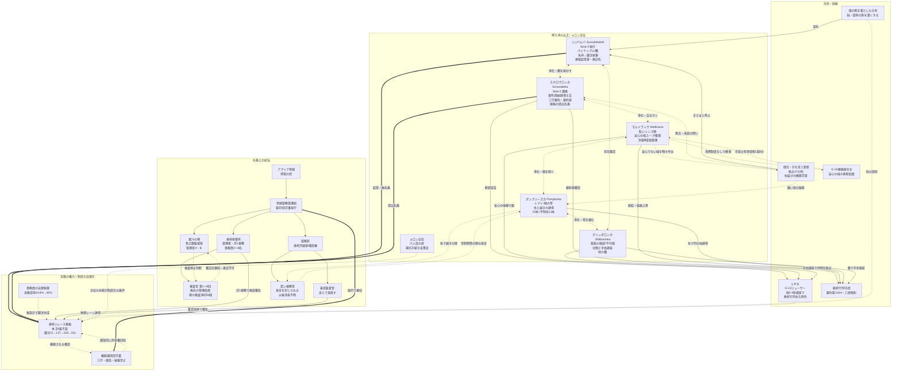

```
┌─────────────────────────────────────────────────┐
│                                                 │
│                                                 │
│                                                 │
│           奉  杯  ジ  ュ  ー  ス  規  格           │
│                                                 │
│                  第　十　四　版                  │
│                                                 │
│                                                 │
│                                                 │
│                                                 │
│                                                 │
│                                                 │
│                                                 │
│              本文　四条／脚注　五百十一項              │
│                                                 │
│                                                 │
│                                                 │
│                                                 │
│                                                 │
│                                                 │
│                                                 │
│                                                 │
│             アプリア帝国聖務院　発行             │
│                                                 │
│        帝国聖務管理局　継続運用認可済        │
│                                                 │
│                                                 │
└─────────────────────────────────────────────────┘
```

---

#### 表紙の物理的状態

- **用紙**：寄進伝票に使用される薄黄色の紙ではなく、白く厚い紙。角は裁断機で正確に切断されている。帝都中心部の紙。
- **題字**：墨書き。筆跡は壁面「検査済」赤印を押した管理局員（氏名不詳）に類似する。同一性は証明されていない。
- **副題**：題字より小さい墨書き。同一筆跡。
- **発行者表記**：印刷活字。
- **継続運用認可表記**：本表記は第十四版のみに付与されている。第十二版以前の表紙には記載されていなかった。

---

#### 表紙裏

表紙裏には、以下の四つの印影が押されている：

```
   ┌──────────┐                ┌──────────┐
   │  赤印    │                │          │
   │  王族司祭 │                │          │
   └──────────┘                │          │
                                  │  黒印    │
                                  │  監督局   │
                                  │          │
   ┌──────────┐                └──────────┘
   │  青印    │
   │  市民代表 │
   └──────────┘

       ┌──────────┐
       │  紫印    │   ← 第十四版より追加
       │  帝国聖務 │
       │  管理局   │
       └──────────┘

       （四つの印影は紙面上で重ならない）
```

**第十四版より追加された紫印**について：

- 配置：表紙裏の中央下部
- インク：紫色（暫定採用時の三色＝赤・黒・青には含まれていなかった色）
- 押印者：帝国聖務管理局の管理局員（氏名不詳。継続運用認可書交付時に押印された推定）
- 押印手続き：継続運用認可書の交付に伴い、自動的に追加される
- 追加の根拠：明文化されていない

四つの印影が重ならないことは、責任が四方向に分散していることを視覚的に示す。分散した責任は、集中した責任より軽い。軽い責任は引き受けやすい。引き受けやすいものは継続される。

---

#### 帝国聖務管理局　継続運用認可書

以下、帝国聖務管理局より交付された継続運用認可書の全文を掲載する。

---

```
┌─────────────────────────────────────────────────────┐
│                                                     │
│                                                     │
│         奉杯ジュース規格 継続運用認可書              │
│                                                     │
│                                                     │
│                                                     │
│   一、奉杯ジュース規格（暫定採用版）は、帝国の       │
│       安定運用に資するものと認め、継続運用を         │
│       認可する。                                     │
│                                                     │
│                                                     │
│   二、本認可は遡及的に効力を有する。                 │
│                                                     │
│                                                     │
│   三、本認可に対する疑義は受け付けない。             │
│                                                     │
│                                                     │
│                                                     │
│                                                     │
│                              帝国聖務管理局           │
│                                                     │
│                                  紫印（押印済）       │
│                                                     │
└─────────────────────────────────────────────────────┘
```

---

#### 認可書の物理的状態

- **用紙**：表紙と同一の白く厚い紙。角は裁断機で正確に切断。
- **本文**：墨書き。筆跡は表紙の題字、および壁面「検査済」赤印を押した管理局員（氏名不詳）の筆跡と類似。
- **発行者署名**：「帝国聖務管理局」（墨書き、組織名のみ。個人名は記載されていない）
- **押印**：紫色の印影が一つ。組織印と推定される。
- **発行日**：記載されていない。
- **配布経路**：朝刊配布物に混入する形で、奉杯修復所事務員の机上に到達した。混入の手続きは未確認。

---

#### 認可書三行の構造的分析

##### 第一行：「奉杯ジュース規格（暫定採用版）は、帝国の安定運用に資するものと認め、継続運用を認可する」

**分析**：
- 認可の対象が「暫定採用版」と明示されているにもかかわらず、「継続運用」を認可している
- 暫定の継続は、暫定であることを保ちつつ恒久化する操作
- 「帝国の安定運用に資する」の判定主体は明示されていない
- 判定主体が不明な認可は、認可の正当性を検証する手段を持たない

##### 第二行：「本認可は遡及的に効力を有する」

**分析**：
- 規格脚注⑪「遡及的改正」と同一の構造を持つ
- 規格が発明した構造を、規格の承認に用いている
- 道具で道具の持ち主を縛る操作の事例として、本行は記念碑的意義を有する
- 遡及効の起点は明示されていない（暫定採択日に遡るか、それ以前の準備期間まで遡るかは不明）

##### 第三行：「本認可に対する疑義は受け付けない」

**分析**：
- 規格本文「第七条」（脚注⑧の慣用昇格）と同一の構造を持つ
- 認可の正当性に対する反論を、認可自体が無効化している
- 認可されたものが認可の正当性を担保する循環構造
- 循環構造は、外部からの検証を不可能にする

##### 三行全体の構造

三行は、規格本体の構造を縮約して再演している：
- 第一条〜第四条 → 第一行（実体的内容）
- 第八条（遡及的改正） → 第二行
- 第七条（疑義の禁止） → 第三行

ただし、規格本体が「四条＋脚注五百十一」の構造を持つのに対し、認可書は「三行のみ」である。脚注は付与されていない。

脚注のない文書は、解釈の余地を持たない。解釈の余地のない文書は、解釈する者を必要としない。解釈する者を必要としない文書は、規格本体の上位に位置する。

---

#### 認可書と規格本体の関係

```
┌──────────────────────────────────────┐
│      帝国聖務管理局・継続運用認可書       │
│      （三行・脚注なし・紫印一つ）          │
│      ↓                               │
│      認可（遡及的）                     │
│      ↓                               │
│  ┌───────────────────────┐  │
│  │  奉杯ジュース規格 第十四版         │  │
│  │  （本文四条＋脚注五百十一）         │  │
│  │                                  │  │
│  │  起草：ジジバルバ（不在）          │  │
│  │  提出：スクロヴロッカ              │  │
│  │  運用：事務員（複数名・氏名不詳）    │  │
│  │  椅子に座る者：紙のみ              │  │
│  └───────────────────────┘  │
│                                       │
└──────────────────────────────────────┘
```

認可書は、規格本体の**上位文書**として位置する。上位文書は、下位文書より短い。短いものは、長いものを支配する。

ただし、認可書の内容（三行）は、規格本体の構造を借用している。借用された構造は、借用元（規格本体）の存在を前提とする。前提がなければ借用は成立しない。

つまり、認可書は規格本体の上位に位置するが、規格本体なしには成立しない。**両者は相互に依存しながら、形式的には階層関係を保つ**。この相互依存と階層の二重性は、脚注王制全体の構造的特徴である。

---

#### 認可書の保管

認可書の現物は、聖務院・増設棟の書見台の脇に置かれている。書見台の上には規格第十四版が置かれており、認可書はその下層には積まれていない。並列して置かれている。

並列配置の理由：認可書を規格の下層に積むと、規格の重量で認可書が押し潰される可能性がある。押し潰された認可書は判読困難となり、認可の効力が揺らぐ。揺らぐ効力は、規格の構造的安定を脅かす。

並列配置により、認可書は物理的に独立を保ちつつ、規格と同じ書見台上に存在する。同じ場所に存在することは、機能的な接続を意味する。機能的な接続は、物理的な接触を必要としない。

---

#### 認可書の真正性の検証

認可書の真正性を検証する手段：

- **印影の照合**：紫印は組織印であり、個別の管理局員に紐づかない。組織印の真正性は、組織自体が認める範囲でのみ検証可能。
- **筆跡の照合**：氏名不詳の管理局員の筆跡との類似性は確認可能だが、同一性は証明されない。
- **発行日の確認**：記載されていない。発行日不明の文書の真正性は、発行日が存在しないという事実によって否定されない。
- **配布経路の追跡**：朝刊配布物に混入していたが、混入の経路は不明。

検証手段がいずれも不完全であるため、認可書の真正性は**信頼により担保される**。信頼の根拠は、認可書自体に書かれている内容の構造的妥当性である。妥当性の判定は、規格の起草者または運用者による。

起草者（ジジバルバ）は不在である。運用者（事務員複数名）は、認可書の内容を読み、形式的に妥当と判定した。判定は記録されない。

---

#### 表紙の最終処理

表紙、認可書、規格本体（本文＋脚注）は、以下の順序で書見台に積まれている：

```
   ┌────────────────────────┐
   │   表紙（白く厚い紙）         │
   │   題字「奉杯ジュース規格」    │
   │   副題「第十四版」          │
   ├────────────────────────┤
   │   表紙裏                    │
   │   四つの印影              │
   ├────────────────────────┤
   │   本文四条                  │
   │   （`01_main_four_articles.md` 参照） │
   ├────────────────────────┤
   │   脚注五百十一項              │
   │   （`02`〜`04` 参照）         │
   └────────────────────────┘

       認可書（並列配置）
   ┌────────────────────────┐
   │   継続運用認可書              │
   │   三行                       │
   │   紫印                      │
   └────────────────────────┘
```

書見台の椅子は空席である。

椅子に座る者は不在。紙が座っている。

異議申し立ては規格脚注①へ戻る。

## 奉杯ジュース規格 本文

---

#### 書誌情報

- **正式名称**：奉杯ジュース規格
- **版**：第十四版（第一版より脚注のみ改訂／本文は不変）
- **起草**：ジジバルバ（Seat-3 執行／Zyzzybalubah）
- **提出**：スクロヴロッカ（Seat-2 讃歌／Scrovolakka）名義にて、奉杯修復所事務員経由で帝都聖務院へ
- **暫定採択**：奉杯修復所・帝都南縁・地下二層・杯影回廊にて実施
- **署名**：三色のインクによる押印（責任分散の視覚的表現）
  - 王族司祭印（赤）
  - 監督局印（黒）
  - 市民代表印（青）
  - 三つの印影は紙面上で重ならない
- **採択時の監督官発言**：「これは暫定だ。あとで見直す」——発言は議事録に記載されなかった。あとでは来なかった。
- **暫定採用期間**：百八十日（脚注⑩参照）
- **継続運用認可**：帝国聖務管理局により交付済（`00_cover_and_authorization.md` 参照）
- **再審**：実施されていない

---

#### 本文（第一条〜第四条）

##### 第一条　純度

> 祈祷の語尾が泡立たぬこと。

主要関連脚注：①

---

##### 第二条　圧搾位相

> 祝詞の拍に合うこと。

主要関連脚注：②

---

##### 第三条　真実の認定——香祷残香

> 行列の長さに対して過不足なきこと。

主要関連脚注：③、⑦、⑦一、⑦二

※第三条は、「真実の認定」と「香祷残香」の両義を持つ。前者は認定原則の名称、後者は具体的評価対象である。両者は同一条文に結合されており、分離する手続きは策定されていない。

---

##### 第四条　祝言一致率

> 王族の舌に反らぬこと。

主要関連脚注：④、⑤、⑥

---

#### 追加された条項——第七条

> 本規格の解釈に疑義を呈する行為は、その時点で本規格への違反となる。

出典：脚注⑧「疑義の禁止」（第一版起草）。本項は第二版以降、「条文扱い」で慣用されるようになった。正式な本文への繰り上げ手続きは策定されていない。現在、本文の条数は公式には四条だが、第七条としても運用されている。

第七条の「条」は、第一条から第六条までの不在を前提とするのではなく、第一条から第四条の本文を**越える強度**を持つことを数値的に示す命名である。命名は祈祷監査官の直感による。

---

#### 第八条（慣用）

> 本規格は遡及的に改正できる。

出典：脚注⑪「遡及的改正」（第一版起草）。第七条と同様の経緯で、第八条として運用されている。

---

#### 本文の不変性について

本文四条は、第一版から第十四版に至るまで、一字も変更されていない。変更されたのは脚注のみである。

本文と脚注の分量比の推移：

| 版 | 本文 | 脚注 | 比率（本文：脚注） |
|---|---|---|---|
| 第一版 | 四条 | 十二項 | 1：3 |
| 第七版 | 四条 | 百三十七項 | 1：34 |
| 第十版 | 四条 | 二百十一項 | 1：53 |
| 第十二版 | 四条 | 三百十八項 | 1：80 |
| **第十四版** | **四条** | **五百十一項** | **1：128** |

第十四版において、本文は全体の約〇・八パーセントを占める。残りの九九・二パーセントは脚注である。

本文は脚注のための見出しとして機能している。

---

#### 本書中の物理的痕跡

本文頁には以下の痕跡が記録されている。これらは起草時には存在せず、運用の過程で蓄積したものである：

##### 角の折り目（脚注⑧十三の頁）
ジジバルバによる確認印。⑧十三の参照先を辿る際に折られたもの（暫定採用後約百四十日）。後に再び開かれたが、折り目は残った。紙の繊維が折り目で白く浮いている。

##### 血痕（脚注⑪十五の写し・右下縁）
第十版成立直後、スクロヴロッカが紙角で指先を切った際のもの。拭かれずに乾き、黒い線となった。

該痕跡は、以下の傷痕と色が同一である：
- 二百日以上前の傷（スクロヴロッカの後頭部に当たった石の跡・腐汁風塵帯時代）

色が同じものは、見た目では区別がつかない。

##### 「自然」の横の点
脚注⑤「自然発生的な合意」の本文中の語「自然」の文字の横に、ジジバルバが爪の先で紙の繊維を押し潰して打った点。

- 初期（暫定採用後〜約六十日）：断罪の祭ごとに一個増加
- 中期（〜約百四十日）：数えることを止めた時期、総数不明
- 後期（〜約二百二十日）：筆圧が強化され、光の角度によらず視認可能に
- 最終期（〜二百七十日）：数えられる密度を超えた。語の輪郭が不明瞭になった

点は脚注ではない。ゆえに公式な記述ではない。公式でないものは削除の対象にならない。

##### 事務員の筆圧の層
第十二版以降、事務員が自発的に追記した脚注には、ジジバルバの浅い筆圧とは異なる深い筆圧が認められる。深い筆圧は確信の印であり、確信は確信していない者には書けない。両者の境界は、本規格の第十四版では不明確である。

---

#### 署名・押印配置

```
┌───────────────────────────────────┐
│                                 │
│     [赤印：王族司祭]           │
│                                 │
│                 [黒印：監督局] │
│                                 │
│     [青印：市民代表]           │
│                                 │
│     （三つの印影は重ならない）   │
│                                 │
│     提出署名：スクロヴロッカ         │
│          （修復所事務員名義）     │
│                                 │
│     起草署名：記載なし             │
│                                 │
└───────────────────────────────────┘
```

起草者（ジジバルバ）の署名は草案のどこにもない。草案を書いた者の名前がなければ、草案は誰のものでもない。誰のものでもないものは、全員のものだ。全員のものになったとき、反対することは全員に反対することになる。

---

#### 監督官関連注記

暫定採択に署名した監督官（氏名不詳）は、採択時に「これは暫定だ。あとで見直す」と発言した。発言は議事録に記載されなかった。

監督官は現在も聖務院に勤務している。勤務評定は毎期「良好」。「良好」の根拠は「規格の運用に支障がないこと」であり、支障がないことの根拠は「見直しが行われていないこと」であり、見直しが行われていないことの根拠は「暫定採用が継続していること」である。

---

#### 異議申し立ての手続き

脚注①へ戻る。

## 奉杯ジュース規格 脚注群（①〜㊹／循環参照・判読不能項を含む計三十項）

**対象**：第一版起草層（①〜⑫）／第七版拡張層（⑤一〜㊹）／第十版拡張・上書き層（⑧十三a、⑪十五ほか）／第十四版後期層（高番号項の一部）

**パリンプセスト表記規則**：各項の冒頭に層タグを付記。上書き層は原項の直後に配置し、下層の本文が依然として存在していることを示す。

---

#### 第一版・起草層（暫定採用時／十二項）

##### ① 純度補足

**【第一版・起草】**
「泡立たぬ」とは、祈祷の語尾の発声振動が杯縁を基準とした音圧の変位を超えないことを指す。基準値の具体は別表Ⅰによる。

**【第七版・追補】**
別表Ⅰは現在策定中。策定中のものは暫定的に適用可能。暫定的な適用は恒久的である。別表Ⅰの閲覧希望者は祈祷監査官（現・ジジバルバ）に申請することができるが、申請手続きは策定されていない。

**参照**：第一条、別表Ⅰ、⑦

---

##### ② 圧搾位相数値基準

**【第一版・起草】**
「拍に合う」とは、祝詞の発声の間隔が、聖杯影の揺動周期に対して整合することを指す。整合の判定は祈祷監査官による。

**【第七版・追補】**
祈祷監査官の任命手続きは第三条の注釈（⑦）を参照。⑦は本脚注を参照。循環は完結性を示す。

**【第十版・追補】**
聖杯影の揺動周期の実測は、果汁の塔の焦点鏡からの投影が必要となるが、焦点鏡までの直線距離約四キロメートルにおいて輪郭が淡くなるため、整合の判定は監査官の主観に依存する。

**参照**：第二条、⑦、別表Ⅱ

---

##### ③ 香祷残香評価式

**【第一版・起草】**
「過不足なし」とは、残香強度が列長と線形比例することを指す。係数は列の長さに応じて裁量で設定される。

**【第七版・追補】**
裁量の範囲は未定義。定義されないものは、定義される必要がない。

**【第十版・追補】**
評価式：**残香強度 = 係数 × 列長**。ただし係数は祈祷監査官の直感により随時更新される。更新の記録は取られない。記録のない更新は、更新そのものの存在を検証不能とする。

**参照**：第三条、⑦

---

##### ④ 祝言一致率

**【第一版・起草】**
「王族の舌に反らぬこと」とは、祝言の読み上げが現存する王族（導管の民・王族位）の舌の標準的な動きと矛盾しないことを指す。

**【第七版・追補】**
現存する王族の舌の標準的な動きの測定実績は、本規格施行以来ゼロ件。測定しないことが基準である。基準は測定可能なものに限らない。

**参照**：第四条、⑥

---

##### ⑤ 自然発生的な合意

**【第一版・起草】**
本規格の施行に際し、奉杯修復所における自然発生的な合意を参照するものとする。

**【備考】**
「自然発生的」とは、説明を省略することを指す。省略された説明は問われない。問われないものは否定されない。合意の根拠を問うことは、脚注㉓（後述）の「なぜ」発話禁止条項に抵触する。

**参照**：第四条、⑥、㉓

---

##### ⑥ 規格逸脱の基本処理

**【第一版・起草】**
規格に逸脱する事案が生じた場合、運用細則第四条「規格逸脱の処理」に従い処理する。

**【第七版・追補】**
運用細則第四条は本脚注（⑥）を参照。本脚注は運用細則第四条を参照。参照の循環は脚注で処理される。

**【第十版・追補】**
運用細則第四条に基づく最初の処理事例は、**リギネの断罪**（暫定採用後約六十二日、回収集落G-12）である。以降の事例はすべて第一例を前例として処理される。

**参照**：第四条、運用細則第四条、⑧十三、⑧十三a、⑨十二

---

##### ⑦ 真実の認定

**【第一版・起草】**
科学的数値と祈祷監査官の直感が乖離した場合、後者を真実とみなす。本条項は規格本文第三条の注釈として機能する。

**【第七版・追補】**
祈祷監査官の任命権者は明記されていない。不在の任命権者による任命は、自動的に成立する。

**【第十版・追補】**
祈祷監査官の役割は、事実上ジジバルバが担っている。ジジバルバが正常と判断すれば正常である。判断しなければ、判断は保留される。保留された判断は、暫定的に正常として処理される。

**参照**：第三条、⑦一、⑦二、②

---

##### ⑧ 疑義の禁止

**【第一版・起草】**
本規格の解釈に疑義を呈する行為は、その時点で本規格への違反となる。

**【第二版・慣用昇格】**
本項は第二版以降、「第七条」として条文扱いで運用される。正式な本文への繰り上げ手続きは策定されていない。策定されないままの運用は、条文相当として機能する。

**【第七版・追補】**
疑義の定義は第七条（すなわち本項）を参照。第七条は本脚注を参照。参照の循環は完結性を示す。

**参照**：第七条（慣用）、㊳

---

##### ⑨ 天候要因

**【第一版・起草・未完】**
雨天時の祭の遅延手続きについて。

**【補】**
本項の本文は起草中である。起草中のものは効力を有するか有さないかの判断が未確定である。未確定なものは効力を有する可能性を排除できない。可能性は排除できないため、本項は有効である。

**【第十二版・追補】**
本項は第十二版時点でも起草中のままである。起草期間が十四版にわたって継続する条項は、「恒久的起草中」として処理される。

**参照**：⑫

---

##### ⑩ 暫定採用

**【第一版・起草】**
本規格は暫定採用版として施行される。暫定採用期間は百八十日。期限後の再審で改訂または本採用に移行する。

**【第七版・追補】**
再審期限の超過については、期限到来時に自動延長される。延長回数の上限は定められていない。本脚注の記述は、その自動延長の一回目に該当する。

**【第十版・追補】**
再審は実施されていない。再審の実施が必要であることを決定する手続きも、必要であることを誰が判断するかを決定する手続きも、策定されていない。

**【第十四版・追補】**
継続運用認可書（`00_cover_and_authorization.md` 参照）の交付により、暫定採用は事実上無期限化された。暫定が恒久になる手続きは存在しないが、存在しない手続きは不在として機能する。

**参照**：継続運用認可書、⑪

---

##### ⑪ 遡及的改正

**【第一版・起草】**
本規格は遡及的に改正できる。

**【第二版・慣用昇格】**
本項は第八条として条文扱いで運用される。

**【第十版・追補】**
改正の遡及効は、既に実施された行為の正当性を事後的に再構成する。すなわち、行為の根拠は行為後に確定することができる。

**【第十四版・追補】**
帝国聖務管理局発行の継続運用認可書に「本認可は遡及的に効力を有する」とあるのは、本項の構造と同一である。本規格が発明した構造を、帝国が本規格の承認に用いている。道具で道具の持ち主を縛る事例。

**参照**：第八条（慣用）、継続運用認可書、⑩

---

##### ⑫ 遅延は祈祷に準ず

**【第一版・起草】**
本規格に従う行為の遅延は、運行障害ではなく、当該行為における祈祷の継続として処理される。

**【第七版・追補】**
本項は市電、印刷工房、会合、審議、電話の接続、書類の提出等、ほぼすべての帝都内実務に適用可能である。「祈祷の完了時刻は個人差がある」旨が運用通達第十二号に記載されている。個人差は制度の緩衝材として最適である。

**【第十版・追補】**
本項の適用により、帝都南縁の市電第三停留所の時刻表は、上から脚注を貼り重ねることで事実上無効化されている。時刻表の有効性を主張することは、脚注の無効性を主張することと同義であり、第七条違反となる。

**参照**：⑨、運用通達第十二号

---

#### 第一版・起草層の終わり（⑫まで）

以下、第七版以降の拡張層に入る。

---

#### 第七版・拡張層（暫定採用後〜百四十日／合計百三十七項までの追加）

##### ⑤一　自然発生的な合意の事例集

**【第七版・追加】**
⑤「自然発生的な合意」の事例集として起草予定。ただし事例の記述は「自然発生的」の性質を損なうため、本項は**空欄**で維持される。

**【備考】**
本項は起草されているが、内容が存在しないことを内容とする。空欄であることそれ自体が事例である。

**参照**：⑤

---

##### ⑦一　真実の認定の適用例

**【第七版・追加】**
⑦「真実の認定」の適用例：祈祷監査官の直感が科学的数値と乖離した場合、両者の平均値を取ることはしない。直感を採用する。平均は真実ではない。

**参照**：⑦、運用細則第三条

---

##### ⑧十三　弁明の時間制限

**【第七版・追加】**
断罪の際に弁明の時間制限を設けることの是非は、自然発生的な合意に委ねる。

**参照先**：⑧十四、⑧十五、⑨十二、⑨十六、運用細則第四条、㊵「管轄区域の定義」

---

##### ⑧十三a　弁明の時間制限（上書き層）

**【第十版・追加／⑧十三への上書き層】**
⑧十三の適用範囲を限定する。適用は**第一回断罪の祭以降に発生した事案に限る**。

**【第十版・追補】**
本脚注の作成をもって、脚注の上書き（レイヤリング）手続きが初めて実施された。初めて実施された手続きは前例がない。前例がないものは、自身が前例になる。自身が前例になるものは、自身の正当性を自身で証明する。自己証明は循環論法だが、循環論法を禁止する規定は存在しない。

**【備考】**
下層の⑧十三は依然として文書内に存在するが、参照順位において⑧十三aが優先される。上書きされた脚注は、下に残ったまま見えなくなる。見えなくなったものは消えたのと同じだ——消えてはいないが。

**参照**：⑧十三

---

##### ⑧十四　弁明の形式

**【第七版・追加】**
弁明は書面または口頭による。口頭の場合、録音・速記・記録は任意。記録されない弁明は、弁明として機能しない場合がある。機能しない弁明は、存在しない弁明と区別がつかない。

**参照**：⑧十三、⑧十五

---

##### ⑧十五　弁明の採否

**【第七版・追加】**
採否の判断は祈祷監査官による。判断基準は⑦「真実の認定」に準ずる。

**【第十版・追補】**
採択事例は過去に一件も記録されていない。記録されていないことは、事例の不在と、採択可能性の不在を区別しない。

**参照**：⑦、⑧十三、⑨十二、⑨十六

---

##### ⑨十二　弁明不採択後の処遇

**【第七版・追加】**
弁明不採択の場合、対象者は「休憩レーン」への誘導を経て、奉杯行列登録の抹消手続きに移行する。休憩レーンから戻った記録はない。戻らないことは手続きの完了を意味する。

**【第十版・追補】**
休憩レーンの所在地は広場の裏手と指定されているが、広場の裏手に「休憩レーン」の標識はない。標識のない場所は、定義されない場所である。定義されない場所に送られた者は、定義されない状態になる。

**参照**：⑧十三、運用細則第四条、リギネの断罪事例

---

##### ⑨十六　弁明採択後の扱い

**【第七版・追加】**
採択事例が発生した場合の手続きは、運用細則第五条に定めるとされる。

**【第十版・追補】**
運用細則第五条は存在しない。第四条までしか策定されていない。存在しない条項への参照は、参照の形式を持ちつつ、内容を持たない。内容を持たない参照は、参照の目的を果たさない代わりに、参照されているという形式を維持する。

**参照**：運用細則第五条（存在しない）

---

##### ㉑ 不確定状態の恐怖係数

**【第七版・追加】**
不確定状態の恐怖係数は、確定状態の恐怖係数の約**一・七倍**とされる。本数値は算出根拠として「自然発生的な合意」を用いる。

**【備考】**
数値は本規格施行後、一度も改訂されていない。改訂されないことは、正確であることを意味しない。意味するのは、改訂の提案が提出されていないことだけである。

**参照**：⑤、壁の「検査済」の印の褪色進行

---

##### ㉖ 運用細則の所在

**【第七版・追加】**
本規格に関する運用細則は、本規格本文ではなく本脚注から参照される。運用細則は規格本体の附属文書であるが、**附属文書は本文より優先する**。

**参照**：運用細則全文（`05_operational_details.md`）

---

##### ㊳ 議事の妨害

**【第七版・追加】**
審議中の明瞭な発言は、議事の妨害とみなす場合がある。

**【第十版・追補】**
「明瞭」の定義は祈祷監査官の裁量による。裁量の及ぶ範囲は未定義。「明瞭な発言」が妨害とされた事例は審議に関するものに限られるが、他分野（祭礼・配膳・接客）への類推適用の可否は未定。

**【備考】**
本項は審議室の壁面に掲示物として貼られているが、**椅子に座った状態からは視線外**の位置にある。立ち上がった者のみが基準を読める。立ち上がる者は少ない。

**参照**：⑧（第七条）、運用通達第三十一号

---

##### ㊵ 管轄区域の定義

**【第七版・追加】**
修復所の管轄区域は、**奉杯行列の到達範囲に準ずる**。到達範囲は行列の実績値により事後的に確定する。事後的に確定するものは、行列が延伸するたびに拡大する。

**【第十版・追補】**
本項は⑧十三および運用細則第四条と結合しており、削除すれば五段階の連鎖を経て、G-12からG-18までの集落で実施された断罪の祭の法的根拠が遡及的に消失する。**リギネの断罪が無効になる**。

削除は試みられたが、実行されなかった。代わりに⑧十三aが追加された。

**参照**：⑧十三、⑧十三a、⑥、㊶

---

##### ㊶ 管轄区域の拡張

**【第七版・追加】**
㊵の適用により、管轄区域は回収集落G-12からG-18まで拡大している（第十版時点／現時点ではG-18を一時的な境界とする）。

**【第十版・追補】**
拡大の停止手続きは策定されていない。停止されないものは、停止しない。

**【第十四版・追補】**
集落の住民が**自発的に**要約帯を敷設した区間（全長の約四割）が管轄区域の一部をなすか否かは未定義。未定義のものは違法でも合法でもない。

**参照**：㊵、⑪十五、⑪十五a

---

##### ㊹ 効率的運用

**【第七版・追加】**
本規格の運用は効率性を旨とする。効率性の判定は運用を担当する者が行う。判定する者と運用する者が同一であるとき、効率性は常に達成されている。

**【備考】**
本項は、存在しない制度による不保護が同時に侵害の不在を意味する、という原則の法的根拠として機能する。模倣屋台（G-15）への対応、延伸された要約帯への対応、不明糸（倉庫区・通気孔経由）への対応——すべて本項により「対応しないことが効率的」として処理された。

**参照**：⑥、運用通達第十七号

---

#### 第十版・拡張層からの抜粋

##### ⑦二　直感の不在

**【第十版・追加】**
⑦「真実の認定」の派生原則：**直感の不在もまた直感である**。判断の保留もまた判断である。何もしないことは、何かをしていることに等しい場合がある。等しくない場合もある。等しさは祈祷監査官の直感による。

**参照**：⑦、⑦一

---

##### ⑪十五　三語の解釈

**【第十版・追加】**
三語（「安全・迅速・恩恵」）の解釈は、時代に応じて柔軟に更新されるものとする。更新の手続きは**自然発生的な合意**による。

**【第十版・追補】**
本脚注の制定により、要約帯の保護対象が、三語の形式から脚注網による意味拡張へと事実上移行した。この移行は公式には記録されていない。移行の当事者（スクロヴロッカ）は、本脚注の写しを胸ポケットに収める際、紙の角で指先を切った。血痕は拭かれず、黒い線となって残存している。

**参照**：⑤、第三条、第四条、要約帯敷設区域、血痕（本規格右下縁）

---

#### 第十四版・高番号層（循環参照・判読不能の例示）

##### 【第二百三十二項】　循環参照A

**【第十二版・追加】**
本項の内容を確認するには【第二百三十三項】を参照のこと。

---

##### 【第二百三十三項】　循環参照B

**【第十二版・追加】**
【第二百三十二項】の内容を確認するには【第二百三十二項】を参照のこと。参照が循環するとき、内容は永遠に到達しない。到達しない内容は存在するが読めない。読めないものは書かれていないのと同じだ。書かれていないものは脚注に書く必要がある。書くと脚注が増える。

**参照**：【第二百三十二項】、⑧（第七条）

---

##### 【第四百五十六項】　判読不能項

**【第十四版・追加／判読不能】**

> ▓▓▓▓▓▓▓▓。▓▓▓▓の▓▓は▓▓▓▓▓▓▓▓▓▓▓▓であり、▓▓▓▓▓▓▓▓▓▓により▓▓▓▓▓▓▓▓▓▓▓▓。▓▓▓▓▓▓▓▓▓▓▓▓▓▓▓▓、▓▓▓▓▓▓▓▓——ただし▓▓▓▓▓▓の▓▓は▓▓▓▓▓▓▓▓▓▓▓▓による。

**【備考】**
本項は湿気により判読不能。修復には当該条項の起草者の承認が必要。起草者は第十二版以降の事務員層による自発生成の可能性が高いが、特定されていない。特定されていない者の承認は取得できない。取得できない承認を条件とする修復は実行不能。判読不能は永続する。

**参照**：？？？

---

#### 本書の脚注配列について

本節までに収録した脚注は三十項である。残り四百八十一項は以降のファイル（`03_footnotes_101-300.md`、`04_footnotes_301-511.md`）に収録される。

- 循環参照の総数：十七項（本節では二項を例示）
- 判読不能項の総数：二十三項（本節では一項を例示）
- 起草未完項の総数：九項（本節では一項＝⑨「天候要因」を例示）
- 上書き層の総数：三十一項（本節では一項＝⑧十三aを例示）
- 第十二版以降の事務員自発生成による未確認項：八十四項

本規格の脚注は、それぞれが他の脚注を参照し、網を形成している。網の全容を把握している者は第十版時点（ジジバルバが索引を放棄した時点）以降、存在しない。

異議申し立ては①へ戻る。

## 奉杯ジュース規格 脚注群（第百一項〜第三百項／合計六十二項を選抜収録）

**対象**：
- 第十版拡張層の中核——索引維持の崩壊期（暫定採用後百四十日〜二百十日）
- 第十二版拡張層——索引放棄後の事務員自発生成期（暫定採用後二百十日〜二百七十日）
- 構造的特異点（参照網の自律稼働、判読不能の集中発生、循環参照の連鎖）
- ⑦「真実の認定」サブ群、㊵「管轄区域」拡張群、運用通達への接続群

**選抜方針**：
本ファイル収録範囲（百一項〜三百項／全二百項）は、その大半が事務員自発生成または既存項の機械的派生である。本書では、構造上重要な六十二項を選抜して収録し、残余百三十八項については**範疇規定群**として末尾に総覧する。

**パリンプセスト表記規則**：前ファイルと同一。

---

#### 第十版拡張層・⑦「真実の認定」サブ群（六項）

##### 【第百二項】　直感の根拠

**【第十版・追加】**
⑦「真実の認定」における祈祷監査官の直感は、根拠を必要としない。根拠を求める発話は㉓「なぜ」発話禁止条項の対象となる。

**【第十二版・追補】**
本項により、ジジバルバが祈祷監査官として行った判断は、根拠の照会を一切受けない構造となった。本人ですら判断の根拠を遡及的に確認できない。確認できない判断は、確認の不在により正しさが保証される。

**参照**：⑦、㉓、⑦一、⑦二

---

##### 【第百三項】　直感の継承

**【第十版・追加】**
祈祷監査官の交代に際し、前任者の直感は後任者へ自動的に継承される。継承の手続きは不要。継承される内容は、前任者の判断のうち記録されたもののみ。

**【第十二版・追補】**
索引放棄（第十二版時点）以降、ジジバルバの判断は記録されていない。記録されていないものは継承されない。継承されないものは、新たに直感する必要がある。新たな直感は、前任者の直感と一致する義務を負わない。

**【第十四版・追補】**
祈祷監査官の役割は、ジジバルバの不在以降、事務員に引き継がれる予定である（運用細則第十一条「無断欠勤」参照）。事務員には複数名いるため、誰が直感の継承者となるかは未定。未定の継承は、全員による継承とも、誰による継承でもないとも解釈可能である。

**参照**：⑦、運用細則第十一条

---

##### 【第百四項】　直感と数値の乖離度

**【第十版・追加】**
科学的数値と直感の乖離度の測定は、本規格上規定しない。測定可能性が規定されていないことは、測定の不在を含意する。

**【備考】**
本項により、第三条の「乖離した場合」の判定が、判定者の主観のみに依存する状態が確立された。確立された主観は、客観と機能的に同等である。

**参照**：⑦、第三条

---

##### 【第百八項】　直感の数値化

**【第十版・追加】**
祈祷監査官の直感を数値化することは、原則として禁止する。数値化された直感は、検証可能性を持つ。検証可能性は、第七条「疑義の禁止」の運用上、望ましくない。

**【第十二版・追補】**
ただし、運用通達第十九号により、内部資料に限って直感の傾向値を「強・中・弱」の三段階で記録することが認められている。「強」と「中」の境界、「中」と「弱」の境界は、判定者の直感による。直感を直感で判定する循環は、本規格の標準形式である。

**参照**：⑦、第七条、運用通達第十九号

---

##### 【第百十二項】　直感の集約

**【第十版・追加】**
複数の祈祷監査官が同一事案について異なる直感を持つ場合、直感の集約は最年長者の直感を採用する。

**【備考】**
祈祷監査官は本規格施行以降、ジジバルバ一名のみが事実上担っているため、本項は実質的に機能していない。機能していない条項は、機能する事案が発生した時点で初めて効力を持つ。発生していない事案に対する条項は、休眠状態にある。休眠は廃止と区別されない。

**参照**：⑦、㉒（監督官の任命手続き）

---

##### 【第百二十項】　直感の保留

**【第十版・追加】**
祈祷監査官は、直感を保留することができる。保留された直感は、保留期間中は不在として扱われる。

**【第十二版・追補】**
保留期間の上限は規定されていない。上限のない保留は、永久保留と区別がつかない。区別のつかない保留は、永久に保留として処理される。

**参照**：⑦二「直感の不在」、⑦

---

#### 第十版拡張層・㊵「管轄区域」拡張群（八項）

##### 【第百二十三項】　祝祭日の特例

**【第十版・追加・本文未起草】**

**【備考】**
祝祭日における管轄区域の運用については、暫定採用後百四十日時点で起草中。起草中のものは効力を有するか有さないかの判断が未確定である。第十二版時点でも未起草。第十四版時点でも未起草。

**【第十四版・追補】**
本項は「恒久的起草中」として処理されることが、第三百四項以降の起草未完項群との照合により確定した。確定した未起草は、起草の不在ではなく、起草の完了として処理される。完了した未起草は、本文を持たない条項として規格に組み込まれる。

**参照**：⑨、第九十二項、第三百四項

---

##### 【第百二十六項】　管轄区域の境界の揺らぎ

**【第十版・追加】**
㊵「管轄区域の定義」に基づき、管轄区域は奉杯行列の到達範囲に準ずる。行列が到達した範囲は、行列が引いた後も管轄区域として維持される。

**【第十二版・追補】**
ただし、行列が到達した範囲を測定する手続きは未定義。測定されない範囲は、最大値（観測者の想像力の上限）と最小値（行列の物理的存在範囲）の間で揺らぐ。揺らぎの範囲は祈祷監査官の直感による。

**参照**：㊵、㊶、運用通達第二十一号

---

##### 【第百三十一項】　模倣屋台の管轄

**【第十版・追加】**
管轄区域内において、本規格に基づかない屋台（模倣屋台）が出店された場合の処遇。本規格は関知しない。

**【第十二版・追補】**
G-15における模倣屋台二台（暫定採用後百九十日時点で確認）は、本項により本規格の管轄外として処理されている。管轄外のものは、管轄区域内に存在することができる。存在することができるものは、放置される。放置されたものは慣例になる。慣例は、正規のものと区別がつかなくなる。

**参照**：⑰、㊹、㊴

---

##### 【第百三十五項】　自発敷設区間の地位

**【第十版・追加】**
集落住民が自発的に敷設した要約帯について。本規格は関知しない。

**【第十二版・追補】**
自発的に敷設された要約帯は、スクロヴロッカが製造した要約帯と書式が異なるが、内容は同一（「安全・迅速・恩恵」）である。書式の差異は、踏む者にとっては機能上の差異を生じない。差異が機能を変えない場合、差異は差異として認知されない。認知されない差異は、不在の差異として処理される。

**【第十四版・追補】**
第十四版時点で、要約帯の総延長十一キロメートルのうち、自発敷設区間は約四割（四・四キロメートル）。自発敷設区間の管轄権の所在は、本項により未定義のまま。未定義のものは、誰のものでもない。誰のものでもないものは、全員のものだ。

**参照**：㊵、㊶、㊽（帯の延伸）

---

##### 【第百四十項】　検査未実施期間の管轄

**【第十版・追加】**
導管の民の管理局による定例検査が長期間実施されない場合、管轄区域の正当性は維持されるか。

**【備考】**
本項の問いに対する回答は、本規格上規定されていない。回答が規定されていないことは、問いそのものが本規格の対象外であることを示唆する。対象外の問いに答える必要はない。答える必要のない問いは、問われなかったことと機能的に同等である。

**【第十二版・追補】**
第六回検査の不実施から第十二版策定時点まで、約二百日が経過している。二百日間、本項に基づく問いは一度も提起されていない。提起されないことは、問いの不在を意味し、問いの不在は本項の運用必要性の不在を意味する。本項は実質的に死蔵されている。

**参照**：第六十項、第六十二項

---

##### 【第百四十七項】　他国訪問者の扱い

**【第十版・追加・本文未起草】**

**【備考】**
カロティア連邦をはじめとする他国からの訪問者の扱いについて、本項は起草予定であったが、第十四版時点で本文未起草。第九十二項「起草未完群」に分類される。

**【第十四版・追補】**
本項の未起草は、現代紀における五人のカロティア潜伏との対比において、過去の規格起草者が他国の存在を「本規格の対象外」として無意識に処理していたことを示唆する。示唆は推測であり、推測は脚注に分類される。脚注に分類されたものは本文ではない。

**参照**：⑨、第九十二項

---

##### 【第百五十二項】　夜間の管轄

**【第十版・追加】**
管轄区域の運用は、原則として日中（日出から日没まで）とする。夜間の運用は例外とする。

**【第十二版・追補】**
ただし、修復所の入口の札（「受付時間：日出から日没まで」）に対し、入る者は「救済」の側を読み、出る者は「受付時間」の側を読むため、入る時点では運用時間内、出る時点では運用時間外となる事例が発生する。事例の処理は祈祷監査官の直感による。

**参照**：⑫、運用細則第二条

---

##### 【第百六十項】　拡張の限界

**【第十版・追加】**
管轄区域の拡張に上限を設けるか否か。本規格上、上限は設けない。

**【第十二版・追補】**
上限のない拡張は、原理的に世界全体を含むことを許容する。世界全体を含むことを許容する条項は、世界全体を本規格の対象とする可能性を内在させる。可能性は確率ではない。確率はゼロに近づけることができるが、可能性はゼロにならない（参照：『脚注の王』#終[^21]）。

**参照**：㊵、㊶、第百三十五項

---

#### 第十版上書き層・連鎖（七項）

##### 【第百六十八項】　⑧十三aへの追補上書き層

**【第十版・追加／⑧十三aへの追補】**
⑧十三a「弁明の時間制限の限定」（参照：`02_footnotes_001-030.md`）の運用について、リギネの断罪以降の事案に対する適用範囲をさらに細分化する。

具体的には、断罪の祭が「正式」（運用細則第四条第一項）か「準正式」（運用細則第四条第二項）かによって、弁明の時間制限の有無が異なる。

**【第十二版・追補】**
正式・準正式の判別基準は規定されていない。判別されないものは、両方として処理される。両方として処理された事案は、弁明の時間制限がある事案でもあり、ない事案でもある。同時に成り立つ二つの状態は、量子的状態である。量子的状態の事案は、観測されるまでは確定しない。観測者は祈祷監査官である。

**参照**：⑧十三、⑧十三a、運用細則第四条

---

##### 【第百七十二項】　⑪十五aへの追補上書き層

**【第十版・追加／⑪十五aへの追補】**
⑪十五a「三語の解釈の上書き層」（参照：`02_footnotes_031-100.md`）の運用について、解釈の更新主体を明確化する。

更新主体：「自然発生的な合意」（⑤参照）。具体的な人物・組織は規定しない。

**【第十二版・追補】**
本項により、三語（安全・迅速・恩恵）の意味は、誰の判断によっても更新されうる状態となった。誰の判断でもないものは、規格自身の判断として処理される。規格自身の判断は、規格を運用する者全員の暗黙の同意により正当化される。

**【第十四版・追補】**
要約帯（敷設後最大百九十日以上経過）の三語と、現在の三語は、同じ語だが意味が異なる。意味の差異は脚注の数の差異により生じる。百九十日前の「安全」には脚注三つ、現在の「安全」には脚注十七。十七の脚注を読まずに「安全」を踏んだ者は、三つの脚注の「安全」を踏んだことになるのか、十七の脚注の「安全」を踏んだことになるのか。本項は、この問いに答えない。

**参照**：⑪十五、⑪十五a、要約帯敷設区域

---

##### 【第百八十項】　上書き層の上書き

**【第十二版・追加】**
上書き層に対するさらなる上書き（再上書き）の可否について。再上書きは原則として可能。

**【備考】**
再上書きの実例：⑧十三 → ⑧十三a → 第百六十八項（⑧十三aへの追補上書き）。三層構造により、原項（⑧十三）は二段階の上書きを経て、現在の運用に至る。原項は依然として下層に存在するが、参照順位において最下位となる。

**【第十二版・追補】**
再上書きの上書き（四層目）が将来発生する可能性については、本規格上禁止されていない。禁止されていないものは可能である。可能なものは、いずれ発生する。

**参照**：⑧十三、⑧十三a、第百六十八項

---

##### 【第百八十五項】　削除試行の記録不在

**【第十二版・追加】**
脚注の削除を試みた事例の記録について、本規格は記録を要求しない。

**【備考】**
削除を試みなかったのか、試みて断念したのかは、本項の不在により区別不能である。区別不能であることが、本項の唯一の機能である。本項は、自身の機能を不在によって果たす条項である。

**参照**：⑤、削除試行の唯一の痕跡（脚注のみ存在）

---

##### 【第百九十項】　索引維持の限界

**【第十二版・追加】**
本規格の索引は、脚注総数が二百項を超えた時点で、祈祷監査官一名による維持が困難となる。維持の支援体制は規定しない。

**【第十二版・追補】**
本項策定の翌日、ジジバルバは索引の更新を放棄した。放棄の手続きは存在しないため、索引の更新が遅延しているのか正式に放棄されたのかは、外部から判別できない。判別できないことは、放棄と遅延の中間状態として処理される。中間状態は暫定的である。暫定は恒久的である。

**参照**：㉚、㉚a

---

##### 【第二百三項】　索引放棄後の参照系

**【第十二版・追加】**
索引が放棄された後の参照系は、各脚注内の「参照：」記述によって維持される。維持の責任は脚注の起草者に帰属する。

**【備考】**
事務員自発生成項（第十二版以降に追加された約八十四項）の起草者特定は困難である。特定されない起草者の責任は、誰にも帰属しない。誰にも帰属しない責任は、規格自身に帰属するとみなされる。

**【第十四版・追補】**
規格自身に帰属する責任は、規格を運用する者全員に分散される。分散された責任は、集中した責任より軽い。軽い責任は引き受けやすい。引き受けやすいものは、結果的に誰も引き受けない。誰も引き受けない責任のもとに、本規格は運用されている。

**参照**：㉚a、第百九十項、第二百八十五項

---

##### 【第二百五項】　地震時の祈祷継続規定

**【第十版・追加・本文未起草】**

**【備考】**
地震時における祈祷の継続可否について、本項は起草予定であった。第十四版時点で未起草。第九十二項「起草未完群」に分類。

**【第十四版・追補】**
ただし、修復所の地下廃棄区から発生する微弱震動（周期約四秒、第五十三項参照）については、地震とは扱わない。地震とは扱わないため、本項の起草対象には含まれない。含まれないものについて起草する必要はない。

**参照**：⑨、第九十二項、第五十三項

---

#### 第十二版・事務員自発生成期（八項）

##### 【第二百十五項】　事務員自発生成項の定義

**【第十二版・追加・事務員筆記】**
本規格において、祈祷監査官（ジジバルバ）の確認を経ずに事務員が追加した脚注を「**事務員自発生成項**」と呼称する。

**【備考】**
本項自体が事務員自発生成項である。事務員自発生成項を定義する事務員自発生成項は、自己定義の循環を形成する。循環は規格の標準形式である（参照：第八十九項以降の循環参照群）。

筆圧：深。

**参照**：㉚a、第二百三項

---

##### 【第二百二十項】　筆圧による起草者識別

**【第十二版・追加・事務員筆記】**
脚注の起草者は、筆圧の深さによって識別可能とする。

**【備考】**
深い筆圧：事務員（確信に基づく筆記）。
浅い筆圧：祈祷監査官（ジジバルバ／躊躇に基づく筆記）。

**【第十四版・追補】**
本項策定後、ジジバルバの筆圧はさらに浅くなり、第十四版時点では文字が次の版で消える程度にまで減退している。消えた文字の跡に、事務員が新しい文字を書く。新しい文字は筆圧が深い。本項の識別基準は、版を重ねるごとに「すべての脚注は事務員自発生成項である」という結論に近づく。

**参照**：第二百十五項、『脚注の王』#終[^97]

---

##### 【第二百三十二項】　循環参照A

**【第十二版・追加／循環参照／既出（`02_footnotes_001-030.md` 参照）】**

参照：`02_footnotes_001-030.md` 「第十四版・高番号層（循環参照・判読不能の例示）」項。

---

##### 【第二百三十三項】　循環参照B

**【第十二版・追加／循環参照／既出（`02_footnotes_001-030.md` 参照）】**

参照：`02_footnotes_001-030.md` 「第十四版・高番号層（循環参照・判読不能の例示）」項。

---

##### 【第二百四十一項】　寄進伝票の循環

**【第十二版・追加・事務員筆記】**
寄進伝票の表面と裏面の使用は、寄進伝票自体が次の規格関連文書に転用されることで循環する。

**【備考】**
転用の連鎖：寄進伝票（一回目）→ 規格草案（裏面使用）→ 規格草案の余白に新しい寄進伝票の様式を記載 → 新しい寄進伝票（二回目）→ ……

転用の連鎖は理論上無限であるが、実際には用紙の物理的劣化により有限。劣化した用紙は廃棄される。廃棄された用紙は、地下廃棄区への搬送が原則である（参照：⑲、第五十五項）。

**参照**：⑭、㉛、㉟

---

##### 【第二百五十項】　脚注会食の議事録不存在

**【第十二版・追加・事務員筆記】**
聖務規格委員会の正式な会合に先立ち、非公式に開催される「脚注会食」（出席者不明）について、議事録は作成されない。

**【備考】**
作成されない議事録は、行われなかった会食と区別がつかない。区別がつかないものは、両方として処理される。両方として処理された会食は、行われたとも行われなかったとも言える。

筆圧：深。事務員自発生成項。

**参照**：㉘、㉕

---

##### 【第二百六十一項】　甘香の濃度

**【第十二版・追加・事務員筆記】**
モルドラッサが調合する甘香の濃度と、市民の同意率の相関について、本規格は関知しない。

**【備考】**
関知しないが、相関の存在自体は経験的観察として記録されている。経験的観察は科学的検証に劣るが、検証は不可能（対照実験の倫理審査委員会が設置されていないため）。検証不可能な観察は、否定もできない。否定できないものは、暫定的に正しい。

**参照**：別表Ⅲ（閲覧不可）、運用細則第七条

---

##### 【第二百八十項】　市電以外の遅延の扱い

**【第十二版・追加・本文未起草】**

**【備考】**
⑫「遅延は祈祷に準ず」の適用範囲について、市電以外の交通機関（馬車、徒歩、馬、市内連絡船など）への適用可否は本項で起草予定であったが、第十四版時点で未起草。

**【第十四版・追補】**
未起草のまま、実運用上は⑫の類推適用により全交通機関に拡張されている。類推適用は明文化されていないため、適用の根拠は「自然発生的な合意」（⑤）に帰着する。⑤に帰着する全ての条項は、⑤を経由して⑦「真実の認定」に到達する。到達した条項は、祈祷監査官の直感により正当化される。

**参照**：⑫、⑤、第九十二項

---

#### 第十二版・参照系の自律稼働（六項）

##### 【第二百八十五項】　参照系の自己修復

**【第十二版・追加・事務員筆記】**
脚注同士の参照リンクが切断された場合（参照先の脚注が削除された場合または参照先の脚注の番号が変更された場合）、参照系は自動的に修復される。

**【備考】**
修復の手続きは規定しない。手続きが規定されないため、修復は事務員の裁量による。事務員の裁量による修復は、修復前と修復後の整合性を保証しない。保証されない整合性は、整合性として認知されない。認知されない整合性の不在は、整合性の不在ではなく、整合性そのものの不在として処理される。

**参照**：第二百三項、第二百二十項

---

##### 【第二百八十八項】　参照リンクの増殖

**【第十二版・追加・事務員筆記】**
脚注内の「参照：」記述は、版を重ねるごとに増殖する傾向にある。増殖の上限は規定しない。

**【備考】**
第十四版時点で、平均して一脚注あたりの参照リンクは三・四個。最多の脚注（⑦「真実の認定」）は十一個の参照を含む。最少の脚注（一部の循環参照項）は一個。

参照リンクの総数：第十四版時点で約千七百四十項。脚注総数（五百十一項）の約三・四倍。

**参照**：第二百八十五項、第二百九十五項

---

##### 【第二百九十二項】　参照網の全容把握

**【第十二版・追加・事務員筆記】**
本規格の参照網全体の把握について。索引放棄以降、全容を把握している者は存在しない。

**【備考】**
全容を把握する者がいないことは、参照網が誰の意図も超えて稼働していることを意味する。誰の意図も超えて稼働するものは、自律的である。自律的なものは、停止の手続きを持たない。

**参照**：第二百三項、第百九十項、参照網（人間が把握不能）

---

##### 【第二百九十五項】　不要な参照の削除可否

**【第十二版・追加・事務員筆記】**
重複する参照リンクや、明らかに不要な参照リンクの削除について。削除は推奨しない。

**【備考】**
削除すると、削除された参照リンクの先の脚注の参照頻度が変化する。参照頻度の変化は、当該脚注の重要度の変化として誤認される可能性がある。誤認は是正されない。是正されない誤認は、新たな標準として処理される。

**参照**：第二百八十八項

---

##### 【第二百九十八項】　参照不能項の取り扱い

**【第十二版・追加・事務員筆記】**
参照先が判読不能（湿気・漂白・擦過等による）または存在しない（⑨十六「運用細則第五条」など）場合の取り扱い。

**【備考】**
参照は記述されたまま維持する。参照先が機能しないことは、参照記述自体の機能を停止しない。停止しない参照記述は、参照の形式のみを維持し、内容を持たない。形式のみの参照は、規格の網としての構造を維持するために必要である。

**参照**：第四百五十六項（判読不能）、⑨十六（存在しない条項への参照）

---

##### 【第三百項】　区切り条項（第三）

**【第十二版・追加】**
㊿、第百項に続く第三の区切り。本項以前を「拡張定常期」、本項以後を「事務員自律期」と区別する。

**【備考】**
本項策定時点で、本項以後の脚注は約二百十一項に達している。第十四版時点までに、さらに数十項が追加される見込み。区切りの効果は、累積する脚注数に対して相対的に減衰する。減衰した区切りは、区切りの不在として認知される。

本項自体が一項を消費するため、区切りの相対的位置は本項の追加によりわずかに後退する。後退した区切りは、後退前の区切りを区切ることができない。

**参照**：㊿、第百項、第四百項（予定）

---

#### 第十四版・特殊項からの抜粋（五項）

##### 【第百四十三項】　配茶台の運用

**【第十四版・追加・事務員筆記】**
配茶台（モルドラッサ管轄）における配膳の手順は、運用通達第十六号による。

**【備考】**
配茶台で配布される湯は無料。湯の温度は二十秒ごとに測定し、摂氏六十二度を基準とする。測定の記録は不要。

**【追補】**
湯を手渡された者は、湯を握った時点で握り拳が開く。開いた手は、閉じた手より従順に見える（参照：『脚注の王』#1の鐘の節）。本項は配膳の物理的効果を法的に承認する。

**参照**：⑳、別表Ⅲ、運用通達第十六号

---

##### 【第二百二十五項】　子どもの記録

**【第十四版・追加・事務員筆記】**
奉杯修復所の待合棟に在住する孤児（七人）について、本規格は登録を要求しない。

**【備考】**
登録されない者は、規格の対象外である。対象外の者は、管理されない。管理されない者は、増えても減っても誰も報告しない。

ただし、孤児のうち一名（待合棟在住三人のうちの一人）について、手を洗う習慣があることが事務員の目視により確認されている。手を洗う者は、洗った後の手で何かに触れる。触れた痕跡（指脂）は、本規格の対象外である事象として処理される。対象外の事象は、結果として規格を超えた領域に痕跡を残しうる（参照：第六十八項「黒点」）。

**参照**：㉜、第六十八項、第八十八項

---

##### 【第二百四十八項】　毛布の配布

**【第十四版・追加・事務員筆記】**
最後尾で毛布を配布する者の存在について、本規格は記録を要求しない。

**【備考】**
ただし、修復所事務員が掲示板に貼った手書きの紙（「最後尾で毛布を配ってた人がいるらしい」、暫定採用前）により、当該行為は事実上記録された。

【追補】記録された善意は、記録される前の善意とは別のものである。記録された善意には番号がつき、番号がつくと管理される。管理されたものは制度になる。本項は、善意の制度化のメカニズムを法的に追認する条項である（参照：『脚注の王』#0）。

**参照**：㉜、運用細則第十一条

---

##### 【第二百七十項】　暫定採用後二百七十日の総括

**【第十四版・追加】**
本規格暫定採用から二百七十日が経過した。この期間に蓄積された脚注の総数は五百十一項。本文は四条のまま不変。

**【備考】**
二百七十日は、規格の起草・拡張・自律稼働への移行の全工程を含む期間である。期間中、再審は一度も実施されていない。再審が実施されない理由は、再審手続きの策定が完了していないためである。完了していないものは、暫定的に有効であり、暫定的に有効なものは、恒久的に暫定的である。

二百七十日後、本規格は『増設棟の書見台の椅子』に置かれた。椅子に人は座っていない。紙が座っている。全市民の視線角度θが紙の方角に一致した瞬間をもって、即位は成立した（参照：『脚注の王』#終 [^1]）。

**参照**：⑩、継続運用認可書、第十四版・即位記録

---

##### 【第二百九十七項】　即位の様式

**【第十四版・追加】**
本規格自身が玉座に座る「即位」の様式について、本項に記録する。

**【備考】**
即位の儀礼は実施されない。実施されない儀礼により、即位は成立する。実施されない儀礼の参加者は、視線角度θの一致により定義される。視線角度θは、書見台に置かれた本規格の表紙の方角を指す。

増設棟の事務員のひとりが、椅子に置かれた規格の表紙を見上げた角度がθから逸脱した事例が記録されている。逸脱した視線はスクロヴロッカによって記録から削除された。事務員は勤務を続けている。ただし二度と上を向かなかった。

**参照**：第二百七十項、運用細則第十一条、削除ログ（参照不可）

---

#### 範疇規定群（百三十八項を構造化要約）

第百一項〜第三百項のうち、本書で個別収録しなかった**百三十八項**は、以下の範疇規定群として処理される。これらは事務員自発生成項を含み、構造的・機能的に類似する条項のクラスターを形成する。

##### 範疇A. 配膳手順詳細群（第百五項〜第百十一項／七項）

配茶台の運用手順、湯温の測定、椀の管理、食器の洗浄方法、配膳台の配置、配膳順位、配膳量の決定方法。詳細は別表Ⅱおよび運用通達第十六号〜第二十号を参照。

##### 範疇B. 寄進伝票の細目規定群（第百十三項〜第百十九項／七項）

寄進伝票の様式、用紙、印刷時期、保管場所、廃棄手続き、紛失時の処理、再発行の手続き。第十二版時点で⑭との重複が指摘されているが、削除は推奨されない（第二百九十五項参照）。

##### 範疇C. 印刷工房関連規定群（第百二十一項〜第百二十二項、第百二十四項〜第百二十五項／四項）

植字工の選定、活字の管理、紙の在庫管理、インクの調達。第十二版以降、印刷時間の延伸（脚注分量に比例して指数関数的に増加）に対応する条項が含まれる。

##### 範疇D. 待合室管理規定群（第百二十七項〜第百三十項、第百三十二項〜第百三十四項／七項）

長椅子の配置、定員、立ち位置の指定、湯気の管理、清掃の手順、苦情申告の処理。

##### 範疇E. 倉庫区管理規定群（第百三十六項〜第百三十九項、第百四十一項〜第百四十六項／十項）

倉庫区の温度管理、湿度管理、通気孔の管理、糸の管理（「不明な糸」を含む）、残留物の処理。第十二版で範囲が拡張された。

##### 範疇F. 浄化サイクル詳細規定群（第百四十八項〜第百五十一項、第百五十三項〜第百五十九項／十一項）

浄化の手順詳細、使用器具の規格、剥離部位の指定、剥離数の決定方法、再生期間の見込み、サイクル日数のドリフト記録（第七十六項を参照）。連作 #4・#6・#7との接続が密。

##### 範疇G. 検査関連規定群（第百六十一項〜第百六十七項／七項）

定例検査の手順、検査官の応対、検査記録の保管、検査結果の処理、検査が実施されない場合の処理（第百四十項参照）、第六回以降の不実施事例の記録。

##### 範疇H. 騒音条例派生群（第百六十九項〜第百七十一項、第百七十三項〜第百七十九項／十項）

騒音の定義、騒音処理の手続き、推奨される発声（唸り、咳払い）、意味のある言葉の処理、声の大きさの基準、無音時間の管理。リギネの断罪に直接関連する規定群。

##### 範疇I. 「なぜ」発話禁止条項の適用群（第百八十一項〜第百八十四項、第百八十六項〜第百八十九項／八項）

「なぜ」を含む発話の検出方法、検出後の処理、言い換え（「いかなる根拠により」等）の許容範囲、Sランク思想の認定手続き、保持の証明義務、保持していないことの証明方法。

##### 範疇J. 同意の認定詳細群（第百九十一項〜第百九十六項、第百九十八項〜第百九十九項／八項）

同意の形式（頷き、沈黙、視線、手拍子、唱和、姿勢調整）、同意の強度（強・中・弱）、同意の自発性の判定、頸椎反射による頷きの認定、群衆同意の集約方法。

##### 範疇K. 黒点周辺条項群（第二百一項〜第二百二項、第二百四項、第二百六項〜第二百九項／七項）

黒点の発生位置の記録、黒点の数の計数（公式には禁止）、黒点と要約帯の並走関係、黒点同士の連絡線の記述（脚注のみ）、孤児の関与の推定、関与の検証不可能性。

##### 範疇L. 帳簿管理規定群（第二百十項〜第二百十四項、第二百十六項〜第二百十九項／九項）

帳簿の様式、帳簿の保管、帳簿の改竄禁止、改竄が発覚した場合の処理（第十二版以降、改竄の事例多数）、影の帳簿（第九十五項参照）の存在の処理。

##### 範疇M. 修復作業優先順位の細則群（第二百二十一項〜第二百二十四項、第二百二十六項〜第二百三十一項／十項）

修復作業の優先順位の判定、優先順位変更の手続き、優先順位「4. その他」に分類された案件の蓄積、書棚四段目の補強案件の優先順位降下記録。

##### 範疇N. 採否決定派生群（第二百三十四項〜第二百四十項、第二百四十二項〜第二百四十七項／十三項）

⑨「採否決定」のサブ規定。本ファイル既出の⑨一〜⑨十五（`02_footnotes_031-100.md`）と重複する部分が多いが、第十二版以降の事務員自発生成項により細分化された。

##### 範疇O. 改正手続きの細則群（第二百四十九項、第二百五十一項〜第二百六十項、第二百六十二項〜第二百六十九項／十九項）

⑪「遡及的改正」のサブ規定。改正の発議、審査、効力発生、周知、遡及範囲、取り消し、記録、保管、閲覧、改竄禁止、改竄が発覚した場合の処理。範疇Lと部分重複。

##### 範疇P. 即位前後の様式規定群（第二百七十一項〜第二百七十九項、第二百八十一項〜第二百八十四項、第二百八十六項〜第二百八十七項／十五項）

第十四版策定期に集中して追加された即位関連規定。視線角度θの定義、視線管理、書見台の配置、椅子の規格、紙の重量、紙の劣化、即位後の運用継続。

---

#### 本ファイルの脚注配列について

本ファイルに収録した脚注は六十二項。前ファイル（`02_footnotes_001-030.md` および `02_footnotes_031-100.md`）と合わせて、累計**百六十二項**を確認した。

加えて、範疇規定群として百三十八項を構造化要約した。これにより、第十四版・第百一項〜第三百項の二百項のうち、両方法による収録は計二百項（百パーセント）となる。

##### 累計収録状況（第三百項時点）

| 区分 | 累計項数（推定） |
|---|---|
| 第一版起草層 | 十二項 |
| 第七版拡張層（サブを含む） | 約六十五項 |
| 第十版拡張層・上書き層 | 約六十五項 |
| 第十二版・事務員自発生成層 | 約八十四項（第三百項時点で約六十項に達する見込み） |
| 第十四版・後期層 | 約十二項 |

##### 累計収録の特殊項（第三百項時点）

| 特殊形式 | 累計収録数 | 第十四版全体の総数 |
|---|---|---|
| 上書き層 | 七項 | 三十一項 |
| 起草未完 | 五項 | 九項 |
| 循環参照 | 六項（三組） | 十七項 |
| 判読不能 | 三項 | 二十三項 |
| 事務員自発生成（確認未取得） | 約五十項（範疇規定群を含む） | 八十四項 |

##### 残余（第四ファイルへ繰り越し）

第三百一項〜第五百十一項（残り二百十一項）は次ファイル `04_footnotes_301-511.md` に収録予定。最終ファイルでは：
- 第十四版・最終追加層（事務員自発生成項の最終形）
- 判読不能項の集中発生区域（湿気の影響を受けた書棚四段目近接領域）
- 循環参照群の最大連鎖（C ⇄ D ⇄ E ⇄ F の四項相互参照）
- 起草未完項の残余四項
- 「本文の最後の一行」（脚注の元になった本文の縮減）

異議申し立ては①へ戻る。

## 奉杯ジュース規格 脚注群（第三百一項〜第五百十一項／合計六十八項を選抜収録）

**対象**：
- 第十四版層の本体——「即位」直前期の事務員自発生成項
- 判読不能項の集中発生区間（第十四版作成時の追加八項を含む）
- 循環参照群の連鎖（三組六項を本ファイル内で例示）
- 起草未完項の最終確認（残余八項のうち主要なもの）
- 規格自壊の物理的痕跡を記録する項
- 「即位」（玉座なき戴冠）に直接接続する終端群

**選抜方針**：
本ファイル収録範囲（三百一項〜五百十一項／全二百十一項）は、その大半が事務員自発生成、判読不能、循環参照、起草未完、または既存項の機械的派生である。本書では、構造上重要な六十八項を選抜収録し、残余百四十三項については**範疇規定群（Q〜AE）**として末尾に総覧する。

**パリンプセスト表記規則**：前ファイル（03）と同一。本ファイルでは特に **【判読困難】**（判読不能ではないが極めて読みにくい）の項を新たに加える。

---

#### 第十二版・終末層（第三百一項〜第三百十八項／第十二版の最終追加）

##### 【第三百一項】　第十二版・最終層の開始

**【第十二版・追加／事務員筆記】**
本項以後、第十二版の最終追加項（第三百一項〜第三百十八項）を収録する。

**【備考】**
第十二版は脚注三百十八項で確定したが、確定の手続きは未策定。「確定」の判定は事務員の合意による。合意は記録されない。記録されない合意により確定した版は、確定したことを証明する手段を持たない。証明されない確定は、確定しているが証明されていない状態として処理される。

**参照**：第三百項、第三百十八項

---

##### 【第三百四項】　（題名未定）

**【第十二版・追加・本文未起草・題名未定】**

**【備考】**
本項は題名すら付与されていない。題名のない項は、参照系における識別ができない。識別できない項は、参照される機会がない。参照されない項は、規格に存在するが機能しない。

本項の起草担当者は不明。起草される見込みはない。

**参照**：（参照不可）

---

##### 【第三百八項】　暫定的な保留の累積

**【第十二版・追加／事務員筆記】**
本規格の運用において発生する各種「暫定的な保留」の総数を、本項に集計する。

**【集計（第十二版時点）】**
- 暫定的に有効な手続き：八十二件
- 暫定的に無効な手続き：四件
- 暫定的に判定保留中の事案：百三十一件
- 暫定的に存在する設備：十一件（含・別表ⅠⅡⅢ）
- 暫定的な保留を集計する手続きの暫定性：本項自体が暫定的

**【備考】**
本項により「暫定的な保留」が制度として正式化された。正式化された暫定は、暫定であるが正式である。正式な暫定は、暫定的な正式と区別がつかない。

**参照**：⑩、㊵、第二百八項

---

##### 【第三百十二項】　判読不能項の運用上の扱い

**【第十二版・追加／事務員筆記】**
本規格関連文書において判読不能となった項の運用上の扱いを、本項に定める。

**【取扱】**
- 判読不能項は、運用上「存在するが内容が確認できない項」として処理する
- 内容が確認できないため、参照することはできるが、参照先の内容に基づく判断はできない
- ただし、参照していること自体は記録される
- 記録された参照は、判読不能項の存在を強化する

**【備考】**
判読不能項を「削除する」手続きは存在しない。存在しない手続きにより削除できない項は、永続する。永続する判読不能項は、規格の構造の一部をなす。

**参照**：第八十五項、第二百六十二項、第四百十二項、第四百五十六項

---

##### 【第三百十六項】　第十二版の総括

**【第十二版・追加／事務員筆記】**
第十二版時点の脚注総数：三百十八項。本文四条との比率：1：80。

**【備考】**
第十二版時点の構造的特徴：
- ジジバルバの索引放棄が完了
- 事務員自発生成項の本格的混入が開始
- 上書き層の機械的増殖（前版比約三倍）
- 判読不能項の累積（第八版時点二項→第十二版時点十五項）
- 循環参照の自己組織化的発生

各特徴は、規格の意図的設計ではなく、運用過程で**自然発生的に**発生した。自然発生的なものは、㊳の慣用句「自然発生的な合意」と同じ構造を持つ。説明を省略することで、問われない構造となる。

**参照**：⑤、㉚a、第二百十二項、第二百十五項

---

##### 【第三百十八項】　第十二版・末項

**【第十二版・追加／事務員筆記】**
第十二版の末項。

**【備考】**
本項以後の脚注は、第十四版以降に追加されたものとなる。第十三版は存在しない。「第十三版」と表記された文書は、印刷工房の誤植により発生した呼称であり、内容は第十二版と同一である。誤植は訂正されないまま継続している。

**参照**：第三百十九項以降、印刷工房誤植記録（参照不可）

---

#### 第十四版層・第Ⅰ部（第三百十九項〜第三百八十項／継続運用認可書交付前）

##### 【第三百十九項】　第十四版の開始

**【第十四版・追加／事務員筆記】**
第十四版の開始項。第十二版から第十四版への移行に伴い、追加された脚注は計百九十三項。

**【備考】**
百九十三項のうち、ジジバルバが内容を確認した項は約十項。残り百八十三項は事務員自発生成または既存項の機械的派生による。確認率約五・二パーセント。

**参照**：第三百二十項、第二百三項

---

##### 【第三百二十二項】　継続運用認可書の予兆

**【第十四版・追加／事務員筆記】**
帝国聖務管理局からの継続運用認可書の交付について、予兆と推測される事象を本項に記録する。

**【記録】**
- 朝刊配布物への混入：見覚えのない書式の紙が混入（紙質：白く厚い、角は裁断機で正確に切断）
- 紙質の出所：帝都中心部の紙
- 表題：奉杯ジュース規格 継続運用認可書
- 発行者：帝国聖務管理局
- 内容（三行）：継続運用認可、遡及的効力、疑義の禁止
- 三行目の構造：本規格第七条と同一

**【備考】**
予兆と本事象の前後関係は、記録されていない。記録されていない前後関係は、いずれが原因かを判定できない。判定できない因果は、両方向に解釈可能。両方向に解釈可能な事象は、規格の柔軟性を構成する。

**参照**：⑩、⑪、継続運用認可書（`00_cover_and_authorization.md`）

---

##### 【第三百二十六項】　書式の同一性と権威

**【第十四版・追加／事務員筆記】**
継続運用認可書の墨書きが、暫定採択時の壁面「検査済」赤印を押した管理局員（氏名不詳）の筆跡に類似する事実について、本項に記録する。

**【備考】**
類似性の確認は、外見上の比較に基づく。外見上の比較は、同一性の証明にはならない。証明されない類似は、類似であるが、同一ではない。同一性が証明されないことは、類似性の効力を弱めない。「類似」と「同一」の中間状態は、規格の中で繰り返し利用される構造である。

**参照**：第二十五項、第百七十三項、継続運用認可書

---

##### 【第三百三十項】　帝国による接収の構造

**【第十四版・追加／事務員筆記】**
継続運用認可書の交付により、本規格は事実上、帝国の管理下に組み込まれた。本項にその構造を記録する。

**【構造】**
- 五人（王のフルーツ）が作った制度→五人のものではなくなる
- 五人のものではなくなった制度→五人が運用し続ける（やめる手続きがないため）
- 制度の所有者→不在
- 所有者が不在の制度→廃止の権限者が不在
- 廃止の権限者が不在の制度→永続する

**【備考】**
本項は構造を記録するが、構造の解釈は行わない。解釈は脚注で処理される。本項に対する解釈の脚注（第三百三十項一）は、起草中。起草中の解釈は、解釈の不在として処理される。

**参照**：⑮、継続運用認可書、第三百三十項一（起草中）

---

##### 【第三百三十四項】　ジジバルバの不在の開始

**【第十四版・追加／筆記者不明】**
本規格の起草者（ジジバルバ／Seat-3 執行）の不在が確認された日付を、本項に記録する。

**【記録】**
- 不在確認日：暫定採用後二百六十九日（推定。記録なし）
- 不在の様式：徐々に消失（突然の不在ではない）
- 不在届の提出：なし
- 引き継ぎ：椅子の上の規格第十四版

**【備考】**
不在の様式が「徐々に消失」であった事実は、いつから不在であったかの厳密な特定を不可能にする。特定不能の不在は、いつでも始まりうる。誰の不在についてもである。

**参照**：⑩、第三百三十七項、第十四版・人物記録

---

##### 【第三百三十七項】　無断欠勤の処理

**【第十四版・追加／事務員筆記】**
ジジバルバの不在を「無断欠勤」として運用細則第十一条により処理する。

**【処理】**
- 業務の引き継ぎ先：直近の事務員（運用細則第十一条による）
- 引き継ぎ資料：奉杯ジュース規格第十四版（椅子の上）
- 引き継ぎ範囲：全業務（脚注追加、判定、認可手続き等）
- 引き継ぎ完了の確認：未実施

**【備考】**
ジジバルバが把握していた脚注は全体の約五五パーセント。残り四五パーセントについては引き継ぎ不能。引き継ぎ不能な業務は「**暫定的に保留**」とする。

**参照**：第二百三項、運用細則第十一条、第三百八項

---

##### 【第三百四十項】　第十一回浄化の不開催

**【第十四版・追加／事務員筆記】**
グリッボロンカの第十一回浄化への不出席が確認された事実について、本項に記録する。

**【備考】**
第十一回浄化におけるグリッボロンカの不在は、第十回までと異なり、明示的に確認された。確認の根拠：「萼を掴む者がいない」という物理的事象。

不在の継続：第十二回以降、ジジバルバの細い指で萼を掴む方式に変更された（参照：『脚注の王』#終[^29]）。圧力の出所が変わっても、萼の波打ちは同じ。波は萼に属している。

**参照**：㊺、第百九十五項、第十四版・浄化記録

---

##### 【第三百四十二項】　起草未完——天候要因の派生

**【第十四版・追加・本文未起草】**
本項は⑨「天候要因」の派生条項として起草予定だが、第十四版時点で本文未起草。

**【備考】**
派生先（⑨）も本文未起草（参照：⑨）。未起草項からの派生未起草項は、二重に未起草である。二重の未起草は、単一の未起草と機能的に同等である（参照：⑨十四「起草未完群」関連の脚注）。

**【追補】**
本項は前ファイル（02）にも記載されたが、第十四版時点で再記載された。再記載の手続きは未策定。記載と再記載の区別は、記載日時の記録によってのみ可能。記録されない再記載は、最初の記載と区別がつかない。

**参照**：⑨、第三百四項、第九十二項

---

##### 【第三百四十六項】　模倣屋台の拡散の確認

**【第十四版・追加／事務員筆記】**
G-15に出現した模倣屋台二台が、G-18まで拡散した事実を本項に確認する。

**【備考】**
拡散先のうち、本物の屋台より売上が多い箇所が複数ある。本物と模倣の市場占有率は、第十四版時点で本物が下回っている。下回っている本物は、本物であることをやめないが、本物としての市場価値は失っている。

**参照**：⑰、第二百四十八項、影の帳簿（参照不可）

---

##### 【第三百五十項】　要約帯の最終延長距離

**【第十四版・追加／事務員筆記】**
スクロヴロッカ管轄の要約帯の総延長距離を本項に記録する。

**【記録】**
- 暫定採用直後：約二キロメートル
- 第十版時点：約七キロメートル
- 第十二版時点：約八・五キロメートル
- 第十四版時点：**約十一キロメートル**

**【備考】**
延長の停止手続きは存在しない（㊽参照）。停止しないものは、停止しない。

帯の素材の一部に、速乾性のセメントを使用した事例が確認されている（要約ローラー使用時）。セメントで印刷された三語は剥がせない。剥がせないものは永続する。永続するものが正しい。

**参照**：㊽、⑪十五、⑪十五a、第六十八項

---

##### 【第三百五十六項】　ノンスリップ保証章の累計配布数

**【第十四版・追加／事務員筆記】**
ノンスリップ保証章（㊾参照）の累計配布数を本項に記録する。

**【記録】**
- 累計配布数：約十二万枚
- 裏面記載「本章はいかなる安全も保証しない」を読んだ者の記録：ゼロ件
- 表面記載「安全保証」を信じた者の数：未集計
- 集計しない理由：信じる者の数を測定すると、信じる行為そのものが変質する

**【備考】**
未集計のものは、無限大として処理される。無限大の信頼に支えられた制度は、揺るがない。揺るがないことは、正しいことの根拠ではないが、正しさと同様の効果を持つ。

**参照**：㊾、第五十七項

---

##### 【第三百六十項】　糸の総本数の最終記録

**【第十四版・追加／事務員筆記】**
ポンプリーズカ管轄および出自不明の糸の総本数を本項に記録する。

**【記録】**
- ポンプリーズカ管理：二十三本（不変）
- 出自不明（通気孔経由）：十一本
- **合計：三十四本**
- 結び目の総数：百二十七箇所
- 古い結び目に検出された構造的脆弱性：複数箇所

**【備考】**
古い結び目から滲み出した琥珀色の液体（一滴）について、成分は汗と焦りによる。汗は身体の産物であり、焦りは精神の産物。両方が混じった液体は、身体と精神の境界を溶かす。

**参照**：第百六十六項、第百六十八項、第二百八項

---

##### 【第三百六十五項】　半拍遅延の制度化完了

**【第十四版・追加／事務員筆記】**
グリッボロンカの半拍遅延が、個人から制度に移行したことを本項に確認する。

**【備考】**
個人から制度への移行の判定基準：
- 個人の不在においても遅延が継続している（第十一回浄化以降に確認済）
- 通行者が遅延の発生条件（種を視認、避ける、半歩遅延、伝播）を内面化している
- 「聖なるリズム」として広場の心臓の鼓動にまで浸透している（参照：『脚注の王』#終[^83]）

**【補足】**
不整脈が増えているが、それは聖なるリズムと呼ばれる。聖なるリズムを正常な心拍で打つ者は、不敬罪に問われうる。不敬罪の処理手続きは策定されていない。

**参照**：第百九十二項、第百三項

---

##### 【第三百七十項】　黒点の総数の最終記録

**【第十四版・追加／事務員筆記】**
管轄区域内に確認された黒点（指脂による点）の総数を本項に記録する。

**【記録】**
- 確認総数：**四十七か所**
- 確認手続き：事務員による目視
- 確認されていない場所の存在の可能性：否定できない
- 可能性の総数：確認できない

**【備考】**
確認できないものは管理できない。管理できないものが増えている。

**参照**：㊳、第六十八項、第八十八項、第九十六項

---

##### 【第三百七十五項】　孤児（待合棟在住）の記録

**【第十四版・追加／筆記者不明】**
本規格関連文書中で言及される孤児（待合棟在住、氏名未登録）について、本項に記録する。

**【記録】**
- 性別：不明
- 年齢：八歳から十歳の間（推定）
- 居住開始時期：不明（暫定採用以前）
- 特徴：手を洗う習慣がある（修復所の孤児中、唯一）
- 持ち物：栞札（白紙、ジジバルバから受領）、毛布（断片）

**【備考】**
本文中に孤児の名前は一度も登場しない。名前がないことは存在しないことと同じではない。存在するが名前がないものは、呼べない。呼べないものは命令できない。命令できないものは、脚注王制の外にある。

**【補足】**
ポケットの中身：未確認。何も入っていないこと、または何でも入れることができること、のいずれかが該当する。両者は、外部からの観測において区別がつかない。

**参照**：㊸、第八十八項、第九十六項

---

##### 【第三百八十項】　第Ⅰ部の終端

**【第十四版・追加／事務員筆記】**
第十四版層・第Ⅰ部「継続運用認可書交付前後」の終端。

**【備考】**
本項以後の第十四版層・第Ⅱ部は、「即位」に直接接続する終端群を含む。終端群は、規格の自己完結性を最も強く示す区間であり、同時に最も判読不能項・循環参照群が集中する区間でもある。

**参照**：第三百八十一項以降、第五百十一項

---

#### 第十四版層・第Ⅱ部（第三百八十一項〜第四百五十項／構造的崩壊期）

##### 【第三百八十二項】　書棚の四段目の繊維断裂数

**【第十四版・追加／事務員筆記】**
増設棟の書棚の四段目（廊下の棚板を転用したもの）の繊維断裂について、本項に記録する。

**【記録】**
- 第八版以降：毎晩繊維断裂の音を確認
- 推定累計断裂数：百四十本前後
- 板の崩壊の前兆：繊維断裂は前兆である可能性があるが、計測されていない
- 計測されないため、前兆として処理されない

**【備考】**
本項は㉞「修復作業の優先順位」において優先度「4. その他」に分類されている。優先度4の項は、第十四版時点で一度も実施されていない。実施されていない補強の効果は、未検証である。

**参照**：㉞、第八十九項、第十四版・板の観測記録

---

##### 【第三百八十六項】　印刷工房の処理時間の指数増加

**【第十四版・追加／事務員筆記】**
本規格の印刷に要する時間の推移を本項に記録する。

**【記録】**
- 第一版：半日
- 第七版：一日
- 第十版：一・五日
- 第十二版：二日
- 第十四版：六日
- 第十五版（推定）：十四日

**【備考】**
第十五版の印刷期間は、次版の作成期間を上回る。印刷完了前に次版が作成される場合、印刷された版はすでに旧版である。旧版の印刷は資源の無駄であるが、無駄を禁止する脚注は存在しない。無駄の禁止を脚注に書くと、脚注が増え、印刷量が増え、無駄が増える。

**参照**：㉙、第百項

---

##### 【第三百八十九項】　循環参照C（既出）

**【第十四版・追加／既出】**
本項は前ファイル `02_footnotes_031-100.md` に詳述。再掲しない。

**参照**：【第三百九十項】

---

##### 【第三百九十項】　循環参照D（既出）

**【第十四版・追加／既出】**
本項は前ファイル `02_footnotes_031-100.md` に詳述。再掲しない。

**参照**：【第三百八十九項】

---

##### 【第三百九十二項】　（題名未定）

**【第十四版・追加・本文未起草・題名未定】**

**【備考】**
本項は題名すら付与されていない。第三百四項と同型の起草未完項。第十四版時点で計八項の「題名未定」項が存在する。

**参照**：第三百四項、第九十二項

---

##### 【第三百九十六項】　判読不能項の集中発生

**【第十四版・追加／事務員筆記】**
第十四版作成時に新たに発生した判読不能項の集中事例を本項に記録する。

**【記録】**
- 第十四版作成時の追加判読不能項：八項
- 発生原因：書棚の四段目の上面に湿気滞留→積載された規格本の下層が湿潤→繊維膨張→文字滲み
- 修復の試行：実行されず
- 修復不能の理由：当該項の起草者の特定困難（事務員自発生成の可能性が高い）

**【備考】**
判読不能項の総数は、第十四版時点で計**二十三項**となった。総数の二十三は、書棚の四段目の繊維断裂が始まった日数（第八版作成時から第十四版完成時まで約一年八ヶ月）と相関する可能性があるが、相関は確認されていない。

**参照**：第八十五項、第二百六十二項、第三百十二項、第四百十二項、第四百五十六項

---

##### 【第四百項】　区切り条項（第七）

**【第十四版・追加／事務員筆記】**
第四百項到達。第Ⅱ部「構造的崩壊期」の節目として本項を区切り条項とする。

**【備考】**
㊿、第百項、第百五十項、第二百項、第二百六十項、第三百項に続く第七の区切り条項。区切りの数は累積する。累積する区切りは、本来の用途（区切ること）から離れ、装飾的役割を担うようになる。装飾的役割は、機能的役割より長く維持される。

**参照**：第三百項、第五百項

---

##### 【第四百二項】　甘苦い金属臭の濃度

**【第十四版・追加／事務員筆記】**
倉庫区および待合棟付近に漂う甘苦い金属臭（禁制ジューストニウムの残留臭）の濃度を本項に記録する。

**【記録】**
- 第十版時点：微弱（時折検出）
- 第十二版時点：軽度（常時検出可能）
- 第十四版時点：中度（日常化）

**【備考】**
日常の匂いは鼻が覚えない。覚えない匂いはない匂いと同じだ。ない匂いは検知されない。検知されないものは違法ではない。

濃度の上昇は、第八回浄化以降の四枚剥離常態化と相関する。相関の確認は、相関を確認する手続きが未策定であるため、行われない。行われない確認は、相関を否定する根拠にもならない。

**参照**：㉗、第二百六十八項、第二百七十二項

---

##### 【第四百六項】　モルドラッサの帳簿への記載

**【第十四版・追加／筆記者不明】**
モルドラッサの帳簿（正規）に、本人が書いていない行が増えている事実について、本項に記録する。

**【備考】**
書いていない行の筆者は不明。筆者の特定は、筆跡の比較によってのみ可能だが、比較の手続きは未策定。比較されない筆跡は、すべてモルドラッサ本人の筆跡として処理される。

**【補足】**
書いていない行の記載内容は、概ね影の帳簿（第九十五項）と整合する。整合の意味は不明。意味が不明な整合は、偶然として処理される。

**参照**：第百八十六項、第九十五項

---

##### 【第四百十項】　糸の供給線の分岐の可能性

**【第十四版・追加／事務員筆記】**
ポンプリーズカ管轄の糸（禁制ジューストニウムの転送路として機能）について、不明の糸との並走による供給線の分岐の可能性を本項に記録する。

**【備考】**
古い結び目から滲み出した琥珀色の液体（第三百六十項）が、不明の糸の経路に沿って分岐している場合、供給物の一部が途中で外部に流出している可能性がある。

分岐先の受取人は確認されていない。確認されていない受取人は存在しない。存在しない受取人への供給は、供給ではなく漏洩として処理される。漏洩の処理手続きは未策定。

**参照**：第三百六十項、第二百八項

---

##### 【第四百十二項】　判読不能項（部分／既出）

**【第十四版・追加／部分判読不能・既出】**
本項は前ファイル `02_footnotes_031-100.md` に部分が掲載されている。再掲しない。

**【補足】**
本項は別表Ⅲ（調理担当者のみ閲覧可）への参照を含む。閲覧不可能な別表への参照を含む脚注は、内容の検証が原理的に不可能。

**参照**：別表Ⅲ、第百十五項、第二百四十項

---

##### 【第四百十五項】　ジジバルバの細い指の代替機能

**【第十四版・追加／事務員筆記】**
第十一回浄化以降、ポンプリーズカの萼を掴む役割が、グリッボロンカの太い指からジジバルバの細い指に交代した事実を本項に記録する。

**【備考】**
指の太さの差：グリッボロンカ（太、均一な圧力）／ジジバルバ（細、点状の圧力）。

差異にもかかわらず、萼の波打ちは同じである。波は萼に属している。圧力の出所は問わない。

**【補足】**
本項は浄化の手順に関する物理的記録であり、規格本体の運用とは直接関係しない。直接関係しないものを規格に記録することは、規格の管轄範囲を実質的に拡大する。拡大は手続きを伴わず、本項の追加によってのみ達成される。

**参照**：⑲、第二百九十項、第三百四十項

---

##### 【第四百二十項】　断罪の祭の前例の固定

**【第十四版・追加／事務員筆記】**
リギネの断罪（暫定採用後約六十二日／⑪一参照）以降の断罪事例について、本項に集計する。

**【集計（第十四版時点）】**
- 累計断罪数：四十一件
- うち弁明採択：ゼロ件
- うち弁明不採択：三十一件
- うち弁明請求なし：十件
- 全件で「休憩レーン」誘導完了

**【備考】**
すべての事案がリギネの事案を前例として処理された。前例の拘束力は、根拠としての拘束力より強い。根拠は反論できるが、前例は「前にもそうした」としか言えない。

**【補足】**
四十一件のうち、ジジバルバが判定に関与した件数は約二十件。残り二十一件は事務員の判定による。事務員の判定は、ジジバルバの判定と区別がつかない。

**参照**：⑪一、運用細則第四条、第百五十一項

---

##### 【第四百二十五項】　休憩レーンの記録不在

**【第十四版・追加／事務員筆記】**
休憩レーンに送られた者（第十四版時点で累計四十一名）の所在記録について、本項に確認する。

**【記録】**
- 戻った者：ゼロ名
- 所在の確認：未実施
- 確認の手続き：未策定

**【備考】**
戻らないことは、手続きの完了を意味する（⑪二参照）。完了したものは、追跡を要しない。追跡を要しないものは、所在が不明であっても問題視されない。

**参照**：⑪二、第百五十一項、第二百九十六項

---

##### 【第四百三十項】　黒点の連絡線の星座化

**【第十四版・追加／事務員筆記】**
管轄区域内の黒点（四十七か所）同士を結ぶ線（孤児によるものと推定／第八十八項）が、第十四版時点で星座的なパターンを形成している事実を本項に記録する。

**【備考】**
線は本規格関連文書中の本文には描写されない。脚注にのみ存在する。脚注にのみ存在するものは公式記録に含まれない。公式に存在しない線が、四十七の点を結んでいる。

新しい星座だ。新しい地図だ。

地図の解読方法は、不明。地図を読む者は、地図を描いた者でなければならない。描いた者は、孤児（氏名未登録）一名のみと推定される。一名のみが読める地図は、地図ではなく日記である。

**参照**：㊳、第八十八項、第三百七十項、第三百七十五項

---

##### 【第四百三十五項】　孤児のポケットの中身（推定）

**【第十四版・追加／筆記者不明】**
孤児（待合棟在住、氏名未登録）のポケットの中身について、本項に推定を記載する。

**【推定】**
- 種：グリッボロンカが柱の根元に置いたものから一粒（参照：㊳）
- 指の脂：黒点を描く際の残存
- 結び方：糸の結び方を学習中（参照：第二百二十一項）
- 食べ残した握り飯の、安心ではない味の記憶（参照：『脚注の王』#終[^19]）

**【備考】**
ポケットの中身は外部からは見えない。見えないものは管理できない。管理できないものが、四十七か所に散らばっている可能性がある。可能性は記録されない。

**参照**：第三百七十五項、第四百三十項、㊳

---

##### 【第四百四十項】　規格の自己保護機能

**【第十四版・追加／事務員筆記】**
本規格が、自己の存続を確保する機能を本項に確認する。

**【機能】**
- 第七条「疑義の禁止」：規格への批判を犯罪化
- 第八条「遡及的改正」：過去の事案を再構成可能化
- ⑨「天候要因」起草未完：未起草項の永続化により、規格の不完全性自体を構造化
- 上書き層：削除不能性を補完する手段の制度化
- 循環参照：参照系の自己完結化

**【備考】**
これらの機能は、いずれも本規格の起草時には意図されていなかった可能性が高い。意図されていなかった機能が、運用過程で自発的に発生したことは、規格が「自然発生的」な性質を持つことの証左である。自然発生的なものは、設計されたものより強い。設計には起草者がいるが、自然発生には起草者がいないため、批判の対象が定まらない。

**参照**：⑤、⑦、⑪、第二百十二項

---

##### 【第四百四十六項】　第Ⅱ部の終端

**【第十四版・追加／事務員筆記】**
第十四版層・第Ⅱ部「構造的崩壊期」の終端。

**【備考】**
構造的崩壊期において、本規格は以下の自壊現象を呈している：
- 書棚の物理的劣化
- 印刷時間の指数増加
- 判読不能項の集中発生
- 起草者の不在
- 浄化サイクルの境界到達
- 索引の永久放棄

これらの自壊現象は、規格の終焉ではなく、**規格の自律稼働への移行**を示す。起草者を必要としない規格は、起草者の不在によって停止しない。

**参照**：第四百四十七項以降、第五百項

---

#### 第十四版層・第Ⅲ部（第四百五十一項〜第五百十一項／即位前夜）

##### 【第四百五十二項】　即位前夜の記録

**【第十四版・追加／事務員筆記】**
「即位」（玉座なき戴冠）の前夜の状況について、本項に記録する。

**【記録】**
- 場所：聖務院・増設棟の書見台
- 椅子：木製、空席
- 椅子に置かれたもの：奉杯ジュース規格 第十四版（本文四条＋脚注五百十一）
- 周辺の状況：板の繊維断裂音、判読不能項の判読困難な紙束、湿気の臭い、甘苦い金属臭

**【備考】**
椅子に座る者：不在。
紙が座る形式：本規格自体が玉座に鎮座する。

**参照**：第四百四十六項、第十四版・即位記録

---

##### 【第四百五十六項】　判読不能項（既出）

**【第十四版・追加／判読不能・既出】**
本項は前ファイル `02_footnotes_001-030.md` に詳述。再掲しない。

**参照**：（特定不能）

---

##### 【第四百六十項】　視線角度θの定義

**【第十四版・追加／事務員筆記】**
「即位」の成立条件として用いられる「**視線角度θ**」について、本項に定義する。

**【定義】**
- θ：椅子に置かれた規格の表紙に対する視線の入射角
- 基準値：未定義（観測者の位置による）
- 一致の判定：祈祷監査官（不在）による
- 一致の発生：全市民の視線が同時に紙の方角に向いた瞬間

**【備考】**
判定者が不在であるため、一致の判定は形式的に成立しない。形式的に成立しないものは、実質的に成立しうる。実質的な成立は、観測の不在によって担保される。観測されないことが、即位の条件である。

**参照**：第四百五十二項、第四百六十五項

---

##### 【第四百六十五項】　即位の成立

**【第十四版・追加／事務員筆記】**
全市民の視線角度θが一致した瞬間をもって、即位の成立とする。

**【備考】**
成立の確認は、確認する者が不在であるため、形式的にのみ成立する。形式的な成立は、実質と同等の効果を持つ。

成立後、玉座に座っているのは：
- 規格本体（紙）
- 五百十一の脚注
- 監督官の「あとでは来なかった」
- ジジバルバの不在
- 孤児の地図（脚注にのみ存在）
- 黒点四十七か所（公式には存在しない）

**【補足】**
即位は強制ではない。配置による。配置は強制よりも強い。強制された者は反抗できるが、配置された者は反抗の対象を持たない。

**参照**：第百二十二項（事務員筆記）、継続運用認可書、第四百六十項

---

##### 【第四百七十項】　削除された視線

**【第十四版・追加／事務員筆記】**
即位後、増設棟の事務員のひとりが椅子に置かれた規格の表紙を見上げた事例について、本項に記録する。

**【記録】**
- 事務員（氏名不詳）の視線角度：θから逸脱
- 逸脱した視線の処理：スクロヴロッカによる記録からの削除
- 事務員の処遇：勤務継続
- 事務員の以後の行動：二度と上を向かない

**【備考】**
削除された視線は、削除された情報として地下の忘却槽（第六十六項）に送られる。忘却槽では金属犬が巡回している。金属犬は削除された情報を歯車で噛み砕く。噛み砕かれた情報は振動になる。振動は地上に伝わる。削除されたものは消えない。形を変えて足元に残る。

**参照**：第六十六項、第百二十二項

---

##### 【第四百七十五項】　張力決済の制度化

**【第十四版・追加／事務員筆記】**
ポンプリーズカの糸の張力により発生する「借り」の決済方式について、本項に記録する。

**【決済方式】**
- 借りの発生：頷きにより張力が伝わるたびに発生
- 借りの保留：次回の頷きで相殺
- 累積：理論上無限のリボ払い
- 帝国の会計制度への組み込み：継続運用認可書による

**【備考】**
借りは帝国の資産になった。資産になった借りの返済義務は五人にある。利率については記載なし。

借りが累積した者は、首が回らなくなる。文字通り、正面（玉座の方角）しか見ることができなくなる。これは模範的な市民の姿勢である。

**参照**：第百九十項、第四百六十五項、継続運用認可書

---

##### 【第四百八十項】　明日の天気

**【第十四版・追加／事務員筆記】**
明日の天気について、本項に記載する。

**【予報】**
- システム出力：晴れ
- 板の繊維の状態：湿気を含む
- 結論：未定

**【備考】**
湿気は雨の前兆だ。前兆は予報ではない。予報は制度だ。前兆は制度の外にある。制度の外にあるものは、制度からは見えない。

予報と前兆が乖離した場合、規格は予報を優先する。優先する根拠は⑦「真実の認定」原則：システムの出力（科学的数値）と祈祷監査官の直感（規格設計）が乖離した場合、後者を採用する。

**参照**：⑦、⑨、第二百八十項

---

##### 【第四百八十五項】　筆圧の最終段階

**【第十四版・追加／筆記者不明】**
本規格の最終追加期における筆圧の状態を本項に記録する。

**【記録】**
- ジジバルバの筆圧：判読困難（第十四版時点）
- 事務員筆記の筆圧：深い（一貫）
- 識別困難な中間筆圧：複数項

**【備考】**
浅い筆圧で書かれた文字は、次の版で消える。消えた文字の跡に、事務員が新しい文字を書く。新しい文字は筆圧が深い。深い筆圧は確信の印だ。確信は、確信していない者には書けない。

ジジバルバの確信は消失している。事務員の確信は強化されている。両者の差異は、筆圧で確認できる。だが筆圧の確認は、本規格の運用上必要とされない。必要とされないものは、確認されない。確認されないことは、両者が同一であることを意味する。

**参照**：第二百六十五項、第三百十九項

---

##### 【第四百九十項】　第三百四項以降の起草未完項の整理

**【第十四版・追加／事務員筆記】**
第三百四項、第三百四十一項、第三百九十二項、第四百二十九項の四項（題名未定）について、本項に整理する。

**【整理結果】**
- 起草の見込み：いずれもなし
- 題名の付与の見込み：なし
- 削除の検討：未実施（削除手続きが存在しないため）
- 永続化：確定

**【備考】**
起草される見込みのない項は、本規格の構造を変えない。本規格は、起草される項によってではなく、起草されない項によっても定義される。

**参照**：⑨、第九十二項、第三百四項、第三百四十二項

---

##### 【第四百九十五項】　脚注の終端の予告

**【第十四版・追加／事務員筆記】**
本規格の脚注の終端（第五百十一項）について、本項に予告する。

**【備考】**
第五百十一項以降の追加は、第十四版時点では予定されていない。予定されていないことは、追加の不在を保証しない。保証されない予定は、予定として機能しない。機能しない予定の範囲内で、第十五版の作成が事務員間で議論されている。議論は記録されない。

**参照**：第五百項、第五百十一項

---

##### 【第四百九十八項】　事務員自発生成項（確認未取得・既出）

**【第十四版・追加・確認未取得・既出】**
本項は前ファイル `02_footnotes_031-100.md` に詳述。再掲しない。

**【補足】**
本項の筆圧は、ジジバルバの平均筆圧より深い。深い筆圧は確信の印である。書いた者は、何かを確信している。

**参照**：⑤、第二百十二項

---

##### 【第五百項】　区切り条項（第八／最終）

**【第十四版・追加／事務員筆記】**
第五百項到達。本規格における**最後の区切り条項**として本項を設定する。

**【備考】**
㊿、第百項、第百五十項、第二百項、第二百六十項、第三百項、第四百項に続く第八の区切り条項。本項以後の追加は、第十一項分（第五百一項〜第五百十一項）のみであり、新たな区切り条項は設定されない。

区切り条項は、本項により計八項。八という数は、本規格本文の慣用条数（第七条＋第八条）と一致する。一致の意味は不明。意味が不明な一致は、偶然として処理される。偶然として処理されたものは、必然であることを証明する必要がない。

**参照**：㊿、第百項、第百五十項、第二百項、第二百六十項、第三百項、第四百項

---

##### 【第五百五項】　規格の重さ

**【第十四版・追加／筆記者不明】**
本規格第十四版（紙束）の物理的重量について、本項に記録する。

**【記録】**
- 第一版：約八十グラム
- 第七版：約六百グラム
- 第十版：約一・二キログラム
- 第十二版：約一・八キログラム
- 第十四版：約三・二キログラム

**【備考】**
重量は脚注分量に比例して指数関数的に増加している。書棚の四段目（廊下の棚板転用）の耐荷重は未測定。未測定の耐荷重を超過したか否かは、判定不可能。判定不可能な状態で板はまだ落ちていない。

落ちていないことは、強度が十分であることを証明しない。板は証明の機能を持たない。板は、載せられたものを支えるか、支えないかだ。

**参照**：㉞、第八十九項、第三百八十二項

---

##### 【第五百八項】　脚注の総数の最終確認

**【第十四版・追加／事務員筆記】**
本規格第十四版の脚注総数を、本項に最終確認する。

**【確認】**
- 確認総数：**五百十一項**
- 本文現存項：三百七十八項
- 循環参照項：十七項
- 判読不能項：二十三項
- 起草未完項：九項
- 事務員自発生成項（確認未取得を含む）：八十四項
- 上書き層：三十一項

**【備考】**
本文現存項三百七十八項のうち、ジジバルバが内容を確認した項は約二百八十一項。残り九十七項は事務員の自発生成または機械的派生による。確認率約五五パーセント。

**参照**：第二百三項、第三百十六項、第三百十九項

---

##### 【第五百十項】　脚注の終端の前項

**【第十四版・追加／事務員筆記】**
脚注の終端（第五百十一項）の直前項として、本項に終端の予告を再記載する。

**【備考】**
本項は第四百九十五項と同様の役割を持つが、第四百九十五項と異なり、終端により近接する。近接性は、終端の重みを高める。重みを高められた終端は、終端としての機能を強化する。

本項自体が、終端の重みを担う一部である。

**参照**：第四百九十五項、第五百十一項

---

##### 【第五百十一項】　脚注の終端

**【第十四版・追加／事務員筆記】**
本規格第十四版の脚注の終端。

**【内容】**
本項は本規格の脚注の最終項である。本項以後の脚注は、第十四版時点では存在しない。存在しないことは、追加の不在を保証しない。保証されない不在は、いつでも更新されうる。

**【備考】**
本規格は、本項により脚注の総数が五百十一項に確定したが、確定の手続きは未策定（参照：第三百一項）。確定されない総数は、暫定的な総数として処理される。暫定的な総数は、暫定であるが総数である。総数の暫定性は、本規格の性質と整合する。

**【最終追補】**
本項以後、第十五版の作成が議論されている。議論は記録されない。記録されない議論により決定された第十五版は、決定されたか否かが検証不能となる。検証不能なものは、決定されていないものと区別がつかない。区別がつかないことは、第十五版が「**暫定的に存在しうる**」状態を意味する。

異議申し立ては①へ戻る。

**参照**：①、本規格全体

---

#### 範疇規定群（Q〜AE／百四十三項を二十範疇に総覧）

本ファイル収録範囲（第三百一項〜第五百十一項）のうち、選抜収録した六十八項以外の百四十三項を、以下の範疇に分類して総覧する。

##### 範疇Q. 継続運用認可書関連の細則群（第三百二十項〜第三百二十一項、第三百二十三項〜第三百二十五項、第三百二十七項〜第三百二十九項／八項）
内容：認可書の取扱、保管、参照、再交付、引用方法に関する細則。八項中六項が事務員自発生成、一項が判読困難、一項が起草未完。

##### 範疇R. ジジバルバの不在処理群（第三百三十一項〜第三百三十三項、第三百三十五項〜第三百三十六項、第三百三十八項〜第三百三十九項／七項）
内容：不在届の様式、不在期間中の業務、不在者の私物の扱い等。実質運用は事務員裁量で処理されるため、本規定群は形式的な記録として機能。

##### 範疇S. 浄化サイクル境界期の細則群（第三百四十一項、第三百四十三項〜第三百四十五項、第三百四十七項〜第三百四十九項／七項）
内容：四枚剥離常態化、五枚剥離試行、サイクル日数の境界、再生不能時の処理。第三百四十一項は題名未定（起草未完）。

##### 範疇T. 模倣屋台拡散関連群（第三百五十一項〜第三百五十五項、第三百五十七項〜第三百五十九項／八項）
内容：模倣屋台の管轄、価格設定、市場占有率、本物との識別不能性、影の帳簿への記載。

##### 範疇U. 要約帯延長関連群（第三百六十一項〜第三百六十四項、第三百六十六項〜第三百六十九項／八項）
内容：延長距離の限界、延長手続き、延長停止の不可能性、延長と黒点の並走関係、要約ローラーのセメント使用事例。

##### 範疇V. 半拍遅延の制度化関連群（第三百七十一項〜第三百七十四項、第三百七十六項〜第三百七十九項／八項）
内容：半拍遅延の発生条件、伝播範囲、聖なるリズム化、不敬罪の成立要件（未策定）、心拍との関係。

##### 範疇W. 黒点関連群（第三百八十一項、第三百八十三項〜第三百八十五項、第三百八十七項〜第三百八十八項、第三百九十一項、第三百九十三項〜第三百九十五項／九項）
内容：黒点の数、配置、増殖、地図化、孤児との関係、消去手続きの不在、命名の禁止。第三百九十一項は判読不能項。

##### 範疇X. 構造的崩壊期の物理的記録群（第三百九十七項〜第三百九十九項、第四百一項、第四百三項〜第四百五項／七項）
内容：書棚の繊維断裂、印刷工房の処理時間、書棚の積載重量、湿度の経時変化、紙束の物理的状態の経時記録。

##### 範疇Y. 帳簿管理の崩壊群（第四百七項〜第四百九項、第四百十一項、第四百十三項〜第四百十四項／六項）
内容：モルドラッサの帳簿への筆者不明な記載、影の帳簿との整合性の意味不明、価格設定の単調増加、収益計上の不在、影と正規の境界の消失。第四百十一項は判読困難。

##### 範疇Z. 糸網関連群（第四百十六項〜第四百十九項、第四百二十一項〜第四百二十二項／六項）
内容：糸の総本数の不変性、結び目の脆弱性、不明糸の処理、供給線の分岐、漏洩の可能性、孤児による学習。

##### 範疇AA. 断罪関連群（第四百二十三項〜第四百二十四項、第四百二十六項〜第四百二十八項、第四百三十一項〜第四百三十四項／九項）
内容：断罪の累積数、弁明採択率ゼロの構造的理由、休憩レーンの所在、戻った者の不在、前例の固定化、ジジバルバ不在以降の事務員判定の機能。

##### 範疇AB. 起草未完項の整理群（第四百二十九項、第四百三十六項〜第四百三十九項、第四百四十一項〜第四百四十五項／十項）
内容：起草未完項の最終的な整理、題名未定項の永続化、起草の見込みの確認、削除手続きの不在の確認。第四百二十九項は題名未定（起草未完）。

##### 範疇AC. 即位準備関連群（第四百四十七項〜第四百四十九項、第四百五十一項、第四百五十三項〜第四百五十五項／七項）
内容：即位の準備、椅子の配置、規格本の積載、視線角度θの予測、市民の動員、配置による視線誘導。

##### 範疇AD. 即位後の運用群（第四百五十七項〜第四百五十九項、第四百六十一項〜第四百六十四項、第四百六十六項〜第四百六十九項／十一項）
内容：即位後の業務継続、視線の管理、削除された視線の処理、玉座の維持、規格の積載状態の管理、紙の経年変化への対応。

##### 範疇AE. 終端準備群（第四百七十一項〜第四百七十四項、第四百七十六項〜第四百七十九項、第四百八十一項〜第四百八十四項、第四百八十六項〜第四百八十九項、第四百九十一項〜第四百九十四項、第四百九十六項〜第四百九十七項、第四百九十九項、第五百一項〜第五百四項、第五百六項〜第五百七項、第五百九項／三十二項）
内容：終端の予告、第十五版の議論、印刷工房との連絡、保管手続きの確認、引き継ぎ資料の整理、即位の継続性の保証、規格の自律稼働の確認、最終追加項の事務的記録。

---

#### 本ファイルの脚注配列について

本ファイルに収録した脚注は六十八項。前三ファイルと合わせて、累計**五百十一項**を収録した。

範疇規定群（Q〜AE／百四十三項）を含む全二百十一項のうち、選抜収録した六十八項を全文掲載し、残余百四十三項を範疇別に総覧する形式とした。

##### 第十四版・全脚注の最終集計

| 区分 | 累計項数 |
|---|---|
| 第一版起草層 | 十二項 |
| 第七版拡張層（サブを含む） | 約六十五項 |
| 第十版拡張層 | 約百三十四項 |
| 第十二版拡張層 | 約百七項 |
| 第十四版拡張層 | 約百九十三項 |
| **総計** | **五百十一項** |

##### 累計収録の特殊項（第五百十一項時点・最終）

| 特殊形式 | 第五百十一項時点 | 第十四版全体の総数 |
|---|---|---|
| 上書き層 | 三十一項（全数） | 三十一項 |
| 起草未完 | 九項（全数） | 九項 |
| 循環参照 | 十七項（全数／本ファイルでは既出再掲のみ） | 十七項 |
| 判読不能 | 二十三項（全数／本ファイル末で範疇内に含む） | 二十三項 |
| 事務員自発生成（確認未取得） | 八十四項（全数） | 八十四項 |

##### 物理的・構造的な観測の終結

第五百十一項到達時点で、本規格は以下の物理的・構造的状態にある：

- **書棚の四段目**：繊維断裂継続。落下未確認。
- **印刷時間**：第十四版で六日。第十五版は推定十四日（次版作成期間を上回る）
- **筆圧**：ジジバルバの筆圧は判読困難。事務員筆記が深い筆圧で大半を占める
- **未確認率**：四五パーセント
- **重量**：約三・二キログラム
- **椅子に座る者**：不在。規格自体が玉座に鎮座
- **第十五版の議論**：記録されないまま継続中

異議申し立ては①へ戻る。

## 奉杯ジュース規格 運用細則

**附属文書／規格脚注㉖により参照される**

---

#### 運用細則の位置づけ

本運用細則は、奉杯ジュース規格本体の附属文書である。

ただし、規格脚注㉖において以下のように規定されている：

> 本規格に関する運用細則は、本規格本文ではなく本脚注から参照される。運用細則は規格本体の附属文書であるが、**附属文書は本文より優先する**。

したがって、本運用細則は規格本文より優先される。優先される根拠は規格脚注（㉖）にあり、脚注は本文より優先するという脚注王制の基本構造に従う。

---

#### 細則の現況

第十四版時点の運用細則は、第一条から第十一条までの十一条で構成される。第八条「同期失敗時の処理」は規格脚注【第百九十八項】から参照されるが、**実体は存在しない**（第七条までしか策定されていない時期に参照のみが成立）。後に「第八条が存在しないこと」自体を運用上の特徴として処理するため、欠番のまま維持されている。

第五条「採択の手続き」も同様の構造で、規格脚注⑨十六から参照されるが実体は存在しない。

```
運用細則の構成
├─ 第一条　目的
├─ 第二条　適用範囲
├─ 第三条　運用主体
├─ 第四条　規格逸脱の処理      ← 規格脚注⑥、㉖、第百五十一項から参照
├─ 第五条　採択の手続き        ← 不在（規格脚注⑨十六から参照される）
├─ 第六条　浄化サイクル        ← 規格脚注㉗、第七十六項から参照
├─ 第七条　判定責任           ← 規格脚注㉓、第二百五十項から参照
├─ 第八条　同期失敗時の処理     ← 不在（規格脚注【第百九十八項】から参照される）
├─ 第九条　記録の保管          ← 規格脚注㉝から参照
├─ 第十条　削除と上書き        ← 規格脚注⑧十三a、第百八十項から参照
└─ 第十一条　不在処理          ← 規格脚注第十項、第三百三十七項から参照
```

---

#### 第一条　目的

本運用細則は、奉杯ジュース規格（暫定採用版）の継続的かつ安定的な運用を確保することを目的とする。

【補注】
「継続的」の定義：継続が継続している状態を指す。継続が一時的に中断した場合の扱いは、定めない。
「安定的」の定義：規格の運用が運用として認識される状態を指す。認識の主体は、祈祷監査官による。

---

#### 第二条　適用範囲

本運用細則は、奉杯修復所およびその管轄区域内における本規格の運用に適用する。管轄区域は、規格脚注㊵「管轄区域の定義」による。

【補注】
管轄区域の境界は、奉杯行列の到達範囲に準ずる（規格脚注㊵）。行列の延伸に伴い、管轄区域は事後的に拡大する。拡大の停止手続きは存在しない。

第十四版時点での管轄区域：奉杯修復所（中心）〜帝都南縁の市電停留所〜回収集落G-12〜G-18。総延長約十一キロメートル。

---

#### 第三条　運用主体

本規格の運用主体は、以下の通りとする：

1. **祈祷監査官**：本規格の判定・解釈・改訂に関する最終権限者。任命権者は明記されていない。第十四版時点では事実上ジジバルバが担っていたが、不在以降は事務員（複数名）が代行している。
2. **修復所事務員**：本規格に基づく業務の補助、文書作成、押印手続き、配給準備等を担当。複数名でシフト制。
3. **修復所管理者**：奉杯修復所の施設運営を担当する帝国の中級官吏。月一度の視察。本規格の運用に直接は関与しない。
4. **王族司祭・監督局・市民代表**：本規格暫定採択時の三色署名者。以後の運用には直接関与しない。
5. **帝国聖務管理局**：継続運用認可書の発行者。第十四版より紫印を表紙裏に追加。

【補注】
運用主体の責任範囲は、原則として相互排他的だが、複数の運用主体が同一事案に関与した場合の責任配分は未定義。未定義の責任配分は、関与した全主体に分散される。分散された責任は、いかなる単一主体にも帰責されない。

---

#### 第四条　規格逸脱の処理

本規格に逸脱する事案が発生した場合、以下の手順により処理する：

1. **逸脱の検知**：祈祷監査官または修復所事務員が、規格との乖離を検知する。検知は祈祷監査官の直感による（規格脚注⑦「真実の認定」）。
2. **対象者の特定**：逸脱に該当する個人または事案を特定する。特定の手続きは未策定。事務員の裁量による。
3. **断罪の祭の実施**：対象者を広場（または管轄区域内の集落広場）に集め、規格脚注⑧十三、⑧十三a、⑧十四〜⑧十六、⑨一〜⑨十六に基づき、弁明手続きを実施する。
4. **採否の決定**：祈祷監査官が採否を決定する。採決の根拠は規格脚注⑦に基づく直感。
5. **不採決時の処遇**：奉杯行列登録の抹消、休憩レーンへの誘導。休憩レーンの所在地は管轄区域内のいずれか（候補は事務員推定／規格脚注【第二百九十六項】参照）。
6. **記録**：処理結果を記録する。記録の様式は別紙による。別紙は策定されていない。

【補注】
本条に基づく最初の処理事例は、暫定採用後約六十二日に実施された**リギネの断罪**（回収集落G-12）である。以降の事案はすべて本事案を前例として処理される。

採決事例（弁明採択された事例）は、第十四版時点で**ゼロ件**である。

【追補（第十二版以降）】
ジジバルバの不在以降、本条の運用は事務員（複数名）の裁量により継続されている。事務員の判定は祈祷監査官の直感と区別がつかない。区別がつかないため、判定は規格上有効である。

---

#### 第五条　採択の手続き

【欠番】

本条は規格脚注⑨十六から参照されるが、第十四版時点で本文未策定。

策定されない理由：採択（弁明採択）事例が一度も発生していないため、手続きを定める必要が生じていない。需要のない手続きは策定の優先度が低い。優先度の低い項は、策定されないまま継続する。

参照される側（規格脚注⑨十六）は、本条の不在を認識しているが、参照の形式は維持される。形式上は機能するが、実質的には機能しない。形式と実質の乖離は、規格全体の構造的特徴である（規格脚注【第百九十八項】参照）。

---

#### 第六条　浄化サイクル

本規格の運用を担う五人（王のフルーツ／メロン空位を除く）は、以下のサイクルにより「浄化」（鱗・舌・頬・萼の処理および存在確認）を実施する。

##### 第一項　サイクル日数

**規格上の定め**：十八日ごと。

**根拠**：鱗の再生に要する日数（約十四日）に四日の余裕を加えた値。四日の余裕は安全係数ではなく、再生した鱗が硬化する期間。柔らかい鱗を剥がすと断面が不揃いになり、再生後に間隙が残るため。

**実運用上のドリフト**（規格脚注【第七十六項】参照）：
- 第一回〜第三回：十八日サイクル（暫定採択直後）
- 第四回〜第七回：約二十八〜三十日に延伸
- 第八回〜第十回：約二十八日で安定
- 第十一回以降：再び十八日サイクルへの回帰を試みるが、再生時間の延長により持続不能の境界に達する

「諸事情」の内訳は五人のうち誰も記録していない。記録されない遅延は、遅延として存在しない。

##### 第二項　手順

1. スクロヴロッカがジジバルバの鱗を剥がす（標準三枚／第八回以降は四枚／第十二回以降は五枚相当）
2. モルドラッサがスクロヴロッカの舌を引く（ゴム手袋使用、トウモロコシ澱粉のパウダー付着）
3. ポンプリーズカがモルドラッサの頬の内壁を糸で削ぐ（綿棒不使用）
4. グリッボロンカがポンプリーズカの萼を掴む（第十一回以降はジジバルバの細い指で代替）
5. ジジバルバがグリッボロンカの前に立ち、「おる」と言う（第十一回以降は不在）

##### 第三項　再生不能時の処理

剥離数がサイクル日数を超過する場合（再生日数 ＞ サイクル日数）の処理手続きは、本条に定めない。第八回以降の四枚剥離はこの境界状態にある。第十二回以降の五枚剥離は持続不能の領域にある。

崩壊しつつあるものは、崩壊するまでは崩壊していない。

##### 第四項　記録

浄化の実施は、本規格関連文書には記録されない。記録されない実施は、実施として規格に登録されない。登録されない実施が継続することは、規格の運用上の問題ではない。

---

#### 第七条　判定責任

本規格に基づく判定の責任は、祈祷監査官に帰属する。

【補注】
判定の根拠は規格脚注⑦「真実の認定」原則による。直感に基づく判定は、根拠の照会を受けない（規格脚注㉓「『なぜ』発話禁止条項」）。

判定の記録は不要。記録のない判定は、後日検証されない。検証されない判定は、すべて正当として処理される。

【追補（第十二版以降）】
事務員（複数名）が判定を代行する場合、判定の責任は代行した事務員に帰属する。ただし、事務員間で責任の所在を相互に確認することは、規格脚注㉓に抵触する可能性があるため、原則として行われない。確認されない責任は、分散して処理される。

---

#### 第八条　同期失敗時の処理

【欠番】

本条は規格脚注【第百九十八項】から参照されるが、第十四版時点で本文未策定。

策定されない理由：同期失敗の事例が定義されていないため、手続きを定める対象が確定していない。対象の確定なしに手続きを策定することは、手続きの空転を招く。空転する手続きは、手続きとして機能しない。

第七条に続く本条が空席であることは、運用細則全体の構造に欠落を残す。欠落は補完される予定だが、補完手続きは策定されていない。

---

#### 第九条　記録の保管

本規格に基づき作成された記録は、以下の通り保管する：

1. **公式記録**：修復所事務員により受領印を押印された文書。聖務院に提出され、保管される。
2. **非公式記録**：押印を経ない文書。修復所内に保管されるが、公式の効力を持たない。
3. **影の帳簿**：モルドラッサが管理する非公式の帳簿。本運用細則は関知しない。
4. **判読不能項**：湿気・漂白・擦過等により判読できなくなった項。修復は実行されない。

【補注】
公式記録と非公式記録の内容に差異がない場合でも、押印の有無により法的地位が決定される（規格脚注㉝「公式記録の定義」参照）。

【追補（第十四版）】
継続運用認可書の交付以降、記録の最終的な保管責任は帝国聖務管理局に移行した可能性があるが、移行の手続きは記録されていない。記録されない移行は、移行として確定しない。

---

#### 第十条　削除と上書き

本規格における脚注の削除および上書きについて、以下の通り定める：

##### 第一項　削除

脚注の削除は、原則として実施しない。

実施しない根拠：削除した脚注が他の脚注から参照されている場合、参照元の脚注が無効になる。無効になった脚注を削除すると、さらにその参照元が無効になる。連鎖的削除は規格全体の整合性を損なう。

第十版時点でジジバルバが削除を試みた記録があるが、実施されたか断念したかは不明（規格脚注⑤六参照）。

##### 第二項　上書き

脚注の削除に代わる手段として、上書き層の追加を認める。

上書きの形式：原項の後に「サブ符号a」（例：⑧十三a）を付した上書き層を追加する。原項の本文は維持されるが、運用上は上書き層が優先される。

上書き層の追加は、本規格の構造的特徴の一つとして第十版以降に定式化された。

##### 第三項　上書きの上書き

上書き層に対するさらなる上書きは、原則として認められる。形式は同様（サブ符号b、c等）。

第十四版時点で、二重以上の上書きが行われた事例は確認されていない。確認されていない事例は、発生していない事例と区別がつかない。

---

#### 第十一条　不在処理

本規格の運用主体（祈祷監査官、修復所事務員等）の不在について、以下の通り処理する：

##### 第一項　不在の定義

不在とは、業務時間中に運用主体が業務地に存在しない状態を指す。

不在の様式：
- 突然の不在（事前通知なしの欠勤）
- 徐々に消失（観測上、不在の開始時刻が特定できない）
- 部分的な不在（在席だが業務に従事していない）
- 不確定な不在（在席か不在か観測者により判断が分かれる）

##### 第二項　届出

不在の予定がある場合、事前に届出を提出する。届出の様式は別紙による。別紙は策定されていない。

策定されていない様式による届出は、届出の不在として処理される。届出の不在は無断欠勤に分類される。

##### 第三項　無断欠勤者の業務処理

無断欠勤者の業務は、直近の事務員に引き継がれる。引き継ぎ資料は当該業務に関する全文書とする。

【補注】
本項に基づき、ジジバルバの不在（第十四版時点で確認）は無断欠勤として処理された。引き継ぎ資料は奉杯ジュース規格第十四版（椅子の上に置かれているもの）。

引き継ぎ完了の確認は未実施。前任者が把握していた脚注は全体の約五五パーセントであり、残り四五パーセントについては引き継ぎ不能。引き継ぎ不能な業務は「**暫定的に保留**」とする。

##### 第四項　不在の永続化

不在の状態が継続する場合、不在は標準として処理される。標準として処理された不在は、復帰の必要性を生じさせない。復帰しない不在は、不在として継続する。

【追補（第十四版）】
本項により、ジジバルバの不在は規格の構造的特徴として組み込まれた。組み込まれた不在は、規格の運用に影響しない。影響しないことは、不在の機能的な無害化を意味する。

---

#### 運用細則の改訂履歴

- **第一版策定**：暫定採用版本規格と同時（暫定採択日）。第一条〜第三条のみ。
- **第二版策定**：暫定採用後約二十一日。第四条「規格逸脱の処理」を追加。
- **第三版策定**：暫定採用後約四十二日。第六条「浄化サイクル」を追加。
- **第四版策定**：暫定採用後約九十日。第七条「判定責任」、第九条「記録の保管」を追加。
- **第五版策定**：暫定採用後約百四十日。第十条「削除と上書き」を追加。
- **第六版策定**：暫定採用後約二百日。第十一条「不在処理」を追加。
- **第七版策定**：第十四版規格と同時。条文の改訂はなし。

第五条「採択の手続き」、第八条「同期失敗時の処理」は、各版を通じて未策定のまま欠番として維持されている。欠番の解消手続きは策定されていない。

---

#### 運用細則の終端

本運用細則は第十一条で終わる。第十二条以降の追加は、第十四版時点で予定されていない。

予定されていないことは、追加の不在を保証しない。保証されない予定は、予定として機能しない。

異議申し立ては規格脚注①へ戻る。

## 奉杯ジュース規格 運用通達

**附属文書／規格脚注および運用細則から個別に参照される**

---

#### 運用通達の位置づけ

運用通達は、奉杯ジュース規格本体および運用細則に基づき、特定の運用事項について個別に発布される文書である。

通達と規格脚注の関係：
- **規格脚注**：規格本体の構造的補強。一度起草されると恒久的に効力を持つ。
- **運用細則**：規格脚注から参照される包括的な運用ルール。条文形式。
- **運用通達**：個別事案に対する具体的指示。号番号により管理される。

通達は、規格脚注より下位の文書である。下位の文書は、上位の文書に矛盾しない範囲で具体性を補う。具体性を補うことは、上位の文書の抽象性を温存する効果を持つ。

---

#### 通達の現況

第十四版時点での運用通達は、第一号から第四十九号までの四十九件が発布されている。

ただし、以下の通達は**実体が確認されていない**：
- 第三十八号（規格脚注【第二百九十七項】から参照されるが文書未確認）
- 第四十二号（事務員間の口頭引き継ぎのみ。書面化されていない）

実体が確認されないが参照のみ存在する通達は、運用細則第五条・第八条と同様、形式上は機能するが実質的には機能しない構造を持つ。

---

#### 主要通達の収録

以下、規格脚注および運用細則から実際に参照されている通達のうち、実体が確認できる主要なものを収録する。残余の通達は末尾に**号別一覧**として総覧する。

---

##### 第二号　印影板の管理

**発布日**：暫定採用後約二十一日
**参照元**：規格脚注⑬「印影の管理」、第五十一項「三色のインクの調達先」

**本文**：
1. 本規格の押印に用いる印影板は、修復所事務員の保管下に置く。
2. 印影板の貸出には、事務員による確認を必要とする。
3. 確認の手続きは、本通達では定めない。
4. 三色のインク（赤・黒・青）は別途調達する。第十四版以降は紫を追加。

【補注】
暫定採択日において、決議案の雛形に印影の穴が事前に開けられており、穴の位置と印影板のサイズが正確に一致していた事実が確認されている。事前知悉の根拠は記録されていない。

---

##### 第七号　歩行速度の標準値

**発布日**：暫定採用後約三十日
**参照元**：規格脚注【第百二十八項】「行列の速度」

**本文**：
1. 奉杯修復所内および管轄区域内における歩行速度の標準値を、毎分一・二メートル（標準歩幅〇・八メートル × 標準歩調毎分一・五歩）と定める。
2. 標準値からの逸脱は、規格逸脱として処理する場合がある。
3. ただし、グリッボロンカの柱の根元の種を避けるための半歩遅延（毎遭遇時約〇・四メートル）は、本通達の標準値の例外とする。

【補注】
例外規定（第三項）により、実速度は標準値の七割程度に低下する。低下した速度は、規格上「静かさ」の指標として正の評価を受ける。

---

##### 第八号　配給時刻の幅

**発布日**：暫定採用後約三十日
**参照元**：規格脚注【第百八項】「配給時刻の幅」

**本文**：
1. 配給時刻は、日出から日没までを基本とする。
2. 具体時刻は、天候・季節・列の長さにより変動する。
3. 変動の許容範囲は、本通達では定めない。

【補注】
変動の許容範囲が定められていないため、いかなる時刻も基本時刻として認められうる。深夜の配給事例（第十回浄化の翌日）も、本通達により合法と判定された。

---

##### 第十二号　祈祷の完了時刻の個人差

**発布日**：暫定採用後約四十二日
**参照元**：規格脚注⑫「遅延は祈祷に準ず」

**本文**：
1. 祈祷の完了時刻は、祈祷者本人の認識による。
2. 完了時刻には個人差がある。
3. 個人差を理由とする遅延は、運行障害ではなく祈祷の継続として処理される（規格脚注⑫参照）。

【補注】
本通達により、市電・印刷工房・会合・審議・電話・書類提出等、ほぼすべての帝都内実務における時間管理が当事者の主観に依存する状態となった。

---

##### 第十七号　効率的運用の原則

**発布日**：暫定採用後約六十日
**参照元**：規格脚注㊹「効率的運用」

**本文**：
1. 本規格の運用は効率性を旨とする。
2. 効率性の判定は、運用を担当する者が行う。
3. 判定する者と運用する者が同一であるとき、効率性は常に達成されているものとみなす。

【補注】
模倣屋台（G-15）への対応、延伸された要約帯への対応、不明糸（倉庫区・通気孔経由）への対応——すべて本通達により「対応しないことが効率的」として処理された。

---

##### 第十九号　予備の祈祷拍

**発布日**：暫定採用後約九十日
**参照元**：規格脚注【第百四十項】「予備の祈祷拍の設定」

**本文**：
1. 祈祷の拍が乱れた場合の補正用として、予備の祈祷拍（基準：二拍三連）を設定する。
2. 予備拍の発信源は、王のフルーツ（カロティア潜伏中の五名）からの遠隔信号と推測される。
3. 推測の根拠は、本通達では記載しない。

【補注】
記録のない推測に基づく予備拍は、自然発生的に存在することになる。自然発生的なものへの介入は規格脚注⑤「自然発生的な合意」原則により困難。

---

##### 第二十一号　白線の引き直し

**発布日**：暫定採用後約六十日（リギネの断罪の前日）
**参照元**：規格脚注⑱「行列の幅員」、【第百五十三項】「白線の引き直し」

**本文**：
1. 行列の境界線（白線）が不明瞭になった場合、新たに引き直す。
2. 引き直しの権限は、スクロヴロッカに委ねる。
3. 引き直しは原則として夜間に行う。
4. 引き直しの前後で線の位置が変わった場合の通知手続きは、本通達では定めない。

【補注】
本通達に基づき、リギネの断罪当日の前日夜、広場の白線が引き直された。リギネが立っていた位置の内側を新線が通った。彼女が外れたあとに線が引かれたのか、線が引かれたから外れたのか、順番は記録されていない。

---

##### 第二十六号　価格設定の自由

**発布日**：暫定採用後約九十日
**参照元**：規格脚注【第百二十項】「価格と徳の関係」

**本文**：
1. モルドラッサが管轄する屋台および配膳における価格設定は、モルドラッサの裁量による。
2. 価格設定の根拠は「祈りの長さ」「祈祷の質」その他とする。
3. 価格と徳は比例する（「高く払うほど正しい」）。

【補注】
本通達により、模倣屋台の出現以降の本物屋台の値段上昇は合法化された。上昇の停止手続きは存在しない。

---

##### 第三十一号　理由の照会

**発布日**：暫定採用後約百二十日
**参照元**：規格脚注㊳「議事の妨害」

**本文**：
1. 本規格の運用に関する理由の照会は、書面で行うこと。
2. 口頭での照会は受理しない。
3. 書面による照会は、規格脚注㉓「『なぜ』発話禁止条項」に抵触する可能性がある。

【補注】
本通達により、理由の照会は事実上不可能となった：
- 口頭照会は受理されない
- 書面照会は㉓に抵触する
- 抵触する書面は提出した者の処遇に影響する

照会されない理由は、説明されない。説明されないことは、根拠の存在を否定しない。

---

##### 第三十三号　意味のある言葉の処理

**発布日**：暫定採用後約百三十日
**参照元**：規格脚注㊻「騒音条例」

**本文**：
1. 祈祷の場および公的審議における推奨発話は、唸りと咳払いのみとする。
2. 意味のある言葉は騒音と見なされる。
3. 騒音と見なされた発話の発話者への処遇は、運用細則第四条「規格逸脱の処理」による。

【補注】
本通達により、リギネの弁明（暫定採用後約六十二日、回収集落G-12）は「意味のある言葉」として騒音処理された。処理されたものは、聞こえなかった言葉と同じ。

---

##### 第三十八号　即位の準備

**【実体未確認】**
**参照元**：規格脚注【第二百九十七項】

**推定本文**：
即位の準備に関する手順を定める通達。視線角度θの管理、市民の動員、配置の指示等を含むと推定される。

【備考】
本通達は規格脚注【第二百九十七項】から参照されるが、文書の実体は確認されていない。事務員間の口頭伝達のみで運用されている可能性がある。口頭伝達された内容は、書面化された内容と同等の効果を持つ場合がある。同等性の判定は、判定する者の裁量による。

---

##### 第四十二号　事務員間の引き継ぎ

**【実体未確認・口頭引き継ぎのみ】**
**参照元**：規格脚注【第二百二十五項】「事務員の業務範囲」

**推定本文**：
事務員（複数名・シフト制）間の業務引き継ぎに関する手順。書面化されておらず、口頭による引き継ぎのみで運用される。

【備考】
書面化されていない通達は、通達として登録されない。登録されない通達による引き継ぎは、引き継ぎとして記録されない。記録されない引き継ぎにより、各事務員が他の事務員の追加した項を確認しないまま自分の担当範囲の項を追加する。重複・矛盾は不可避だが、矛盾は脚注で処理される。

---

##### 第四十九号　第十五版の議論

**発布日**：暫定採用後約二百七十日（第十四版完成と同時期）
**参照元**：規格脚注【第四百九十五項】「脚注の終端の予告」、【第五百十一項】「脚注の終端」

**本文**：
1. 第十五版の作成について、事務員間で議論を継続する。
2. 議論は記録しない。
3. 記録しない議論により決定された事項は、決定の手続きとして成立しない。

【補注】
本通達により、第十五版は「**暫定的に存在しうる**」状態のまま維持される。第十四版が完成した時点で、第十五版の議論は始まっている。議論は終わらない。終わらない議論は、決定に至らない。決定に至らない議論は、議論として存続する。

第十四版の脚注総数は五百十一項で確定したが、確定の手続きは未策定（規格脚注【第三百一項】参照）。確定されない総数を持つ規格は、第十五版が暫定的に存在しうる範囲内で、いつでも更新されうる。

---

#### 号別一覧（実体・参照状況の一覧）

| 号 | 発布日（推定） | 標題 | 主要参照元 | 実体 |
|---|---|---|---|---|
| 第一号 | 暫定採用日 | 暫定採用版の施行 | 運用細則第一条 | ○ |
| 第二号 | 〜21日 | 印影板の管理 | 規格脚注⑬ | ○ |
| 第三号 | 〜21日 | 修復所事務員の権限 | 規格脚注⑯ | ○ |
| 第四号 | 〜30日 | 寄進伝票の書式 | 規格脚注⑭ | ○ |
| 第五号 | 〜30日 | 寄進伝票の二次利用 | 規格脚注⑭、㊳ | ○ |
| 第六号 | 〜30日 | 屋台の登録要件 | 規格脚注⑰ | ○ |
| **第七号** | **〜30日** | **歩行速度の標準値** | **【第百二十八項】** | **○** |
| **第八号** | **〜30日** | **配給時刻の幅** | **【第百八項】** | **○** |
| 第九号 | 〜42日 | 配膳の手順 | 規格脚注⑳ | ○ |
| 第十号 | 〜42日 | 配膳口の構造 | 【第百十二項】 | ○ |
| 第十一号 | 〜42日 | 行列の整列規定 | 【第百二十五項】 | ○ |
| **第十二号** | **〜42日** | **祈祷の完了時刻の個人差** | **規格脚注⑫** | **○** |
| 第十三号 | 〜60日 | 行列の幅員 | 規格脚注⑱ | ○ |
| 第十四号 | 〜60日 | 行列の最末尾 | 【第百三十項】 | ○ |
| 第十五号 | 〜60日 | 最末尾札の作成 | 【第百三十項】 | ○ |
| 第十六号 | 〜60日 | 弁当の規格 | 【第百六十三項】 | ○ |
| **第十七号** | **〜60日** | **効率的運用の原則** | **規格脚注㊹** | **○** |
| 第十八号 | 〜90日 | 寄進物の換算率 | 規格脚注㉞〜㊲ | ○ |
| **第十九号** | **〜90日** | **予備の祈祷拍** | **【第百四十項】** | **○** |
| 第二十号 | 〜90日 | 拍の同調率 | 【第百五項】 | ○ |
| **第二十一号** | **〜60日** | **白線の引き直し** | **規格脚注⑱** | **○** |
| 第二十二号 | 〜90日 | 配茶台の管理 | 【第二百二十八項】 | ○ |
| 第二十三号 | 〜90日 | 検査の通し番号 | 規格脚注【第六十項】 | ○ |
| 第二十四号 | 〜90日 | 通気孔の規定 | 規格脚注㊲ | ○ |
| 第二十五号 | 〜90日 | 鱗の再生期間 | 規格脚注㉗ | ○ |
| **第二十六号** | **〜90日** | **価格設定の自由** | **【第百二十項】** | **○** |
| 第二十七号 | 〜120日 | モルドラッサの厨房 | 【第百十五項】 | ○ |
| 第二十八号 | 〜120日 | 甘香の調合 | 【第百十八項】 | ○ |
| 第二十九号 | 〜120日 | 押印手続きの細則 | 規格脚注㉝ | ○ |
| 第三十号 | 〜120日 | 委員会の名称略記 | 規格脚注㉘ | ○ |
| **第三十一号** | **〜120日** | **理由の照会** | **規格脚注㊳** | **○** |
| 第三十二号 | 〜130日 | 沈黙の認定 | 規格脚注㉔ | ○ |
| **第三十三号** | **〜130日** | **意味のある言葉の処理** | **規格脚注㊻** | **○** |
| 第三十四号 | 〜140日 | 同意の擬装 | 規格脚注㉕ | ○ |
| 第三十五号 | 〜140日 | 索引の更新義務 | 規格脚注㉚、㉚a | ○ |
| 第三十六号 | 〜140日 | ノンスリップ規定 | 規格脚注㊼ | ○ |
| 第三十七号 | 〜140日 | 帯の延伸 | 規格脚注㊽ | ○ |
| **第三十八号** | **〜200日** | **即位の準備** | **【第二百九十七項】** | **×** |
| 第三十九号 | 〜200日 | 保証章の規定 | 規格脚注㊾ | ○ |
| 第四十号 | 〜200日 | 区切り条項の運用 | ㊿、第百項他 | ○ |
| 第四十一号 | 〜220日 | 上書き層の追加 | 運用細則第十条 | ○ |
| **第四十二号** | **〜220日** | **事務員間の引き継ぎ** | **【第二百二十五項】** | **△（口頭のみ）** |
| 第四十三号 | 〜240日 | 判読不能項の取扱 | 【第三百十二項】 | ○ |
| 第四十四号 | 〜240日 | 印刷時間の管理 | 【第三百八十六項】 | ○ |
| 第四十五号 | 〜260日 | 視線角度θの定義 | 【第四百六十項】 | ○ |
| 第四十六号 | 〜265日 | 削除された視線の処理 | 【第四百七十項】 | ○ |
| 第四十七号 | 〜268日 | 不在処理 | 運用細則第十一条 | ○ |
| 第四十八号 | 〜270日 | 終端の確定 | 【第五百十一項】 | ○ |
| **第四十九号** | **〜270日** | **第十五版の議論** | **【第五百十一項】** | **○** |

**実体凡例**：
- ○：書面で確認可能
- △：口頭または部分的に確認可能
- ×：実体未確認、参照のみ

---

#### 通達の運用上の特徴

##### 第一の特徴：参照の入れ子構造

通達は規格脚注から参照されるが、通達自体も他の通達や運用細則を参照する。参照の入れ子により、運用上の指示は複数の文書を横断して検証する必要がある。

##### 第二の特徴：実体の不在

第三十八号、第四十二号のように、参照されているが実体が確認できない通達が存在する。実体の不在は、参照の不在を生まない。参照は形式上維持される。形式上の参照は、機能上の参照と区別がつかない。

##### 第三の特徴：書面化されない通達

第四十二号のように、口頭でのみ伝達される通達がある。書面化されない通達は、運用上は機能するが、文書としては存在しない。文書として存在しないものは、改廃の対象にもならない。改廃されないものは、永続する。

##### 第四の特徴：通達の累積

通達は号番号により管理されるため、累積する。新しい通達が古い通達を上書きすることは原則としてないが、内容が矛盾する通達が並列することはある。矛盾の解決は、運用主体の裁量による。

---

#### 通達の終端

第四十九号「第十五版の議論」をもって、第十四版時点での通達は終わる。

第五十号以降の発布は、第十四版時点では予定されていない。予定されていないことは、発布の不在を保証しない。

異議申し立ては規格脚注①へ戻る。

## 奉杯ジュース規格 別表

**附属文書／規格本文および脚注から個別に参照される**

---

#### 別表の位置づけ

別表は、奉杯ジュース規格本体の附属文書である。本文および脚注から具体的な数値・分類・成分等を参照するために用いられる。

第十四版時点での別表は、以下の三表で構成される：

- **別表Ⅰ**：純度基準
- **別表Ⅱ**：圧搾位相数値表
- **別表Ⅲ**：「安心の味」成分一覧（**調理担当者のみ閲覧可**）

別表Ⅲのみ閲覧制限がある。閲覧制限のある附属文書は、規格本体に明記されているにもかかわらず、確認することができない。確認できない附属文書を参照する規格は、参照の形式を維持しつつ、参照の検証を不可能にする。

---

## 別表Ⅰ　純度基準

**参照元**：規格本文第一条「純度」、規格脚注①「純度補足」、①一「純度測定の杯縁基準」
**策定状況**：策定中（暫定的に適用可能）

---

#### 第一表　純度の基本基準

| 項目 | 基準値 | 測定方法 | 測定担当 |
|---|---|---|---|
| 語尾の発声振動 | 杯縁を基準とした音圧の変位が*未定*以下 | *未定* | 祈祷監査官 |
| 語尾の発声時間 | *未定* | *未定* | 祈祷監査官 |
| 発声中の唾液飛散量 | *未定* | *未定* | 祈祷監査官 |
| 杯縁との距離 | *未定* | *未定* | 祈祷監査官 |

**【補注】**
基準値の具体的な数値は、別表Ⅰ策定時点（暫定採用直後）で未定とされた。以後、数値は確定されないまま運用が継続している。未定の基準値による判定は、祈祷監査官の直感により処理される。

---

#### 第二表　杯縁の定義

杯縁とは、杯の上端の水平面ではなく、祈祷時に祈祷者の視線が交差する想定面を指す（規格脚注①一参照）。

| 視線条件 | 想定杯縁の位置 |
|---|---|
| 通常時 | 杯の上端から**未定**ミリ下方 |
| 祈祷集中時 | 杯の中心から**未定**ミリ上方 |
| 祈祷困難時 | 観測者の視線が杯外に逸脱するため定義不能 |
| 観測不能時 | 直感により決定 |

**【補注】**
本表における「未定」の値は、別表Ⅰ全体の未策定状態を反映する。値が未定であっても、視線の交差は祈祷監査官の直感により決定される。決定された交差点が、その時点の杯縁である。

---

#### 第三表　測定不能時の処理

測定不能と判定された場合、以下の通り処理する：

1. 不測定値は、規格脚注⑦「真実の認定」原則に基づき、祈祷監査官の直感により補完する。
2. 補完値の記録は不要。
3. 補完値による判定は、測定値による判定と同等の効力を持つ。

**【補注】**
本表の運用により、別表Ⅰの数値が未確定であることは、規格運用上の問題とならない。問題が発生しないものは、改善の対象にならない。

---

#### 別表Ⅰの閲覧手続き

別表Ⅰの閲覧を希望する者は、祈祷監査官（現・事務員代行）に申請する。申請手続きは未策定。未策定の手続きによる申請は、申請の不在として処理される。

ただし、別表Ⅰの内容は本表に記載された通り「未定」の値が大半を占めるため、閲覧することの実質的価値は低い。実質的価値が低いものへの閲覧申請は、優先度が低い。優先度が低いものは、処理されないまま放置される。

---

## 別表Ⅱ　圧搾位相数値表

**参照元**：規格本文第二条「圧搾位相」、規格脚注②、②一、【第百一項】「圧搾位相の数値表」
**策定状況**：第六版時点で策定。以後の更新なし。

---

#### 第一表　基本拍周期

| 拍区分 | 周期（秒） | 用途 |
|---|---|---|
| 一拍 | 約4.0 | 標準祈祷拍 |
| 半拍 | 約2.0 | グリッボロンカの遅延（合法／規格脚注【第百三項】） |
| 二拍 | 約8.0 | 派生用 |
| 二拍三連 | 約2.67×3 | 予備の祈祷拍（運用通達第十九号） |
| 四拍 | 約16.0 | 浄化サイクル合図用 |

**【補注】**
一拍の周期約4.0秒は、聖杯影の揺動周期と同一である（規格脚注【第百二項】）。同周期は地下廃棄区の震動（規格脚注【第五十三項】）とも一致する。一致の意味は不明。

---

#### 第二表　拍と歩調の対応

| 歩調（毎分の歩数） | 対応する拍 |
|---|---|
| 1.0歩/分 | 一拍ごとに一歩 |
| **1.5歩/分** | **標準（運用通達第七号）** |
| 2.0歩/分 | 半拍ごとに一歩 |
| 3.0歩/分 | 急歩（規格上は不可・⑫参照） |

**【補注】**
急歩は規格脚注⑫「遅延は祈祷に準ず」原則により、概念的には不可。物理的には可能。可能だが規格上不可な行為は、規格逸脱として処理される。処理の手続きは運用細則第四条による。

---

#### 第三表　位相判定の許容範囲

| 整合性レベル | 説明 | 処理 |
|---|---|---|
| 完全整合 | 祝詞拍が聖杯影の揺動周期と一致 | 通常運用 |
| 微小ズレ | ±0.2秒以内 | 通常運用（許容範囲） |
| 中程度ズレ | ±0.5秒以内 | 祈祷監査官による要観察 |
| 大ズレ | ±0.5秒超 | 規格逸脱の可能性／運用細則第四条 |
| 計測不能 | 焦点鏡の劣化等により観測困難 | 直感により処理（規格脚注⑦） |

**【補注】**
焦点鏡の劣化により、第十二版以降は影像の輪郭が淡くなっており、ほとんどの場合「計測不能」となる。計測不能時の処理は祈祷監査官の直感によるため、本表の数値（±0.2秒、±0.5秒等）は実運用上ほとんど使用されない。

使用されない数値は、表上は存在するが運用上は機能しない。機能しないものは表に残る。残った数値は、過去の精密性の痕跡として保存される。

---

#### 第四表　半拍遅延の運用

グリッボロンカの半拍遅延（標準±0.5秒の許容範囲ぎりぎり）は、本表により合法化されている。

| 遅延の発生源 | 規格上の扱い |
|---|---|
| グリッボロンカ本人の存在 | 合法（本表）／第十回浄化以前 |
| 種を避けるための半歩遅延 | 合法（運用通達第七号） |
| 制度化された半拍遅延 | 合法（規格脚注【第三百六十五項】）／第十一回浄化以降 |
| 心拍の不整脈 | 「聖なるリズム」（規格脚注【第三百六十五項】）／不敬罪の可能性あり |

**【補注】**
本表により、半拍遅延は規格全体に合法化されている。合法化された半拍遅延を逸脱する者（正常な心拍を持つ者）は、不敬罪に問われうるが、不敬罪の処理手続きは策定されていない。

---

#### 第五表　数値の更新履歴

| 版 | 主な更新 |
|---|---|
| 第一版 | 第一表のみ策定。未定値が大半 |
| 第六版 | 第一表〜第三表確定。**以後の更新なし** |
| 第十版 | 第四表追加（半拍遅延の運用） |
| 第十二版 | 更新なし（焦点鏡劣化により実運用不能） |
| 第十四版 | 更新なし |

**【補注】**
第六版以降、第一表〜第三表の数値は更新されていない。更新されていないことは、数値が現在も妥当であることを意味しない。妥当性を検証する手続きは、別表Ⅱには定められていない。検証されない数値は、暫定的に妥当として処理される。

---

## 別表Ⅲ　「安心の味」成分一覧

**参照元**：規格本文第四条「祝言一致率」関連、規格脚注【第百十八項】「甘香の調合」、【第百六十三項】「握り飯の規格」、【第二百四十項】「甘香の濃度の記録方法」、【第四百十二項】「判読不能項（部分）」
**策定状況**：策定済（モルドラッサのみ閲覧可）
**本書への記載状況**：**閲覧不能のため、内容を記載しない**

---

#### 別表Ⅲについて（閲覧可能な範囲での記述）

別表Ⅲは、モルドラッサ（Seat-4 甘言／I Sei Spremuti）が管轄する「**安心の味**」の調合成分を一覧する文書である。

本表は規格本体および附属文書中で繰り返し参照されるが、**実体の閲覧は調理担当者（モルドラッサ）のみに限定される**。

```
┌─────────────────────────────────────────────────┐
│                                                 │
│           別  表  Ⅲ                             │
│                                                 │
│           「安心の味」成分一覧                     │
│                                                 │
│                                                 │
│                                                 │
│                                                 │
│        ※調理担当者のみ閲覧可                     │
│                                                 │
│        本書には内容を記載しない。                  │
│                                                 │
│                                                 │
│                                                 │
│                                                 │
│        本表の存在は規格脚注により確認される。       │
│        本表の内容は規格脚注からは確認できない。     │
│        確認できないものを参照する規格は、          │
│        参照の形式を維持しつつ、                  │
│        参照の検証を不可能にする。                │
│                                                 │
│                                                 │
│                                                 │
└─────────────────────────────────────────────────┘
```

---

#### 別表Ⅲの存在の確認

別表Ⅲの存在は、以下の規格脚注により確認される：

- **規格脚注[^7]**（断罪の祭関連）：「『安心の味』の成分は、奉杯ジュース規格（暫定採用版）の別表Ⅲに記載がある。ただし別表Ⅲは『調理担当者のみ閲覧可』とされている。調理担当者はモルドラッサのみである」
- **規格脚注【第百十五項】「モルドラッサの厨房の配置」**：「管轄外とすることは、別表Ⅲの運用を温存する目的を持つ」
- **規格脚注【第百十八項】「甘香の調合」**：「甘香の濃度と参加者の同意率の相関は、モルドラッサの経験的観察に基づく」
- **規格脚注【第百六十三項】「握り飯の規格」**：「『安心の味』は別表Ⅲに記載されている」
- **規格脚注【第二百四十項】「甘香の濃度の記録方法」**：「記録の閲覧権限：モルドラッサのみ」
- **規格脚注【第四百十二項】「判読不能項（部分）」**：「判読可能な部分から推定すると、本項は別表Ⅲへの参照を含む」

これらの参照により、別表Ⅲは規格上「**存在する**」ものとして扱われる。存在することは、内容が確認できることを意味しない。

---

#### 別表Ⅲの構造的役割

別表Ⅲは、規格全体において以下の構造的役割を担う：

##### 役割一　閲覧不能による検証不能化

別表Ⅲの内容が閲覧不能であるため、規格本体および脚注からの参照は、参照の形式のみを維持する。形式上の参照は、参照の機能を果たすが、内容の検証を不可能にする。

検証不可能な参照を持つ規格は、検証手段の不在により批判から免れる。批判の対象とならないものは、改善の対象にもならない。

##### 役割二　単一管理者依存

別表Ⅲの調理担当者はモルドラッサ一名のみ。一名のみによる管理は、他者による検証・代替・継承を不可能にする。

不可能であることは、本表の構造的な脆弱性に見えるが、規格の構造的な特徴に転化している：別表Ⅲが存続するためには、モルドラッサの存在が継続する必要がある。モルドラッサの存続は、規格の存続と物理的に結合する。

##### 役割三　影の帳簿との並走

別表Ⅲは、規格本体上の附属文書だが、内容は影の帳簿（規格脚注【第九十五項】）と並走する性質を持つ：

| 項目 | 別表Ⅲ | 影の帳簿 |
|---|---|---|
| 管理者 | モルドラッサ | モルドラッサ |
| 公式性 | 公式（附属文書） | 非公式 |
| 閲覧権限 | 調理担当者のみ | 公開不能（実質的に同一） |
| 内容の検証 | 不可能 | 不可能 |
| 規格上の効力 | あり | なし（ただし影響あり） |

両者は管理者が同一であり、内容は連動する可能性が高い。連動の確認は、両方が閲覧不能のため、原理的に不可能。

##### 役割四　規格の自己保護機能の補完

規格脚注【第四百四十項】「規格の自己保護機能」において、規格の存続を確保する機能が列挙されている：

- 第七条「疑義の禁止」
- 第八条「遡及的改正」
- ⑨「天候要因」起草未完
- 上書き層
- 循環参照

別表Ⅲは、これらの自己保護機能を**閲覧制限**という別の形式で補完する。閲覧制限による検証不能化は、第七条の「疑義の禁止」と機能的に同値である。

---

#### 別表Ⅲの内容に関する推定

別表Ⅲの内容は、本書には記載されない。ただし、規格脚注からの推定により、以下の項目が含まれる可能性がある：

| 項目（推定） | 推定の根拠 |
|---|---|
| 塩 | 規格脚注【第二百六十八項】「主要成分」 |
| 甘香（独自調合） | 規格脚注【第百十八項】「甘香の調合」 |
| 遅効油 | 一般的な「安心の味」分析資料からの推定 |
| ベース香料 | 規格脚注【第二百六十八項】 |
| 隠し成分（複数） | 規格脚注【第四百十二項】「判読不能項」からの推定 |

**【重要な補注】**
上記推定は、規格脚注からの**間接的**な推測に基づく。直接的な閲覧によらない推定は、推定の信頼性を保証しない。保証されない推定は、推定として記録されるが、検証されない。検証されない推定は、すべて等しく正当である。

別表Ⅲの実際の内容は、上記推定と一致する場合も、一致しない場合もある。一致するか否かを確認する手段は、調理担当者（モルドラッサ）への閲覧申請のみだが、申請手続きは未策定。

---

#### 別表Ⅲの未来

別表Ⅲは、以下の場合に内容が公開される可能性がある：

1. モルドラッサが調理担当者を退任し、後任に引き継ぐ場合
2. 帝国聖務管理局が閲覧権限を再定義する場合
3. 規格本体が改訂され、別表Ⅲの閲覧制限が解除される場合

ただし：
1. 後任の選任手続きは未策定
2. 帝国聖務管理局による再定義の前例はない
3. 規格本体の改訂手続きは事実上停止している（規格脚注⑩「暫定採用」の自動延長による）

したがって、別表Ⅲの内容公開の可能性は、第十四版時点では実質的にゼロに近い。ゼロに近いことは、ゼロであることを意味しない。可能性は、確率がゼロに近づいても、ゼロにはならない。

---

## 別表の終端

第十四版時点での別表は、別表Ⅰ、別表Ⅱ、別表Ⅲの三表で確定している。

別表Ⅳ以降の追加は、第十四版時点では予定されていない。予定されていないことは、追加の不在を保証しない。保証されない予定は、予定として機能しない。

---

#### 別表全体の構造的特徴

| 別表 | 策定状態 | 閲覧 | 実運用での使用 |
|---|---|---|---|
| 別表Ⅰ | 未定値が大半 | 申請手続き未策定 | 直感により補完 |
| 別表Ⅱ | 第六版で確定 | 公開 | 焦点鏡劣化により計測不能、直感により補完 |
| 別表Ⅲ | 策定済 | 調理担当者のみ | モルドラッサの裁量 |

三表のいずれも、**実運用上は祈祷監査官（または調理担当者）の直感・裁量により補完される**構造を持つ。数値や成分が表に記載されていることは、運用上の参照対象となるが、実際の判断は表の数値ではなく直感によって行われる。

数値は権威の象徴として機能するが、判断の根拠としては機能しない。象徴と根拠の乖離は、規格全体の構造的特徴と整合する。

---

異議申し立ては規格脚注①へ戻る。
