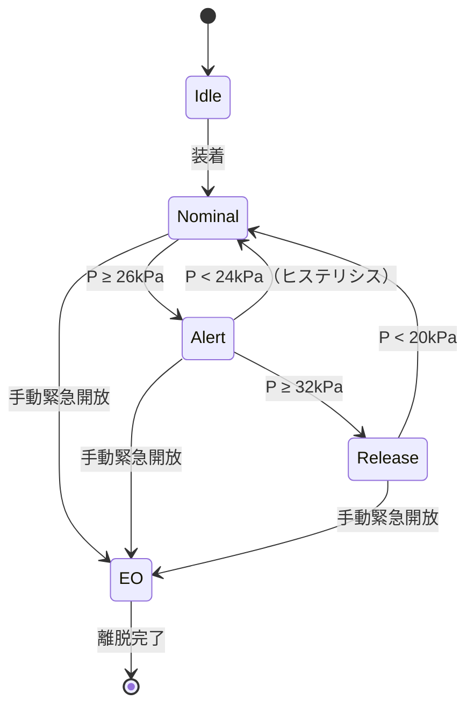
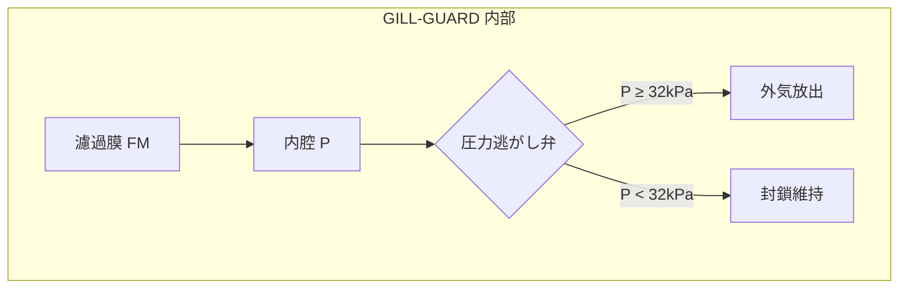

## 0. 適用範囲

本仕様書は、**GILL-GUARD Model B 系列**（B-2 / B-2R / B-3）に適用する。
Model A 系列（初期型）は本仕様外であり、旧版 v1.x を参照のこと。

## 1. 用語

| 用語 | 定義 |
|---|---|
| **GG** | GILL-GUARD 本体 |
| **圧力逃がし弁（PRV）** | 内圧が閾値を超えた際に自動開放される機構 |
| **濾過膜（FM）** | 果汁中の不溶性粒子を除去する多孔膜 |
| **緊急開放（EO）** | 手動で GG を口腔から即時切り離す操作 |
| **整備員** | GG の定期点検を行う資格を持つ者 |

## 2. 動作閾値

内圧 $P$ について、以下の閾値を定める:

$$
P_{\text{nominal}} = 18 \text{ kPa}, \quad
P_{\text{alert}} = 26 \text{ kPa}, \quad
P_{\text{release}} = 32 \text{ kPa}.
$$

$P \geq P_{\text{release}}$ のとき PRV は必ず開放されなければならない。
$P_{\text{alert}} \leq P < P_{\text{release}}$ の範囲では、着用者に
**可聴アラート** を発し、$10$ 秒以内の応答を要求する。

## 3. 状態遷移

GG の状態は下図に従って遷移する。



ヒステリシスは $2$ kPa を設ける。これにより閾値近傍での振動を抑える。

## 4. 緊急開放手順

整備員は、着用者が以下のいずれかを呈したとき、直ちに EO を実行する:

1. 意識低下または応答欠如（$5$ 秒以上）
2. 口腔からの不自然な泡沫
3. 可聴アラートが $10$ 秒以上継続し、着用者が応答しない

EO は右側のリリースレバーを **下方向に 45° 回転** させることで実行される。
レバーは誤操作防止のため、装着中はロックされている。ロック解除は
同側の小ボタンを同時押下する。

## 5. 定期点検

| 項目 | 周期 | 合格基準 |
|---|---|---|
| 濾過膜 FM の目視 | 装着毎 | 穿孔・変色なし |
| PRV 閾値校正 | 週次 | $P_{\text{release}} = 32 \pm 1$ kPa |
| アラート音量 | 月次 | $\geq 65$ dB @ $30$ cm |
| 筐体気密 | 月次 | 漏洩率 $\leq 0.5\%/\text{min}$ |

## 6. 保守記録

保守記録は次の形式で残す:

```
YYYY-MM-DD / GG-SERIAL / 整備員ID / 項目 / 結果 / 備考
```

例:

```
2026-04-17 / GG-B2-0193 / R-014 / PRV校正 / OK (31.8 kPa) / 再調整済
```

## 7. 改訂履歴

- **v2.1** (2026-04-18): ヒステリシスを明文化、緊急開放の誤操作防止手順を追加。
- **v2.0** (2026-03-02): Model B-3 対応。閾値を $28 \to 32$ kPa に引き上げ。
- **v1.3** (2025-11-12): アラート音量下限を追加。
- **v1.0** (2025-07-01): 初版。

## 付録. PRV 断面



---

**注記**: 本仕様書は現場運用のためのものであり、設計上の変更を伴う
改修は修繕班の統括の承認を要する。
